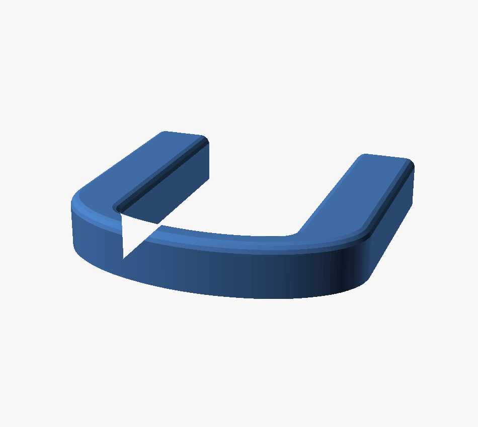
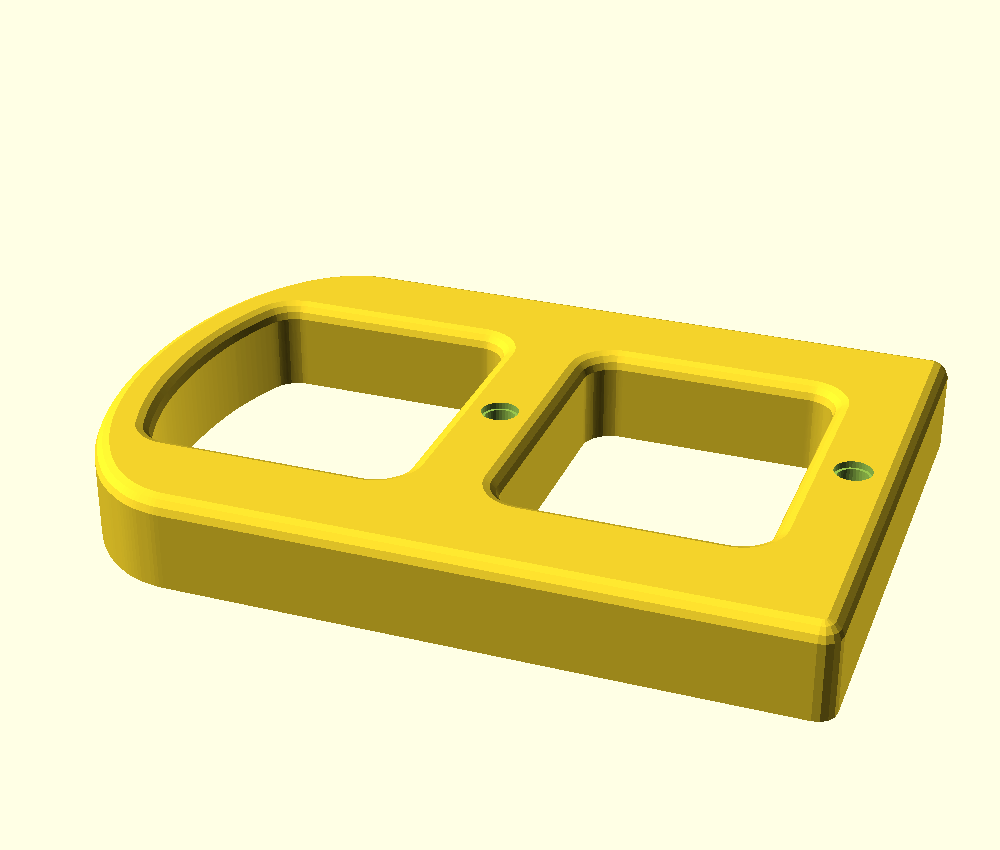
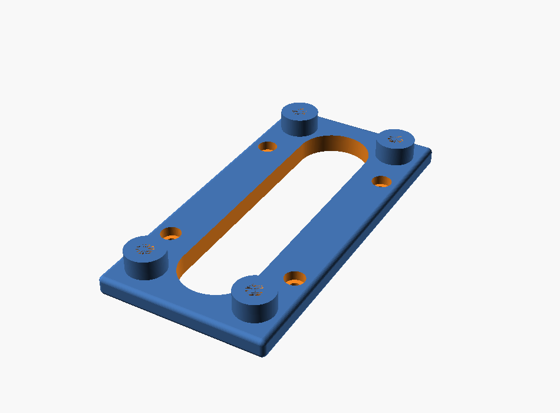
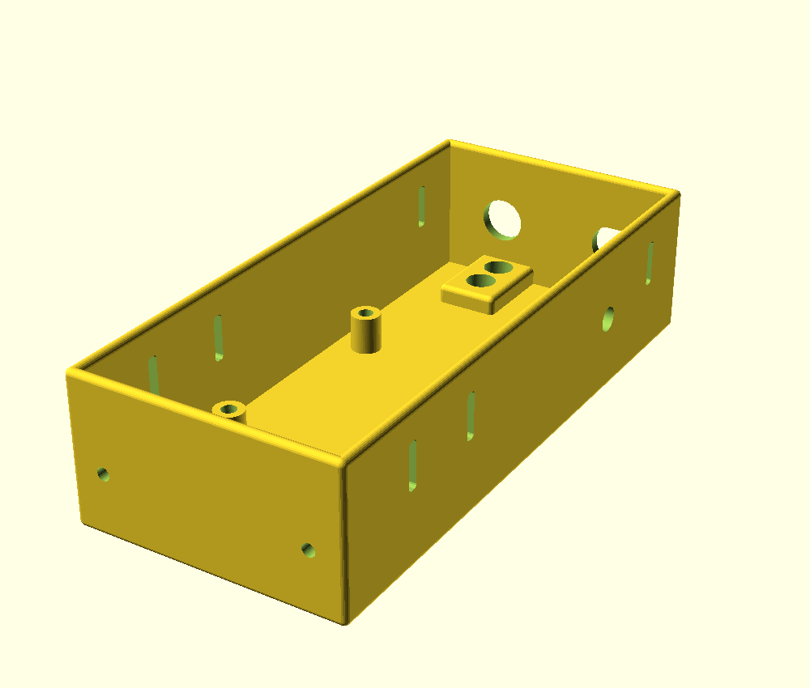
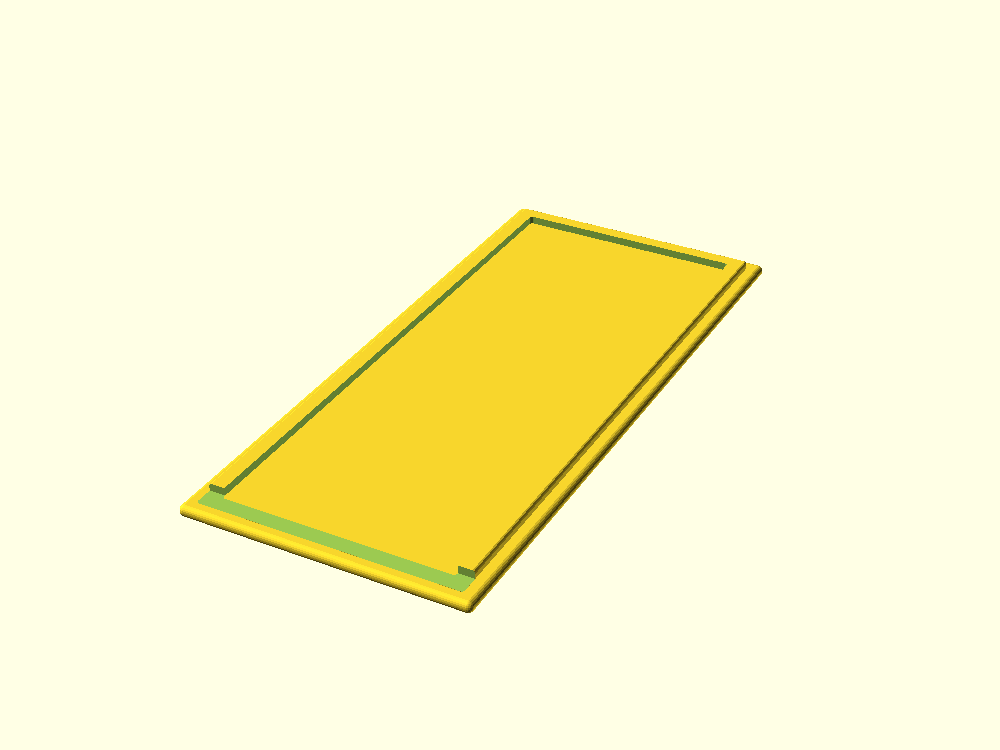
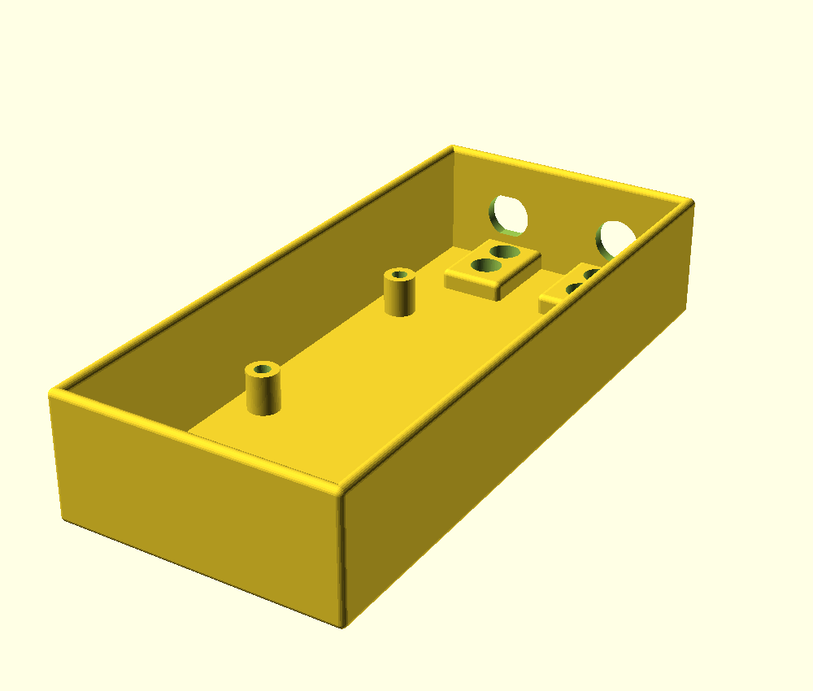
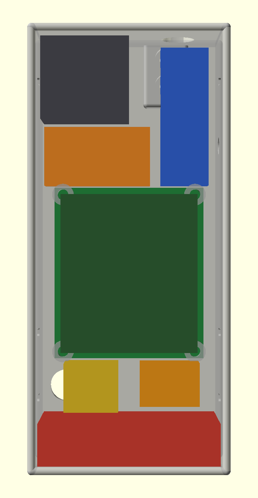

# Modular manpack internal frame — Retevis RT-95 / AnyTone AT-779UV

This is a clean-room decomposition of the single-piece reference STL from
[RT-95 Manpack Rails and BNC bulkhead antenna mount](https://makerworld.com/en/models/1117937-rt-95-manpack-rails-and-bnc-bulkhead-antenna-mount?from=search#profileId-1115768) with the following notable changes:

- Separated into printable modules — **17 STLs**, counting alternates — each of
  which fits a Prusa Mini (180 × 180 mm bed).
- Every module-to-module joint uses stainless M4 socket-cap bolts into brass heat-set inserts.
  M3 appears only where an off-the-shelf part dictates it: the SBC and cover in
  the compute box, and the microphone bracket on `handle_mic`.
- Radio mounts use stainless M5 bolts or factory thumb screws.
- Frame base allows additional modules to be connected such as battery frame or compute box.
- Optional handle variant carries the AT-779UV's own microphone bracket (§2.6.1).

Key files and directories

- Source: `cad/manpack_frame.scad`
- Meshes: `stl/`
- Renders: `img/`

---

## 1. What the reference STL actually is

The reference was measured directly (voxel probing at 1 mm, exact plane
extraction, and 2D section polygons) rather than eyeballed. It is a single
watertight body, **140.75 × 85.00 × 228.00 mm**, 226.9 cm³:

| Feature           | Measured geometry                                                                                                                                                                                                                               |
| ----------------- | ----------------------------------------------------------------------------------------------------------------------------------------------------------------------------------------------------------------------------------------------- |
| Side rails ×2     | flat plates **8.25 mm** thick, 60 mm deep, **228 mm** tall                                                                                                                                                                                      |
| Inner clear span  | **124.25 mm** (this is the radio width datum)                                                                                                                                                                                                   |
| Radio mount       | **one Ø5.000 through-hole per rail**, at the radio bay's exact centre in both Y and Z, with a **Ø26.468 × 5.5 mm** flat-bottomed recess on the outer face                                                                                       |
| Crossbeams ×2     | **7 (deep) × 4 (tall) mm**, back face only, at Z 45.365–49.365 and Z 191.999–195.999, spanning the full 124.25 mm                                                                                                                               |
| Back stiffener ×2 | 4 mm fin at Y 73–77, inboard of each rail, tying the two beams                                                                                                                                                                                  |
| Antenna ears ×2   | 3.75 mm pad, **Ø12.468** hole, 25 mm forward cantilever, hole 12.66 mm back from the pad tip and 11.375 mm inboard of the rail's inner face; diagonal gusset **confined to the 8.25 mm rail plane**; the two ears tied by a 4.78 × 3.75 mm rail |
| Handles           | integral loop in the top of each rail: **33.75 × 18.5 mm** hand aperture, **11.5 mm** grip bar                                                                                                                                                  |
| Feet              | integral bottom arch: 40 × 40 mm aperture, 3.19 mm ground pad                                                                                                                                                                                   |

**228 mm tall is why it cannot print on a Mini.** A 60 × 228 rectangle will not
fit a 180 × 180 square at any rotation ((228 + 60)/√2 = 203.6 > 180).

Two measurements drove real design decisions and are worth calling out:

- The radio mount is a **single M5 bolt per side**, dead centre of the bay. That
  is the standard mobile-radio trunnion mount — the radio hangs on its own
  threaded side holes. It is reproduced exactly.
- The antenna gusset lives **inside the rail plane** (X 0–8.25), which is
  precisely what leaves the bore under the Ø12.468 hole clear. At X ≥ 9 there is
  only the 3.75 mm pad. Getting this wrong blocks the antenna shank.

---

## 2. Part breakdown

| #   | Part                       | Qty   | Print size (mm)   | Solid vol | Inserts |
| --- | -------------------------- | ----- | ----------------- | --------- | ------- |
| 1   | `side_panel`               | 2     | 164 × 70 × 9      | 76.0 cm³  | —       |
| 2a  | `crossbeam_top_front_dual` | 1\*\* | 124.25 × 16 × 24  | 44.5 cm³  | 12      |
| 2b  | `crossbeam_top_front_triple` | 1\*\* | 124.25 × 16 × 24  | 43.5 cm³  | 16      |
| 2c  | `crossbeam_top_front_grid` | 1\*\* | 124.25 × 16 × 24  | 43.1 cm³  | 14      |
| 3   | `crossbeam_top_back`       | 1     | 124.25 × 16 × 24  | 46.3 cm³  | 4       |
| 4a  | `crossbeam_bottom_front`   | 1\*\*\*\* | 124.25 × 16 × 24  | 45.9 cm³  | 6       |
| 4b  | `crossbeam_bottom_front_rail` | 1\*\*\*\* | 124.25 × 16 × 24  | 42.6 cm³  | 13      |
| 5   | `crossbeam_bottom_back`    | 1     | 124.25 × 16 × 24  | 45.9 cm³  | 6       |
| 6a  | `handle`                   | 2\*\*\*\*\* | 68 × 70 × 12      | 23.1 cm³  | 4 M4    |
| 6b  | `handle_mic`               | 1\*\*\*\*\* | 101 × 70 × 12     | 46.1 cm³  | 4 M4 + 2 M3 |
| 7   | `antenna_mount_bnc`        | 2\*   | 35 × 24 × 33      | 10.9 cm³  | —       |
| 8   | `antenna_mount_so239`      | 2\*   | 35 × 24 × 38      | 11.6 cm³  | —       |
| 9   | `base_plate`               | 1     | 142.25 × 70 × 16  | 55.9 cm³  | 4       |
| 11a | `compute_box_inline`     | 1\*\*\* | 142.25 × 49 × 70  | 95.7 cm³  | 4       |
| 11b | `compute_box_front`      | 1\*\*\* | 72 × 160 × 40     | 86.0 cm³  | 4 M3    |
| 11c | `compute_box_front_cover`| 1\*\*\* | 72 × 160 × 5      | 36.6 cm³  | —       |
| 11d | `compute_box_front_slim` | 1\*\*\* | 72 × 160 × 32     | 76.0 cm³  | 4 M3    |
| 11e | `compute_box_front_slim_cover` | 1\*\*\* | 72 × 160 × 5 | 37.1 cm³  | —       |
| 10  | `battery_box`              | 1     | 143 × 59.8 × 94.8 | 103.3 cm³ | 4       |

\*\* Parts 2a–2c are alternatives — the three top-front layouts (§2.11). Print one.
`_dual` is the original and is bit-identical to it, so an existing beam still fits.

\* Parts 7 and 8 are alternatives — print **two of whichever connector you use**,
not both. They share an identical leg, rib and bolt pattern, so they are
interchangeable on the same crossbeam without touching anything else.

\*\*\* Parts 11a, 11b and 11d are the three compute-module variants (§2.12) — pick
one, or none. 11c and 11e are the covers for 11b and 11d respectively, and are not
optional if you fit the box they belong to.

\*\*\*\* Parts 4a and 4b are alternatives. `_rail` adds a row of accessory columns to
the bottom beam's front face, needed only if you fit `compute_box_front`. The
plain one is bit-identical to the beam already printed.

\*\*\*\*\* Parts 6a and 6b are alternatives **per side**. `handle_mic` carries the
AT-779UV's own microphone bracket (§2.6.1); print it for one side and a plain
`handle` for the other, or two plain ones if you do not want the mic mount.

#### Which variants do I actually print?

Five of the entries above are alternates, not additions. The minimum working
frame is **12 parts**; everything else is opt-in.

| Choose | Options | Pick this if… |
| ------ | ------- | ------------- |
| Top-front beam | `_dual` / `_triple` / `_grid` | `_dual` if you only want two antenna mounts and already own the printed beam — it is bit-identical. `_grid` if you want the accessory rail. `_triple` for three stations. |
| Bottom-front beam | plain / `_rail` | `_rail` **only** if fitting `compute_box_front`; otherwise the plain one, which is bit-identical to the beam already printed. |
| Handles ×2 | `handle` / `handle_mic` | Two plain ones normally. Swap **one** for `handle_mic` if you want the AT-779UV microphone bracket. |
| Antenna mounts ×2 | `_bnc` / `_so239` | Two of whichever connector you use — never one of each. Same leg and bolt pattern, so you can swap later. |
| Compute module | `_inline` / `_front` / `_front_slim` / none | `_front` and `_front_slim` both need the `_rail` bottom beam and their own cover — they are alternatives to each other, not additions. `_inline` stacks under the frame instead. Most builds need none of them. |

Largest part is 164 mm — **16 mm of bed margin**. All seventeen meshes verified
watertight, single-shell, and bed-legal.

Solid volume is 851 cm³ for one of each of the seventeen files. A full 12-piece
build (BNC mounts, battery frame, no compute box) is 560 cm³ with the grid beam,
561 cm³ with the triple, 562 cm³ with the dual; add 96 cm³ for the inline compute
box, or 109 cm³ for the front one with its cover. Swapping one plain handle for
`handle_mic` adds 23 cm³.
Actual filament use is far lower — the beams are small enough in section that
the slicer's perimeters and infill dominate. If mass matters, the base plate is
the obvious place to add a lightening window.

### 1 — `side_panel` ×2


A plain flat plate. It carries **only** the ported radio mount plus through-holes
for the beams and handle. No feet, no handle, no antenna mount, and **no heat-set
inserts at all** — every insert lives in the mating part, which is what keeps
this a simple flat print.

- Radio mount: **two** Ø5.000 through-holes at Y 35, each with the Ø26.468 × 5.5 mm
  outer-face recess, verbatim from the reference. **Z 98** is the ported reference
  position and suits the RT-95; **Z 129** is 31 mm higher for the AT-779UV. See
  §2.10 for the derivation. Use whichever pair matches the radio; the unused pair
  is just a drain hole.
- Windows: the upper one moved from Z 118–132 to **Z 150–172**. The new AT-779UV
  recess spans Z 115.8–142.2 and ran straight through where it used to be.
- 8 × M4 clearance holes, heads counterbored flush in the **outer** face → the
  four crossbeams.
- 4 × M4 clearance holes, heads counterbored flush in the **inner** face → the
  handle. Flush heads keep the radio bay clear.
- Two lightening/ventilation windows, positioned to leave ≥ 10.8 mm of material
  between them and the M5 recess ligament. Set `panel_windows = false` for a
  plain plate.

### 2–5 — `crossbeam` ×4

Four beams instead of the reference's two, front and back at top and bottom,
forming a closed box. Each spans the full 124.25 mm between the panel inner
faces, with **two axial M4 inserts per end** stacked vertically so the joint
cannot rotate about a single bolt.

Extra insert faces by position:

- `crossbeam_top_front_dual` / `_triple` / `_grid` — 8, 12 or 14 inserts in the
  **front face**, the accessory stations (§2.11).
- `crossbeam_bottom_front_rail` — the same beam plus 7 accessory columns in its
  front face, for a tall front module.
- `crossbeam_bottom_front` / `_bottom_back` — 2 inserts each in their
  **undersides** for the base plate.

### 6 — `handle` ×2



An arch, not the reference's squared loop. It still laps 48 mm down the panel's
outer face on four M4 bolts, and the panel's top edge still forms the aperture
floor, but everything above that line was reworked after the built pack showed
the original reading as two blocky slabs.

|                    | reference / v1             | now                           |
| ------------------ | -------------------------- | ----------------------------- |
| Proud of the frame | 30 mm                      | **20 mm**                     |
| Overall height     | 78 mm                      | **68 mm**                     |
| Hand aperture      | 33.75 × 18.5               | **40 × 13**                   |
| Grip bar section   | 11.5 × 12 mm, square edges | **7 × 12 mm, fully radiused** |
| Volume             | 37.6 cm³                   | **22.6 cm³**                  |

Three changes, each aimed at a stated problem:

- **10 mm off the height.** This is the whole pack's tallest point, so it comes
  straight off the assembled envelope: 210 → **200 mm**.
- **Shoulders tapered.** Above the panel line the outline is a half-ellipse
  springing from the panel top, so the handle stops carrying its full 70 mm depth
  up to a flat square top. That is what removes the bulk near the top.
- **Everything radiused except the mating face.** The part is filleted 2.5 mm on
  every edge, then sliced back at the mating plane so the face that lands on the
  panel stays dead flat and full width. Extruding to `handle_t - fill` and
  shrinking the profile by `fill` first is what makes the sphere restore full size
  at that plane rather than doming it.

**The trade:** the aperture loses 5.5 mm of height. It is widened 33.75 → 40 mm to
claw some back, but it is now a two-finger lifting loop rather than a three-finger
grip. If that reads as too tight in the hand, `grip_ap_h` and `grip_bar_h` are the
two numbers — they sum to whatever you want proud of the frame, and the bar cannot
go below ~6 mm because the fillet construction needs the profile to survive an
`offset(-2.5)`.

**The arch is constant thickness, and that was a correction.** The first cut of
this rework gave the aperture a flat top under a curved outer arch. A flat line
under a curve necessarily pinches at the ends: the band waisted to **5.29 mm at
Y 21 and Y 49** against 7.00 mm at the apex — a 24 % notch sitting exactly where
the arch meets the shoulder. My own scan showed it and I let it pass because the
bending moment is low there, which was the wrong call: a waist at a joint is a
stress raiser whatever the nominal moment. The aperture's top now follows the
outer arch offset inward by `grip_bar_h`, so the band holds 7.0–7.25 mm across the
span and _grows_ to 8.25 mm into the shoulders.

| at the arch/shoulder joint       | waisted  | constant band |
| -------------------------------- | -------- | ------------- |
| minimum depth                    | 5.00 mm  | **7.00 mm**   |
| section modulus                  | 46.4 mm³ | **94.3 mm³**  |
| stress, one-handed 6× drop-catch | 7.06 MPa | **3.47 MPa**  |
| safety factor (PLA)              | 7.1      | **14.4**      |

Note this part renders through an `offset()` plus `minkowski()` and takes ~65 s to
export, against well under a second for everything else.

#### 2.6.1 — `handle_mic`, the microphone-bracket variant



The AT-779UV ships with its own microphone bracket — **55 H × 35 W × 10 D mm, two
M3 holes 45 mm apart vertically**. So this variant does not capture the mic at
all. It only presents two flat, coplanar landings with an M3 insert in each.

| Z (global)  | feature                                              |
| ----------- | ---------------------------------------------------- |
| 99 – 111    | lower bracket beam — **M3 insert at 105**            |
| 111 – 144   | open window, 33 mm                                    |
| 144 – 156   | upper bracket beam — **M3 insert at 150**            |
| 156 – 193   | **grip aperture, 37 mm**                              |
| 193 – 200   | grip band, unchanged at 7 mm                          |

The bracket occupies Z 100–155, clearing the grip floor by 1 mm, so **nothing
crosses the hand opening**. Inserts measure 105.00 and 150.00 off the mesh —
45.00 apart.

**The handle had to grow downward, 68 → 101 mm.** This is forced, not a choice:
55 mm of bracket below a usable grip does not fit in the original 61 mm aperture,
which would have left 6 mm of finger room. The extension lies against the side
panel it already bolts to, so it needs **no panel changes** — the mic's load is
downward, in-plane shear on the existing four M4 bolts, and the small outboard
moment is taken by the extension bearing flat on the panel.

The window between the two beams is what keeps the extension a frame rather than a
slab, and gives the mic lead somewhere to run. The grip band is untouched: the
aperture *floor* was raised to 156 and its top still follows the offset arch, so
the constant-thickness band from the v2 rework is exactly as it was.

**Inserts differ by face and size** — M3 for the bracket, opening onto the *outer*
face; M4 for the frame, opening onto the *mating* face. They cannot be confused at
assembly.

Print pose is the same as the plain handle, mating face down: that face is sliced
dead flat, and it puts the M3 pockets face-up as blind holes rather than bridged
ceilings.

**Not for storage.** The bracket projects 10 mm outboard and the mic well beyond
that. This is for when the frame is out of the bag standing on its own, or the
side is pulled away.

One cost: the upper beam overlaps the panel's `win_b` ventilation window across
Z 150–156, covering about 6 mm of its 22 mm height.

**Before printing 101 mm of handle**, confirm the bracket's two holes are centred
on its 55 mm height. That assumption is what puts 5 mm of bracket above the top
hole and 5 below the bottom; if they sit off-centre, `mic_bolt_z` moves.

*Approaches tried and abandoned, so they are not re-attempted:* a printed stud for
the mic to hang on (wrong — the mic carries the male knob), and a keyhole plate to
receive that knob. The knob's disc measures **20 mm**, which needs a 29 mm pocket;
the plate left in front came out 3.5 mm, and it still caught the disc by only
1.9 mm because the neck could never drop clear of the Ø21.5 entry hole inside a
61 mm aperture. The bracket sidesteps all of it.

### 7–8 — `antenna_mount_bnc` / `antenna_mount_so239`

| BNC | SO-239 |
| --- | ------ |
|  |  |

The reference ear, made modular and offered in two connector variants. Both share
an identical leg, gusset ribs and M4 bolt pattern, so either bolts to the same
inserts in the top-front crossbeam — you can swap connector type later without
reprinting anything else.

|                       | `antenna_mount_bnc`     | `antenna_mount_so239`                      |
| --------------------- | ----------------------- | ------------------------------------------ |
| Connector             | BNC bulkhead            | SO-239 / UHF female, 4-hole flange         |
| Bore                  | **Ø12.468 mm** [PORTED] | **Ø15.88 mm** (0.625")                     |
| Flange screws         | —                       | 4 × Ø3.4 on a **17.98 mm** square (0.708") |
| Forward reach         | 25 mm [PORTED]          | 30 mm                                      |
| Bore setback from tip | 12.66 mm [PORTED]       | 17 mm                                      |
| Print size            | 35 × 24 × 33 mm         | 35 × 24 × 38 mm                            |

The BNC variant is the reference connector carried over verbatim — the reference
STL is itself titled a _BNC bulkhead_ antenna mount, which is what the Ø12.468
bore is for. The SO-239 variant reaches 30 mm rather than 25 mm and sets its bore
17 mm back from the tip; both were needed so the rear pair of flange screws clears
the bracket's own leg and the front pair keeps material at the pad tip.

**Both variants are a single symmetric part used twice.** An earlier revision
needed a mirrored left/right pair because the bolt columns were offset to dodge
the crossbeam's end-insert pockets. Insetting the whole bracket 6 mm from the
panel inner face solves that instead, which lets the bolts sit symmetrically
between the ribs and removes the handedness.

Verified: bore clear below each pad for the connector body, all four flange-screw
nut positions clear, and zero enclosed voids in either part.

#### Rework history (v2)

The first version of this bracket had three defects, all found on a printed part:

1. **One entire bolt column was unusable.** The ribs were 8 mm thick at the
   bracket edges and the bolt columns sat at 14 and 30 mm across a 35 mm width —
   so the 30 mm column landed inside the right-hand rib. Worse than overlapping:
   because the rib spans the full pad depth, up to **19.75 mm of solid rib sat in
   front of the counterbore mouth**, sealing both holes into enclosed internal
   voids with no tool access. The printed part showed them as blind dimples where
   the slicer had bridged over a sealed cavity.
2. **The ribs were too wide**, leaving no clear span to put the bolts in.
3. **The ribs were not actually joined to the pad.** The rib profile stopped
   exactly at the pad's underside, so the two shared a plane and nothing more —
   zero volumetric overlap. Combined with the fillet on the pad's edge, that left
   a real groove along the top of each rib, visible on the print.

Fixes: ribs thinned 8 → **5 mm**, bolts moved to **10.5 / 24.5 mm** in the open
span between them, the whole bracket inset 6 mm so those symmetric columns still
clear the crossbeam's end inserts, and the rib profile carried up through the
pad's full thickness so it merges rather than touches. Consequence: antenna bore
spacing drops from 89.25 mm to **77.25 mm**.

### 9 — `base_plate`



The modular bottom interface. Bolts up into the two bottom crossbeams on four
M4 bolts. Its **four bosses are simultaneously the frame's feet and the M4
attachment grid** that future modules (battery, tuner, ATU) bolt up into — one
feature doing both jobs, so nothing else needs to hang off the frame.

**It is a ring, not a plate.** All that remains is the perimeter backing the two
side panels (X 0–9 and 133.25–142.25) and the two bottom crossbeams, widened front
and back to carry the feet. The centre is a **120.25 × 30 mm stadium opening**,
which also serves as the battery lead's pass-through — it spans the same 30 mm of
depth the old 36 × 26 cable slot did and the entire width, so it passes anything
that slot did, and the separate slot is gone.

The opening cannot follow the beam lines exactly. The Ø16 feet at Y 12 / 58 reach
4 mm past them, and **corner rounding cannot rescue it**: at the ideal Y 16–54 the
largest radius that fits is 19 mm, still short of the 19.2 mm needed to clear a
foot. Counter-intuitively a _larger_ radius helps — a small corner brings the
opening nearer the foot — so the optimum is the limit case, a full stadium. At
Y 20–50 with r = 15, inset 2 mm from the panel inner faces, it leaves **2.94 mm**
of material between each foot boss and the opening edge, which the model asserts
on every render.

The 2 mm inset is deliberate. Running the opening right up to the panel line — the
literal reading of "line up with the side panels" — made the arc exactly tangent
to the panel's inner face at Y 35: zero margin at one point. Because the plate
prints upside down that face is the _first layer_, where elephant-foot
compensation enlarges a hole, so the opening would have crept ~0.2 mm under the
panel edge. The inset costs ~120 mm² of opening (3 %) and, as a bonus, improves
the foot ligament from 2.08 to 2.94 mm.

Verified after the cut: the perimeter still fully backs both side panels (100 % of
samples) and both crossbeams, the material around all four feet and all four base
bolts is intact, and the worst-case panel margin measures 1.995 mm. Opening the
centre took the plate from 75.9 cm³ to **55.9 cm³**, 26 % lighter.

Its top face is deliberately left flat. An earlier revision had two raised
locating lips for the panel bottom edges; they made the part unprintable (see
§9), and since the panels are located by their 16 bolts into the crossbeams, the
lips were redundant.

### 10 — `battery_box`


An **open frame** — not a box — for a **TalentCell LF4011 12 V 6 Ah LiFePO4**
pack lying flat on its largest face (**132 × 75.8 × 37.3 mm**, measured).

**It bolts into the four Ø16 foot bosses on the base plate** (X 14 / 128.25,
Y 12 / 58) with 4 × M4 × 12 into the heat-set inserts already in them. Those
bosses were designed from the start as both the frame's feet and the M4 module
interface, so **nothing on the frame changes to accept it** — the base plate is
reprinted only for the cable slot, not for this.

Structure: two end walls, a back wall and a floor, every one of them windowed,
plus a centre rib under the pack. The front is open so the pack slides in, and
the top is open because the base plate is the lid. That is also why it needs no
cable hole of its own — the lead goes straight up into the base plate's slot.

Retention is by geometry, not just the strap. A **top flange runs the full length
of each end wall**, reaching 19.5 mm inboard so it laps 18 mm over each of the
pack's long edges. The pack can lift 2.5 mm before it meets them. The flange runs
the full length rather than being four pads because the bolts sit 10.4 mm inboard
of the walls — too far to cantilever cleanly — and a full-width cross rail would
have been a 135 mm bridge. A hook-and-loop strap through the four slots crosses
the 13.5 mm clear zone in front of the pack and stops it sliding out.

|                  |                                                                      |
| ---------------- | -------------------------------------------------------------------- |
| Cavity           | 135 × 90.8 × 38.8 mm                                                 |
| Outer            | 143 × 94.8 × 51.8 mm, reaching 24.8 mm forward                       |
| Behind the frame | nothing — the back wall is flush with the frame back                 |
| Bolts            | 4 × M4 × 12 into the base plate feet                                 |
| Print pose       | back wall down, 143 × 59.8 mm footprint, 94.8 tall                   |
| Stacking feet    | 4 × Ø16 × 8 mm with M4 inserts, at the same X 14 / 128.25, Y 12 / 58 |
| Stack pitch      | 59.8 mm per module                                                   |

**It presents the same interface on its underside that it consumes on top.** Four
Ø16 × 8 mm feet with M4 inserts sit at the same X 14 / 128.25, Y 12 / 58, so a
further module bolts under the battery frame exactly as the battery frame bolts
under the base plate — verified by stacking a second copy at the 59.8 mm pitch
with zero interference and all four bolts clean. Cables reach a module below
through the floor windows, so no extra pass-through was needed.

The feet are plain cylinders rather than ramped. A 45° print ramp would have to
run toward +Y, which is the downward direction in the print pose, and for the
rear pair at Y 58 that would have reached Y 74 — past the back face, breaking
both the "nothing behind the wearer" rule and the print pose's bed datum. Left
unramped they cost about 18 mm² of unsupported area each, which is what any
horizontal boss costs. The floor windows were reshaped around all four pads.

Windowing still nearly halves it: 103.3 cm³ against ~190 cm³ for the equivalent
closed box.

### 11 — the top-front crossbeam: three layouts

| `_dual` | `_triple` | `_grid` |
| --- | --- | --- |
|  |  |  |

All three use the **same station pattern** — a copy of the antenna mount's own
four bolts, two M4 columns 14 mm apart and two rows 10 mm apart at Z 162 / 172.
They differ only in how many stations and where, so the antenna mounts are
unchanged and interchangeable between them.

| | `_dual` | `_triple` | `_grid` |
| --- | --- | --- | --- |
| Bolt columns | 4 | 6 | **7, uniform** |
| Column spacing | 14 / 63 / 14 | 14 / 24 / 14 / 24 / 14 | **14 mm throughout** |
| Inserts | 8 | 12 | 14 |
| Mounting positions | 2 fixed | 3 fixed | **6, overlapping at 14 mm** |
| Wider bolt spans | no | no | **yes — 28, 42, 56, 70, 84 mm** |
| Outer bore spacing | 77.25 mm | 76 mm | 70 mm |
| **35 mm brackets at once** | 2 | **3** | 2 |
| Volume | 44.5 cm³ | 43.5 cm³ | 43.1 cm³ |

`_dual` is the original: one station per antenna mount, nothing else. It is
**bit-identical to the beam already printed**, so it is not a reprint.

`_triple` is the one to pick if you want **three full-width mounts at once** —
three SO-239 brackets sit side by side with a 3 mm gap, spanning X 15.625 to
126.625. It is the only layout that fits three, because its 38 mm pitch exceeds
the 35 mm bracket width while 26 mm does not.

`_grid` is a **uniform 14 mm column grid**, not a set of fixed stations. Because
the pitch equals the antenna mount's own bolt spacing, *every adjacent pair of
columns is a station* — six positions at 14 mm increments rather than a few fixed
ones. It also lets a wider accessory span three, five or all seven columns for a
28 / 56 / 84 mm bolt base, which the fixed layouts cannot offer at all: good for a
Le Frite compute box or a DC charge-port plate that wants a broad, stiff footprint.

The model asserts `grid_pitch == 2 * rail_bolt_dx`, because the grid only works as
a grid while its pitch matches the mount's bolt spacing.

An earlier revision of this layout used four fixed stations at 26 mm, which gave
columns alternating 14 / 12 mm — the stations were equally spaced but the holes
were not. Four stations *cannot* be made uniform: that needs a 28 mm pitch, which
overruns the beam's usable bolt span by 1.7 mm at each end and drives the outer
pockets into its own end inserts. Dropping to a 7-column grid fits with 5.3 mm to
spare and gives more positions, not fewer.

**Four full-width mounts are not possible on any layout.** Their bolts must lie
within X 23.85–118.40 (94.55 mm) to stay 3 mm clear of the beam's own end-insert
pockets, and four brackets packed edge to edge need 119 mm of bolt span. Shrinking
the bracket to the ≤26.85 mm that would allow it leaves 2.33 mm per gusset rib,
down from 5 mm — and those ribs carry the cantilevered pad and the antenna's
bending load.

Every layout keeps its outermost pocket at least 3 mm clear of the crossbeam's
own end-insert pockets, which occupy the first and last 9 mm of the span; the
model asserts it. `_dual` and `_triple` have ~5.3 mm of material there, `_grid`
5.3 mm.

**What can coexist on `_grid`.** Positions run every 14 mm — 36.125, 50.125,
64.125, 78.125, 92.125, 106.125 — so what fits together depends only on how many
positions apart you go. Two accessories clash if their half-widths sum to more
than the gap:

| positions apart | gap | two 35 mm items | 35 mm + a 22 mm one | two 22 mm items |
| --- | --- | --- | --- | --- |
| 1 | 14 mm | no | no | no |
| 2 | 28 mm | no | no | **yes** |
| 3 | 42 mm | **yes** | **yes** | **yes** |
| 4–5 | 56–70 mm | **yes** | **yes** | **yes** |

The narrowest an accessory can physically be is about 22 mm — the 14 mm bolt span
plus two Ø8.2 counterbores. So in practice:

- **two** 35 mm antenna mounts, three positions apart or more (1&4 gives 42 mm,
  1&6 gives 70 mm)
- **three** minimum-width items at positions 1, 3, 5
- or a mix: an antenna at position 1 leaves 4, 5 and 6 open for anything

Four full-width mounts remain impossible on any layout — their bolts would need
119 mm of span against the 94.55 mm available. `_triple` is still the only layout
that fits three 35 mm brackets, because its 38 mm pitch exceeds the bracket width
outright.

Set `top_front` to `"dual"`, `"triple"` or `"grid"` to pick which one the assembly views build
with; it also moves the antenna brackets to that layout's outer stations.

---

### 12 — `compute_box`, two variants

| `_inline` | `_front` (cover off) |
| --- | --- |
|  |  |

Carries a **Libre Computer La Frite** (AML-S805X-AC, 64 × 56 mm, M3 mounting on
**58.75 × 49.5**) with its 128 GB eMMC, plus a CM108/CM119 USB audio
fob, a PTT board and a GPS module, for onboard logging over WiFi to a tablet.

**Only the SBC gets a dedicated mount**, because it is the only one of the four
whose footprint is fixed and known. On `_inline` everything else lands on a
generic **M3 through-hole grid at 10 mm pitch** — 30 positions — plus zip-tie
slots. Swapping a CM108 for a CM119, or changing the PTT board entirely, costs
nothing here. The grid holes double as ventilation.

`_front` **no longer has the grid.** It was removed along with the back-wall
cutout: neither earned its place once the board was rotated, and the bays are big
enough that loose devices are better zip-tied than bolted to a hole that happens
to line up. Ventilation is now whatever the openings happen to give: the cover is
solid and the rim slots are gone, so the box breathes only through its cable
entries. That is fine for an idling SBC in a padded bag and should be revisited if
anything warm goes in.

**The mounting pattern is now measured, not published — and the published figure
was wrong.** M3 was confirmed early by test-fitting a bolt. The pitch was carried
as the Raspberry Pi Model A figure of 58 × 49.5 until a **printed test fit** showed
it short: with the pair nearest the converter seated, the pair at the USB end
missed by 0.5–1 mm. Calipers on the board put that dimension at **58.5–59 mm**, so
the model now uses **58.75**, the midpoint. 49.5 fitted and is unchanged.

Residual uncertainty is ±0.25 mm against roughly ±0.1 mm of slack from an M3 in the
board's ~3.2 mm hole, so **start all four screws before tightening any of them** —
the board will pull into place across four fixings but binds if one corner is fully
seated first. That is most likely what made the USB-end pair read as clearly wrong
rather than merely tight. If a later measurement lands nearer one end of the range,
`sbc_hx` is the single number to move.

This is the second assumption in the project that only a printed part could
retire — the first was the antenna bracket's sealed counterbores.

|                   | `_inline`                     | `_front`                        |
| ----------------- | ----------------------------- | ------------------------------- |
| Mounts to         | the module stack, above the battery box | the top-front crossbeam's accessory columns |
| Outer             | 142.25 × 70 × 49 mm           | **72** × 160 × **33** mm        |
| SBC orientation   | lying flat on the floor       | flat on the back wall, **turned 90°** |
| Grid positions    | 30 (6 × 5)                    | none — see above                |
| Outer depth       | 49 mm                         | **40 mm** (was 33; the converter forced it) |
| Cover             | open front                    | `compute_box_front_cover`, 36.6 cm³ |
| Volume            | 95.7 cm³                      | 86.0 cm³                        |

**`_inline`** bolts up into the plate above and presents the same four feet
below, so the battery box hangs off it unchanged — stack pitch **49 mm**. Its
topology deliberately mirrors `battery_box`: back wall, two end walls, floor,
full-length top flanges carrying the M4s, feet, open at the front and top. That
is the one shape already proven to print on this frame. Floor-down would put the
feet on the bed under a full-width floor — the base plate's old mid-air failure —
and a closed front would become a 142 × 49 ceiling in the back-down pose. The
open front doubles as the port access: the SBC's connector edge faces out of it,
so USB, Ethernet, DC and the GPS lead are all reachable.

The SBC does not have to dodge the top flanges: it tops out 1 mm below their
underside, so the whole floor width is usable and the grid gets the rest.

**`_front`** hangs off the crossbeam, inside the 160 H × 80 W × 50 D envelope
available on the front of the frame. **Width is set by the rail, not by the
contents**: 72 mm is what leaves one antenna mount beside it with a 9.5 mm gap,
and both the board (56 across) and the converter (65) fit the 66 mm interior
without it growing. **Depth is set by the converter** — 35 mm front-to-back needs
37 of interior, so 40 outer.

**The board is turned 90°, and that turn is what makes the box work.** With the
La Frite's 58 mm hole axis vertical, the **USB edge points up toward the radio and
the power/Ethernet edge points down toward the battery** — the ports are reachable
in the orientation the box is actually used in. It also means the board needs
56 mm across instead of 64, which is what let the box narrow from 80 to 72.

Three bays, top to bottom:

| Z (box-local) | height | contents                                    |
| ------------- | ------ | ------------------------------------------- |
| 107 – 157     | 54 mm  | USB devices, plugged into the upward ports  |
| 39 – 103      | 64 mm  | the La Frite                                |
| 3 – 18        | 15 mm  | buck converter, flat on the floor           |

Standoffs measure at X 11.25 / 60.75 and Z 41.65 / 100.35 — 49.5 across,
**58.75 up**. They stand **6 mm** off the back wall (was 5) with a **6 mm** insert
pocket (was 5): the heat-set inserts were bottoming out. The pocket now ends
exactly at the wall's inner face, leaving 1 mm of pad beside it and 2 mm of wall
behind.

Measured clear interior, which is what the electronics actually get:

| | clear | contents | spare |
| --- | --- | --- | --- |
| Width, bottom bay | **66.05 mm** | converter 65 | **1.05 mm total — 0.5 a side** |
| Depth | **37.05 mm** | converter 35 | 2.05 mm |
| Floor to board edge | 42.00 mm | converter 15 + gap | — |
| Top bay depth | 31 mm clear of the M4 pads | — | 37 mm if a device straddles them |

**That 0.5 mm per side on the width is the tightest fit in the project.** It is a
print-tolerance judgement, not a clash: a Mini typically holds internal dimensions
within ±0.15 mm and the converter has its own tolerance, so it should go in, but
there is no room to be wrong and none for a zip tie beside it. If it binds, scrape
the wall rather than reprint.

**The board sits 5 mm lower than it first did**, which is worth understanding
because it is free height. Dropping the converter flat onto the floor freed 5 mm;
spending it on the board position rather than on the connector gap handed the 5 mm
to the USB bay, where it is scarce. A CM108/CM119 fob runs ~50–52 mm: at the old
49 mm it did not fit, at 54 it does.

Its four M4s want two accessory columns **28 mm apart** — on the `_grid` beam,
columns 85.125 and 113.125, the pair that lands inside a 72 mm box sitting to the
right of an antenna mount. The bolts land on local 8 mm pads, because a 3 mm wall
cannot hold a 4 mm counterbore.

**It bolts top and bottom.** Four M4s into the top beam at Z 162 / 172, plus two
into `crossbeam_bottom_front_rail` at Z 32, so it is tied at both ends rather than
hanging as a cantilever from the top alone.

That bottom row is a **single** row, not two. The bottom-front beam's underside
already carries the base-plate inserts over beam-local Z 0–9, and a second row at
6 would run straight into them; a row at 16 (global Z 32) leaves 4.15 mm between
the two sets of pockets and keeps all seven columns usable. It also lands 12 mm up
the box's back wall, clear of its bottom rim.

**Cable entries on `_front`.** A back-wall grommet and two top-wall bulkheads —
the floor is solid, because the converter sits on it:

| connection | route |
| --- | --- |
| DC power from the battery | **Ø12 grommet in the back wall, X 12 / Z 28** |
| Audio to/from the radio | **no entry** — the rim slot was removed |
| PTT | **no entry** — see above |
| Ethernet, HDMI | right-angle adapters inside the box — see below |
| USB (the CM108/CM119 fob) | plugs directly into the upward ports in the top bay |
| WiFi antenna | SMA bulkhead, right side wall, Y −20 / Z 118 |

**The top wall carries exactly two openings**, both on the depth centreline at
Y −20, and nothing else:

| feature | position | measured |
| --- | --- | --- |
| Missile-switch barrel | X 20 | Ø11.95 |
| USB bulkhead | X 54 | 12.00 across X, **11.05 between the flats** |

The USB hole is a **D-form** — Ø12 with the top and bottom flattened to 11 mm
across — which is the connector's own anti-rotation shape, so it needs no separate
fixings. The flats are assumed to run across the *depth*; if the connector keys the
other way it is a 90° rotation and one line.

**The switch sits on the left, over the 12 V entry at X 12**, so the switched 12 V
pair stays at that end of the box. It was briefly on the right, 46 mm from its own
supply, which put a switched pair straight across the 5 V side.

**The 30 × 14 top rim slot is gone.** It used to carry audio, PTT and a GPS lead
down from the AT-779UV's control face, which points up at Z 179.5 — but it shared
this end of the top wall with the USB hole, and two openings were doing the work of
one. Consequence worth stating plainly: **this box now has no cable entry for audio
or PTT.** The back-wall Ø12 at Z 28 is power only and sits behind the converter.
If a PTT board stays in this box, it needs an entry adding back.

**SMA bulkhead in the right side wall**, Ø6.5 at Y −20 / Z 118, for a WiFi dongle
with an external antenna. It goes in the one clear band on that wall — 11.75 mm
above the board at Z 103 and 12.25 mm below the M4 pads at Z 133.5, with the
nearest zip-tie slot 22 mm away. Ø6.5 is the usual panel hole for a 1/4-36 SMA
bulkhead, but **the wall is 3 mm, at the top of what most SMA bulkheads accept** —
check the thread length before printing. A shallow outside counterbore is the fix
if it runs short.

**The switch protrudes 30 mm into the box with its cables on**, and that fills the
top bay:

```
top bay      X 3..69  x  Z 103..157     66 x 54
switch       X 4..36  x  Z 127..157     32 x 30
  region A   X 36..69 x  Z 103..157     33 x 54
  region B   X 3..36  x  Z 103..127     33 x 24   (under the switch)
```

**Centring the bezel in the depth cost 12 mm of bay width.** Turning it from
20 wide × 32 deep to 32 wide × 20 deep is what makes it sit on the centreline
rather than swallowing the whole depth — but the full-height strip beside it shrank
from 45 mm to 33 mm. The audio fob is ~52 mm and rises off the board's USB ports,
so its height forces it into that strip; at 18 mm wide it fits with 15 mm to spare.

**The GPS module no longer fits.** 18 (fob) + 25 (GPS) = 43 mm side by side against
a 33 mm strip, and its 25 mm height also exceeds the 24 mm clear under the switch.
It fitted at 45 mm and does not at 33. A PTT board still does, because it sits
below Z 127 and may run past X 36 where the switch does not reach — but the same
**~23 mm height limit** applies to anything under the switch.

**Power moved from the floor to the back wall, and its height is constrained.**
The converter now covers the floor where the grommet used to be, and entering at
the back lets the 12 V leads turn once into the frame instead of doubling back
underneath the module. But the **bottom-front crossbeam occupies global Z 16–40 =
box-local −4 to 20**, so the back wall is flat against beam material below
box-local 20 and a hole there would open into the beam, not the frame. Ø12 centred
at Z 28 spans 22–34: verified open across that band, **2 mm clear of the beam** and
5 mm below the board edge at 39.

**The converter bolts to the floor.** It is an **LY-KREE XS120503** — 12 V in,
5 V 3 A / 15 W out — with a slotted fork tab at each end, so **two** fixings, not
four. Two M3 clearance holes (Ø3.4) through the floor, **54.00 mm apart** and
**13.50 mm back from the inside face of the back wall**, both measured off the
mesh. Plain through-holes: the floor is only 3 mm, and a counterbore deep enough
for an M3 cap head would leave under 1.5 mm. Screw from underneath, or use a
countersunk screw. The tabs being slotted absorbs positional error a round hole
would not.

These replaced the zip-tie slots that used to be here. A 65 mm converter in a
66 mm interior leaves 0.5 mm a side — nothing would have passed a tie anyway.

**The datum matters:** 13.5 mm is from the **inside** face of the back wall, not
the outside. The wall is 3 mm, so reading it the other way moves the holes 3 mm.
The inside face is what the converter registers against, and the 65 mm overall is
measured across the tabs — which puts the holes 5.5 mm inboard of each end and
lands them inside the 35 mm footprint, as they must be.

**The cover's bottom rim is gone entirely**, not merely notched. The rim projects
2 mm into the opening across Z 3–7, and a 35 mm converter in a 37 mm interior has
nothing to give. Three sides still locate the cover; the six screws hold it.

**Ports are connect-before-closing.** With the board turned, the ports open in the
plane of the board — up and down *inside* the box — so no wall needs a cutout and
the cover can be solid. Ethernet and HDMI use right-angle adapters, which is not
optional: a straight RJ45 plug needs ~40 mm below the board edge and the converter
top is at 18.

**The 21 mm budget.** Below the board edge (Z 39) down to the converter top
(Z 18) there is 21 mm, across the converter's full width. Treat it as the hard
limit on how far any adapter may project downward, and pick the variant whose
socket faces the **cover**, since that is the direction you are coming from when
the box is open. Note this moved the wrong way: it was 22 mm against the previous,
smaller converter.

One thing to weigh: at 72 mm wide the box spans X 63.1–135.1, which leaves room
for **one** antenna mount on columns 1–2 (X 18.6–53.6) with a 9.5 mm gap. At the
original 80 mm there was no room for one at all.

#### 11c — `compute_box_front_cover`



A plain 3 mm panel with a locating rim nesting inside the opening. **No screws, no
vents** — it is held on with velcro tape.

The rim is a **4 mm rim, not a slab**. A solid plate here cost 22 cm³ and stole
2 mm of interior depth from a box with 1 mm to spare over the SBC.

**Velcro replaced six M3 screws, and that resolved a defect rather than dodging
one.** For several revisions this cover had six clearance holes with nothing behind
them: the box cut their insert pockets at X 9 and 63 while its side walls only
existed at X 0–3 and 69–72, so every cut landed in open air and removed nothing.
`cmf_cov_boss` was defined in the model and never referenced. No mesh check could
see it — subtracting from empty space is a no-op, not an error, and the part stayed
watertight and single-shell throughout. It was found on a printed part. Bosses were
then built and verified, and dropped again when velcro turned out to be lighter and
simpler; the box saved ~6 cm³ of plastic and six brass inserts with it.

**Two things follow from having no fixings.** The rim is now the only thing
aligning the cover, and it is **absent along the bottom edge** — notched full width
so the converter can sit flat — so the cover is located on three sides only.
Nothing but the tape resists it sliding downward. And the velcro lands on the box's
3 mm front edge: 464 mm of perimeter, about 14 cm² of area, but a narrow strip, so
tape wider than 3 mm will overhang inward and foul the rim.

The eighteen vent slots are gone too. They were sized when the box still breathed
through an M3 grid that no longer exists, and were judged of little practical value
in a bag-carried box. **If an SDR or anything else warm goes inside, revisit airflow
deliberately rather than by reinstating them.**

#### 11d/11e — `compute_box_front_slim` and its cover



A stripped alternative to `_front`, carrying **only the La Frite and its
converter** — no audio fob, no PTT board, no GPS. Nothing is shared with the deep
box except the rail bolt pattern and the board's own numbers, so the two can
diverge freely.

|                 | `_front` | `_front_slim` |
| --------------- | -------- | ------------- |
| Outer           | 72 × 160 × **40** | 72 × 160 × **32** |
| Volume          | 86.0 cm³ | **76.0 cm³** |
| Converter       | flat on the floor | **upright against the back wall** |
| Standoffs       | 10 mm | 10 mm |
| 12 V entry      | back wall, X 12 / Z 28 | back wall, X 56 / Z 46 |
| Switch          | left, X 20 | right, X 52 |
| Both top holes  | on the depth centreline, Y −20 | on the depth centreline, Y −16 |
| USB             | D-hole, X 54 | D-hole, X 20 |
| Also carries    | fob, PTT | — |

**Standing the converter on the back wall is what makes it flatter.** On the floor
it consumed 35 mm of depth and forced the box to 40; upright it consumes 15, and
the 35 becomes height — which this variant can spare, because the fob, PTT board
and GPS are gone. It is held flush by two M3 through the back wall, **countersunk
in the outer face**: the bottom-front crossbeam lies directly behind that wall over
box-local Z −4 to 20, so a proud screw head at Z 16.5 would stop the box seating on
the beam.

**The 12 V entry forced the board upward.** It has to be in the back wall, and at
the original board height there was nowhere for it: Z ≤ 20 has the crossbeam
behind it, Z 3–38 is covered by the flush converter, Z 38–42 was a 4 mm gap, and
above that is the board. Moving the board up 13 mm to Z 55–119 opens a 17 mm band;
Ø12 at Z 46 clears the beam by 20 mm, the converter by 2 and the board by 3.

**Switch and USB are on opposite sides from the deep box, deliberately.** Here the
12 V entry is at X 56, so the switch — which breaks the 12 V line — sits at X 52
beside it, and the 5 V output leaves from the other end. Same principle as the
deep box, mirrored because the power entry is mirrored.

Clearances are tight at the top: a 30 mm USB flange centred at X 20 and a 32 mm
switch bezel centred at X 52 leave **1 mm between them**. 62 mm of hardware across
a 72 mm wall, with 9 mm taken by the two outer edges. **Anything wider than 30 mm
will not fit beside the switch at any position.**

Its cover is the same plain velcro panel as 11c, sized to the 32 mm depth.

**The USB bulkhead is the same D-form as the deep box** — Ø12 with the top and
bottom flattened to 11 mm across, measured 12.00 × 11.05. It replaced an assumed
14 × 8 slot with two M3 at 24 mm centres, which was the wrong shape for this
connector and needed two fixings it does not use.

Losing those fixings bought back the clearance that was the tightest thing on this
part. The 24 mm screw span made the hardware 30 mm wide and left **1 mm** to the
switch bezel; a bare Ø12 leaves **10 mm**.

#### `compute_box_front_populated` — a layout aid, not a printable part



The box seen straight through its opening with representative blocks where the
electronics go, for planning cable runs and judging free space before wiring.

| colour | component | source |
| --- | --- | --- |
| red | buck converter, 65 × 35 × 15 | **measured** |
| green | La Frite, 64 × 56 (dark = connectors and eMMC) | **measured**, with its M3 pattern |
| yellow / amber | right-angle Ethernet / HDMI adapters | placeholder |
| blue | CM108/CM119 audio fob | placeholder |
| orange | PTT board | placeholder |
| purple | GPS module | **no longer drawn — it does not fit** |

**Only the converter and the board are real measurements.** The other five are
typical parts, not the ones you will fit — correct them by editing `cmf_dev_fob`,
`_ptt`, `_gps`, `_rj45` and `_hdmi`.

Two things to know about using it:

- **Render in PREVIEW, not `--render`.** CGAL discards `color()`, so a full render
  comes out monochrome and useless for this purpose. The shell is drawn with `%`
  so it ghosts.
- The layout is only free in the **top bay**. Everything else is forced: the
  converter fills the floor, the M3 pattern fixes the board, and the two adapters
  have to live in the 21 mm between the board edge and the converter — which is
  why they are drawn crowding that gap.

The first version of this drawing put the top-bay devices flat on the back wall
and they fouled the M4 bolt pads — 2 mm deep over 22.5 mm of height, confirmed by
a clash check rather than by eye. They are now drawn 1 mm forward of the pads.
**That overlap is accepted rather than designed around**, since the box is bolted
up once and not routinely removed; the drawing simply shows where it happens.
Depth in that bay is 31 mm clear of the pads, 37 mm if a device straddles them.

---

### Radio mount positions — why two sets of holes

The two radios differ almost entirely in the dimension that becomes the standing
height in this frame:

| Radio            | W × D × H          | Standing height | Mount hole |
| ---------------- | ------------------ | --------------- | ---------- |
| Retevis RT-95    | 124 × **163** × 39 | 163 mm          | **Z 98**   |
| AnyTone AT-779UV | 124 × **101** × 36 | 101 mm          | **Z 129**  |

With a single hole at Z 98 and each radio's side hole at its own mid-depth, the
RT-95 spans Z 16.5–179.5 — filling the frame with its face flush at the top. The
AT-779UV spans Z 47.5–148.5, leaving its control face 31 mm down inside the
frame. That is the "too low" symptom exactly, and it makes the offset
(163 − 101) / 2 = **31 mm**. At Z 129 the AT-779UV's face reaches the same 179.5
the RT-95 does.

The two Ø26.468 recesses end up 4.5 mm apart. The material between them is full
9 mm thickness — only the recess discs themselves are thinned to 3.5 mm.

---

---

## 3. Deliberate deviations from the reference

These are engineering necessities, not preferences. Each is a parameter.

| Change               | From                                                                  | To                                                       | Why                                                                                                                                                                                                                               |
| -------------------- | --------------------------------------------------------------------- | -------------------------------------------------------- | --------------------------------------------------------------------------------------------------------------------------------------------------------------------------------------------------------------------------------- |
| Crossbeam section    | 7 × 4 mm                                                              | **16 × 24 mm**                                           | An M4 heat-set insert needs a Ø5.7 × 9 mm pocket. It physically cannot fit in a 7 × 4 mm beam. This is the direct cost of the M4-bolted requirement.                                                                              |
| Frame depth          | 60 mm                                                                 | **70 mm**                                                | With four beams instead of two, front beams now exist at the top. At 60 mm deep they would overhang the radio's upward-facing control panel by 12 mm per side. At 70 mm the overhang is **zero** — verified in `img/asm_top.png`. |
| Panel thickness      | 8.25 mm                                                               | **9.0 mm**                                               | Leaves 5.0 mm under an M4 counterbore and 3.5 mm under the M5 recess (reference: 2.75 mm).                                                                                                                                        |
| Antenna gusset       | one 8.25 mm rib in the rail plane                                     | **two 5 mm ribs, one per bracket edge**                  | A bolt-on bracket has no rail plane to hide the rib in. Duplicating it onto both edges keeps the bore under the hole clear and makes the bracket symmetric; 5 mm rather than 8 mm leaves a clear central span for the bolts.      |
| Antenna hole spacing | 101.5 mm                                                              | **70–77.25 mm**                                          | Set by which top-front layout the brackets sit on (§2.11): 77.25 mm on `_dual`, 76 mm on `_triple`, 70 mm on `_grid`.                                                                                                            |
| Handle thickness     | 8.25 mm                                                               | **12 mm**                                                | Needed to seat an axial M4 insert.                                                                                                                                                                                                |
| Handle form          | squared loop, 30 mm proud, 33.75 × 18.5 aperture under an 11.5 mm bar | **arch, 20 mm proud, 40 × 13 aperture under a 7 mm bar** | The built pack showed the squared loops reading as two blocky slabs — hard on the bag it only just fits, and hard on the hand. See §2.6.                                                                                          |
| Leg standoff         | 45 mm of integral leg                                                 | **18 mm base plate**                                     | That 45 mm of dead space is now where a bolt-on module goes.                                                                                                                                                                      |

Unchanged on purpose: inner span 124.25 mm, M5 hole Ø5.000 at the bay centre,
Ø26.468 × 5.5 recess, Ø12.468 antenna hole, 3.75 mm pad, 25 mm reach, 12.66 mm
setback, 33.75 × 18.5 aperture, 11.5 mm grip bar.

**Dropped:** the reference's back stiffener fins and the rail tying the two
antenna ears. Both existed to stiffen a two-beam frame; the four-beam box makes
them redundant.

---

## 4. Hardware

All bolts stainless, socket cap. Structural inserts are brass M4, 6.0 mm OD ×
8.0 mm long (Ruthex/Bumat type) — pockets Ø5.7 × 9.0 mm with a Ø6.6 lead-in
chamfer. **M3 inserts appear in three places only** — the SBC standoffs and cover
screws in `compute_box_front`, and the microphone bracket on `handle_mic` —
pockets Ø4.0 × 5.0 mm. Everything structural stays M4.

| Joint                           | Bolt           | Qty                      | Insert lives in                      |
| ------------------------------- | -------------- | ------------------------ | ------------------------------------ |
| Side panels → 4 crossbeams      | M4 × 12        | 16                       | crossbeam ends                       |
| Side panels → handles           | M4 × 12        | 8                        | handle legs                          |
| Antenna mounts → top-front beam | M4 × 12        | 8                        | top-front beam front face            |
| Base plate → bottom beams       | M4 × 12        | 4                        | bottom beam undersides               |
| **Battery box → base plate**    | **M4 × 12**    | **4**                    | base plate feet                      |
| Next module → battery box       | M4 × 12        | 4                        | battery box feet                     |
| Compute box (front) → beams     | M4 × 12        | 4 top + 2 bottom         | box back-wall pads / beam front face |
| SO-239 flange → antenna mount   | M3 × 10 + nut  | 4 per mount              | (through-holes; SO-239 variant only) |
| La Frite → compute box          | M3 × 8         | 4                        | box standoffs                        |
| Cover → compute box             | *velcro tape*  | —                        | (was 6 × M3; see §11c)               |
| **Mic bracket → `handle_mic`**  | **M3**         | **2**                    | the two bracket beams                |
| **Radio → side panels**         | **M5 × 10–12** | **2**                    | the radio's own threaded side holes  |
|                                 | **M4 total**   | **40 bolts, 44 inserts** | (frame only; compute box adds 6)     |

M4 × 12 is correct throughout: 4.0 mm counterbore, plus 5.0 mm of remaining
panel, plus 7.0 mm of thread engagement, against a 9.0 mm pocket. Do not fit
longer bolts — M4 × 16 bottoms out.

Check the M5 length against your radio's actual side-hole thread depth. With the
head seated 5.5 mm down in the recess, an M5 × 12 gives 3.5 mm through the panel
and 8.5 mm into the radio.

---

## 5. Printing

| Part               | Orientation                       | Notes                                                                                                                         |
| ------------------ | --------------------------------- | ----------------------------------------------------------------------------------------------------------------------------- |
| `side_panel`       | flat, **inner** face down         | M5 recess and all 8 beam counterbores open upward; only 4 × Ø8.2 bridges                                                      |
| `crossbeam` ×4     | long axis on the bed, 24 mm tall  | end **and** front-face inserts both come out in-plane                                                                         |
| `handle`           | flat, mating face down            | one bridge over the grip aperture; flattest face becomes the lap joint                                                        |
| `handle_mic`       | flat, mating face down            | same pose; puts the M3 bracket pockets face-up as blind holes rather than bridged ceilings                                     |
| `compute_box_front`| back wall down, open front up     | standoffs and all pockets open upward; the floor is flat and unbroken                                                         |
| `compute_box_front_populated` | — | **not printable.** Layout aid; render in preview so `color()` survives |
| `compute_box_front_cover` | flat, rim up               | panel face on the bed; plain panel, nothing to bridge                                                                         |
| `compute_box_front_slim`  | back wall down, open front up | same as the deep box; converter posts are gone, so the back wall is flat                                                   |
| `compute_box_front_slim_cover` | flat, rim up          | as 11c                                                                                                                        |
| `antenna_mount` ×2 | on its back                       | every layer smaller than the one below — no supports; one symmetric part, print two                                           |
| `base_plate`       | upside down, flat top face on bed | feet and every insert mouth point upward; fully self-supporting                                                               |
| `battery_box`      | **back wall down**, open front up | floor-down would cantilever both top flanges 19.5 mm along their whole length; on its back they become ribs off the back wall |

Each `part=` value in the .scad already emits the part in its recommended pose,
so `stl/*.stl` are ready to slice as-is. **Do not re-orient them** — the poses
are not arbitrary, and two of them were chosen to fix specific defects (§9).

Material choice and full slicer settings are in **§9**.

**Insert-direction note:** the beam end inserts, the beam front-face inserts and
the handle inserts are all in-plane in their recommended orientations, so bolt
tension pulls against knurls rather than trying to delaminate layers. The two
exceptions are the base-plate feet inserts and the bottom-beam underside
inserts, both of which are loaded in compression by the pack's own weight.

---

## 6. Assembly order

Order matters in one place: the handle lap pads cover the top crossbeam bolt
heads, so the top beams go on first.

1. Heat all 40 inserts. Beam ends first — check the two per end are square, or
   the panel will not sit flat.
2. Bolt the four crossbeams to one side panel (16 × M4 × 12, heads on the
   **outside**). Add the second panel.
3. Bolt the base plate up into the two bottom beams (4 × M4 × 12). Its locating
   lips should capture both panel bottom edges.
4. Drop the radio in and fit the two M5 bolts through the panel recesses into
   the radio's side holes.
5. Bolt on the two handles (8 × M4 × 12, heads on the **inside**, flush). If one
   is a `handle_mic`, its two M3 bracket inserts go in from the **outer** face —
   do not confuse them with the M4s, which open on the mating face.
6. Bolt on the two antenna mounts (8 × M4 × 12), then fit the antenna
   connectors.
7. If fitting the battery box: bolt it up into the four feet (4 × M4 × 12),
   route the battery lead up through the base plate's central opening, slide the
   pack in from the front and strap it.
8. If fitting `compute_box_front`, populate it **before** the cover goes on —
   the downward-facing power and Ethernet connections are not reachable once it
   is closed. Order inside the box: converter onto the floor first (two M3 through
   the floor into its slotted tabs, 12 V in through the back-wall grommet), then
   the La Frite on its four M3 standoffs — **start all four screws before
   tightening any of them** — then the right-angle adapters, then USB devices in
   the top bay. Cover last — velcro, no tools.
9. The microphone bracket mounts to `handle_mic` last, and comes off again for
   storage — it projects 10 mm outboard and the mic well beyond that.

10. **Bolt either front compute box to the crossbeam BEFORE fitting its switch and
    USB bulkhead.** Both cover the M4 heads once installed — the switch bezel and
    the bulkhead sit directly over them, and although neither *touches* the bolt
    pads, neither leaves a driver anywhere to go. This is deliberate: the top wall
    is 72 mm and the switch bezel alone is 32, so no arrangement frees both bolt
    columns. The box is a fit-once item; the cover comes off far more often, and
    velcro means that needs no tools at all.

---

## 7. Verification performed

Not just rendered — checked:

- All 15 meshes watertight, **single connected shell**, within 180 × 180.
  (This caught two real defects: the antenna gusset and the base-plate locating
  lips initially only touched their neighbours on a coplanar face, producing
  two- and three-shell parts.)
- **Zero interference** across all 66 pairs of parts in assembled position,
  including the radio envelope.
- **All 36 M4 bolt axes and both M5 axes** traced: each passes through a
  clearance hole in one part and lands inside the insert pocket of the other,
  with no material fouling the shank.
- Antenna bore clear below each pad for the connector body, and for the SO-239
  variant all four flange-screw nut positions clear.
- **Void connectivity**: every M4 counterbore traced back to outside air, and
  both antenna brackets confirmed to contain **zero enclosed voids**. This is the
  check that would have caught the v1 bracket, whose two right-hand bolt holes
  were sealed inside the rib.
- Both antenna variants confirmed **mirror-symmetric in X**, so one part serves
  both sides.
- All 16 accessory-rail bolt axes traced into the crossbeam's inserts, and the
  station-to-station clash table computed from real part widths rather than
  assumed.
- Battery box: all four bolts traced into the base plate's foot inserts, cable
  column clear through both parts, zero enclosed voids.
- **Recursive stack test**: a second battery frame placed one pitch (59.8 mm)
  below the first shows zero interference and all four bolts running cleanly from
  the lower flange into the upper frame's foot inserts. The module interface
  therefore repeats indefinitely.
- Battery frame's rearmost point is Y 69.99 against a frame back of 70.0 —
  nothing protrudes behind the wearer.
- Handle after the arch rework: self-supporting in its print pose (the only
  growing layers are the four insert pockets' chamfers and ceilings), mating face
  flat at 2055 mm², all four bolt axes still landing in their inserts with the
  narrower 15 mm legs, and the assembly's tallest point down to 199.95 mm.
- Arch band thickness scanned along the whole span, not just at the apex. This is
  what caught the waist at the arch/shoulder joint; the band is now measured at
  7.0 mm minimum, rising to 8.25 mm at the shoulders.
- Full load-path check at one-handed lift with a 3× snatch (54.7 N on one handle,
  from a measured 1.86 kg pack): arch apex 5.5 MPa, legs 0.15, bolt bearing 0.28,
  insert shear 13.6 N each, lap peel 13.6 N/bolt, lateral across layers 3.3 MPa.
  The handle prints flat so arch bending runs along the filaments, not across
  layer bonds.
- Compute boxes: SBC envelope (64 × 56 board + 22 mm of connectors) traced clear
  of the walls and top flanges, both variants single-shell with zero enclosed
  voids, inline verified to bolt up into the plate above and accept a module on
  its own feet below.
- `compute_box_front` after the rework: all four standoffs located by **counting
  solid islands standing proud of the back wall**, not by point-probing — four at
  X 11.25 / 60.75 × Z 41.65 / 100.35, each 38.0 mm², which is a Ø8 pad minus its
  Ø4 insert pocket to the decimal. This was the check that finally settled the
  board rotation; three earlier point-probes of the same feature were wrong (see
  below). Spacing re-measured after the correction: 58.70 on a 0.5 mm grid against
  the 58.75 modelled, and 49.50 across.
- Standoff height and pocket depth traced through the thickness: pad solid to
  bedZ 8.95 (6 mm proud of a 3 mm wall) with the pocket open from 2.95, i.e. the
  full 6 mm.
- Converter fixings swept across the floor: two Ø3.40 holes at X 9.03 / 63.03 —
  **54.00 mm apart**, symmetric about the box centre at 36.03 — and 13.50 mm back
  from the inside face, through the full floor thickness.
- Back-wall power entry after moving it left: open X 6.05–18.00, Ø12.00, centred
  12.03 and wholly inside the first quarter; the old centred position at X 36
  re-probed solid, confirming it moved rather than gained a second hole.
- Back wall re-swept after removing the grid and the cutout: 2146 points, exactly
  four voids remaining, all four on the M4 clearance holes.
- Buck converter (65 × 35 × 15, measured) traced clear sitting flat on the floor,
  and the clear interior measured by contiguous-run sweep at five heights:
  **66.05 mm wide, constant the full height of the bay** — no fillet loss — and
  37.05 deep.
- Back-wall power entry traced against the bottom-front crossbeam: open across
  box-local Z 22–34, solid again at Z 19 and Z 37, so it opens into the gap
  between the beams rather than into beam material.
- Cover rim: bottom band verified gone across the full width, the other three
  bands intact, and the panel **not** holed beneath it. After the switch to velcro,
  the panel re-checked for zero through-holes.
- Deep box top wall swept across X at eight depth bands: openings appear **only**
  at Y −16 to −24, and only two of them — the switch bore and the USB D-form. Every
  other band solid, which is how the removed rim slot was confirmed gone rather
  than merely moved.
- SMA hole traced through the right wall: Ø6.55 at Y −20 / Z 118, wall solid again
  at Z 108 and Z 128, left wall untouched at the same coordinates.
- Slim box: seven islands proud of the back wall counted at bedZ 7 — four standoffs
  at 49.5 × 58.75, two converter posts 54 apart, and the M4 pad slab (posts have
  since been replaced by countersunk through-holes).
- `handle_mic`: M3 insert axes measured at Z 105.00 / 150.00 — 45.00 apart —
  scanned strictly inside each beam, and both apertures confirmed by a centreline
  sweep that finds exactly two runs (37 mm grip, 33 mm window). The plain `handle`
  re-exported and diffed against it: 0.0000 mm bounds, 0.0000 cm³.
- Base plate after opening the centre: perimeter coverage re-sampled under both
  side panels (100 %) and both crossbeams, material around all four feet and all
  four base bolts intact, the foot-to-opening ligament asserted at ≥ 1.5 mm, and
  the opening-to-panel margin fine-probed at 1.995 mm on both sides.
- **Regression check that nothing already printed was invalidated**: every STL
  compared against the committed version. Only `side_panel` and `base_plate`
  changed; the four crossbeams, both handles and both antenna mounts are
  bit-for-bit the same geometry.
- **Per-layer cross-sectional area of every shipped STL in its print pose**, to
  find material laid over voids. This caught two real orientation defects: the
  base plate printing 98 % in mid-air on two locating lips, and the side panel
  bridging a Ø26.5 mm ceiling directly under the ligament that carries the
  radio. Both are fixed; no part now needs supports.
- Asserts in the model fail the render if the panel exceeds the bed, the beam
  span exceeds the bed, `frame_d` is too small to clear the control panel,
  `bay_h` is too small for the radio, or the M5 recess leaves < 3 mm of panel.

**A subtraction that removes nothing is invisible to every check here.** The
cover's six screw bosses were never built, and the model still exported watertight,
single-shell, void-free, with correct bounds and volume — because cutting a
cylinder out of empty space is a no-op, not an error. No mesh property distinguishes
"this feature was made correctly" from "this feature was never made". The check that
would have caught it is the one already used for bolt axes elsewhere: **trace every
fastener from its clearance hole into the material that is supposed to receive it,
and assert that material exists.** That check was applied to the M4 frame joints and
not to the M3 cover screws.

**Point-probes lie more often than the geometry does.** Every false alarm during
the compute-box and handle work was a bad measurement, not a bad part, and they
failed in ways that looked exactly like real defects:

| what was probed | why it read wrong |
| --- | --- |
| SBC pad centres | the centre *is* the M3 insert pocket — empty by design |
| pad walls, as a ring with `.all()` | the ring straddled a slot, so one open point failed the whole test |
| a point "inside the bar" | box-local coordinates against an STL exported in its print pose |
| M3 insert spacing | the scan window ran past the beam into the finger opening and averaged two voids |
| clear interior width | took `min`/`max` of all free points instead of the largest contiguous run, so one ambiguous point exactly on the boundary stretched the span by 3 mm and implied a missing wall |
| cover rim, top band | probed at Y 157, past the rim's own end at 156.6 |

The habits that catch these: probe a **control** you know the answer to in the
same run, prefer **cross-sections and island counts** over point sampling for
anything whose size matters, and confirm the coordinate mapping against a known
feature before trusting a sweep.

Reported clearances at the shipped parameters:

```
frame body            = 142.25 x 70 x 180 mm
assembled envelope    = 166.25 x 108 x 200 mm  (depth shown for the deeper SO-239 bracket)
radio bay (WxDxH)     = 124.25 x 38 x 116 mm
radio clearance  side = 1 mm/side   above/below = 7.5 mm
panel print footprint = 164 x 70  (bed 180) -> margin 16 mm
panel under M5 recess = 3.5 mm of material carrying the radio
```

---

## 8. Open items — read before printing

1. **Verify the M5 hole position against the radio in hand.** The reference puts
   it at the exact centre of the bay in both Y and Z, and that is the only
   evidence available for where the radio's threaded side holes actually sit.
   `radio_by` and `radio_bz` are one-line changes; everything else follows.

2. **`radio_h = 36` and `radio_d = 101` are assumptions**, and they are the two
   numbers that matter: `radio_h` sets `frame_d` (70 mm gives zero control-panel
   overhang) and `radio_d` sets `bay_h`. Re-measure before committing 400 cm³ of
   filament. The echo block above reports the resulting clearances on every
   render.

3. **The radio hangs on two M5 bolts through 3.5 mm of plastic, with nothing
   resisting rotation about that axis.** This is inherited from the reference,
   which is thinner still at 2.75 mm. It is the frame's single biggest structural
   risk. If it worries you, the fix is a bottom ledge or a back-biased top boss
   on the side panels — but that adds features to a part the brief specifies as
   carrying the radio mount only, so it has been left alone rather than added
   unasked.

4. Side clearance is **1 mm per side** in Y between the radio and the top
   crossbeams. That is deliberate — it is what buys zero overhang over the
   control panel — but it means a radio thicker than 38 mm needs `frame_d`
   increased.

5. **The RT-95 does not fit this frame in Y.** Its 39 mm body against the 38 mm
   clear channel between the front and back crossbeams is a **1 mm
   interference** — the mount holes at Z 98 are right for it, but the beams are
   1 mm too close. The fix is `beam_d` 16 → 15, giving 40 mm clear, but that
   means reprinting all four crossbeams, so it has been left alone rather than
   forced on a frame that is already built and working with the AT-779UV. The
   model prints a warning rather than failing when `radio = "rt95"`.

6. The Ø26.468 × 5.5 mm recess is reproduced because the brief says to transfer
   the radio mounts, but its purpose is inferred: it is far too large for an M5
   head, so it is almost certainly a seat for the OEM knurled mounting knob. If
   you are using plain M5 socket caps, it can shrink to Ø10 and reclaim 2 mm of
   panel thickness under the bolt.

7. **`handle_mic`: confirm the bracket's holes are centred on its 55 mm height**
   before printing 101 mm of handle. That assumption puts 5 mm of bracket above
   the top hole and 5 below the bottom; if they sit off-centre, `mic_bolt_z`
   moves and the two beams move with it.

8. **`compute_box_front`: the converter fits with 0.5 mm a side on width.**
   65 × 35 × 15 measured, into a 66.05 mm interior. That is the tightest fit in
   the project and it is a print-tolerance call, not a clash — see §2.12. Also
   resolved: it is an LY-KREE XS120503 and its leads exit one end. The Ø12
   back-wall entry now sits at **X 12**, in the first quarter, chosen to keep the
   12 V run away from the Ethernet and HDMI adapters on the board's downward edge.
   Note this puts power and the Ethernet lead in the same corner; if the intent is
   to separate power from *both* port leads, the right-hand quarter would do it
   better, and `cmf_grom_x` is a one-line change.

9. **Right-angle Ethernet and HDMI adapters are required, not optional**, and
   neither has been dimensioned. A straight RJ45 plug needs ~40 mm below the
   board edge; the converter is at 22 mm. The hard limit on any adapter's
   downward projection is **21 mm**, across the converter's full width. Measure
   from the plug's mating face to the back of the housing. If it exceeds 21 mm the
   only real lever left is moving the converter out of the bottom bay — the rim
   notch and the floor drop have both already been spent.

10. **RESOLVED — the cover is now velcro-closed** (§11c). It previously had six
    screws with no bosses to land in. Both the screws and the vent slots are gone.

11. **The switch body depth (30 mm, measured with cables) leaves 24 mm under it.**
    That is now the binding constraint on the top bay, not the bay's 54 mm height.
    Check any PTT board against ~23 mm before assuming it fits.

12. **La Frite port positions along the board edge are not modelled.** The box is
    sized to the board outline and its M3 pattern; which port sits where along the
    now-downward edge is unverified, so the 21 mm budget is assumed to apply to
    all of them equally.

---

## 9. Print settings

### Overview

Slice `stl/*.stl` as-is. Every part is already in its recommended pose (§5) and
**no part on this frame needs supports** — the only ceilings anywhere are the
tops of insert pockets and bolt bores, the largest of which is the Ø12.468 mm
antenna bore through a 3.75 mm wall. Verified by measuring per-layer
cross-sectional area on all seventeen meshes; the biggest single unsupported area on
any layer is about 93 mm². The one exception is `compute_box_front_cover`, whose
counterbores and vents all open upward, and `compute_box_front`, whose floor is now
flat — the buck-converter ribs that once stood on it were removed when the rim
notch let the converter sit directly on the floor.

Two of those poses are load-bearing decisions rather than convenience, so do not
re-orient them in the slicer:

- **`side_panel` prints inner face down.** Flipping it puts a Ø26.5 mm bridged
  ceiling directly beneath the 3.5 mm ligament that carries the radio's entire
  weight through two M5 bolts. Inner-face-down makes that ligament ordinary solid
  layers and reduces the part to four trivial Ø8.2 mm bridges.
- **`base_plate` prints upside down**, flat top face on the bed. This is also why
  it has no raised locating lips: with the plate inverted — the only pose in which
  the feet and every insert mouth and counterbore point upward — the lips became
  the first layers and left 98 % of the plate printing in mid-air.

Five things matter more on this design than the usual quality knobs:

1. **Perimeters carry the load, not infill.** Every joint on the frame is either
   a bolt through a counterbore or a heat-set insert in a boss, and both react
   into wall material. Given a choice between more infill and more perimeters,
   always take the perimeters.
2. **Solid layers at the M5 recess.** The ligament under the recess is only
   3.5 mm — about 17 layers at 0.20 mm. With a slicer default of 4 top / 4 bottom
   solid layers, the middle of the one feature carrying the radio would be
   _infill_. Bump the side panels to **5 top / 5 bottom**, and — this is the part
   that actually guarantees it — apply the height range modifier described under
   _Per-object modifiers_ below, which forces that 4 mm band to 100 % solid
   regardless of layer height.
3. **The M4 counterbore is 4.0 mm deep for a 4.0 mm head — zero margin.** If your
   first layer is over-squished or elephant-foot compensation is set aggressively,
   heads will sit proud. This specifically matters at the four top-crossbeam
   bolts, because the handle lap pads seat directly on top of them: one proud head
   there and the handle rocks. Check with a straightedge before fitting handles.
4. **Ø8.2 mm counterbores will not accept an M4 washer** (≈Ø9 mm OD). Run the M4
   bolts bare. The M5 recess has room for a washer if you want one.
5. **Print one crossbeam first as a coupon.** `crossbeam_top_front_dual` carries 12 of
   the design's 40 inserts — four in its ends and eight in its front face — which
   is two of the three insert axes in one part. Test-seat one insert and run an
   M4 × 12 into it before committing the other three beams. (The third axis, the
   downward pockets in the bottom beams' undersides, is the only one loaded purely
   in compression, so it is the least critical to trial.)

Rough filament expectation for a complete 11-piece set — the slicer is the
authority, this is only for planning: **~250–300 g in PLA** at prototype
settings, **~400–500 g in PETG** at production settings.

Batch the four crossbeams together; they share an orientation and a profile.

### 9.1 Prototype / dev — PLA

Cheap and fast, for checking fit, clearances, radio hole alignment and handle
feel. **Not a field frame** — see the caveats at the end of this subsection.

| Setting            | Value                                              |
| ------------------ | -------------------------------------------------- |
| Nozzle / layer     | 0.4 mm / **0.20 mm**                               |
| Perimeters         | 2                                                  |
| Top / bottom solid | **5 / 5**                                          |
| Infill             | 15 % gyroid                                        |
| Nozzle temp        | 210 °C (first layer 215 °C)                        |
| Bed temp           | 60 °C                                              |
| Cooling            | 100 %                                              |
| Brim               | 5 mm on the four crossbeams; none needed elsewhere |
| Supports           | none                                               |

Why a brim only on the crossbeams: their footprint is 124 × 16 mm and they stand
24 mm tall, so they are the one narrow, tippy part in the set. Everything else
has a large flat first layer (`side_panel` 9714 mm², `base_plate` 9579 mm²).

**Why 0.20 mm and not something coarser.** The prototype's whole job is to check
the M5 hole position, the counterbore depths and the insert-pocket fit, and all
three shift with layer height — a coarser prototype would fail to validate the
very dimensions it exists to validate. The savings come from 2 perimeters and
15 % infill instead, which is where the bulk of the time and filament is anyway.
Keeping prototype and production on the same 0.20 mm layer also means what you
measure on the prototype still holds for the production run.

**PLA-specific caveats:**

- **Heat-set inserts:** iron at 200–210 °C and go slowly. PLA's window between
  "flows" and "gushes" is narrow, and an overheated boss will swallow the insert
  crooked. For a fit check, install only the inserts you actually need.
- **Torque finger-tight only.** PLA creeps under sustained preload; a PLA frame
  will loosen at every joint over days, and the two M5 bolts through a 3.5 mm
  PLA ligament are the worst case.
- **Do not leave it in a car.** PLA's glass transition is around 60 °C. A closed
  vehicle in sun will exceed that and the frame will sag under the radio's weight.
- **Cheapest useful subset:** caliper the radio first (free, and it settles
  `radio_h` / `radio_d` — see §8 item 2). Then print one crossbeam as the insert
  coupon. Then the two side panels plus four crossbeams, which is the minimum
  assembly that trial-fits the radio and proves both M5 holes. Leave the handles,
  antenna mounts and base plate until the bay geometry is confirmed.

#### PrusaSlicer 2.9.6 — PLA prototype profile (Prusa Mini, 0.4 mm nozzle)

Start from **`0.20mm SPEED @MINI`** — of the system presets the Mini offers
(0.10 FAST DETAIL, 0.15 SPEED, 0.15 STRUCTURAL, 0.20 SPEED, 0.20 STRUCTURAL) this
is the fastest at the 0.20 mm layer the prototype needs. Switch to **Expert**
mode, change the values below, then _Save Print Settings as_
**`MANPACK PLA 0.20 @MINI`**.

Setting names are as they appear on each PrusaSlicer Print Settings page.
Anything not listed keeps the base profile's value.

| Page                  | Setting                    | Value                                   |
| --------------------- | -------------------------- | --------------------------------------- |
| Layers and perimeters | Layer height               | **0.20**                                |
| Layers and perimeters | First layer height         | **0.20**                                |
| Layers and perimeters | Perimeters                 | **2**                                   |
| Layers and perimeters | Top solid layers           | **5**                                   |
| Layers and perimeters | Bottom solid layers        | **5**                                   |
| Layers and perimeters | Perimeter generator        | Arachne                                 |
| Layers and perimeters | Detect bridging perimeters | ✔                                       |
| Layers and perimeters | Seam position              | Aligned                                 |
| Infill                | Fill density               | **15 %**                                |
| Infill                | Fill pattern               | Gyroid                                  |
| Infill                | Top / Bottom fill pattern  | Monotonic                               |
| Infill                | Combine infill every       | 1                                       |
| Skirt and brim        | Brim type                  | Outer brim only                         |
| Skirt and brim        | Brim width                 | **5 mm** (crossbeam plate only, else 0) |
| Skirt and brim        | Brim separation gap        | 0.1 mm                                  |
| Support material      | Generate support material  | ✘ unchecked                             |
| Speed                 | External perimeters        | **25 mm/s**                             |
| Speed                 | Bridges                    | **25 mm/s**                             |
| Advanced              | XY size compensation       | **0**                                   |
| Advanced              | Elephant foot compensation | 0.2 mm                                  |

**Filament Settings — a separate profile from Print Settings.** Temperatures and
fan live here, not in the Print Settings profile. Start from `Generic PLA`, save
as **`MANPACK PLA @MINI`**:

| Page     | Setting                          | Value           |
| -------- | -------------------------------- | --------------- |
| Filament | Nozzle temperature, other layers | **210 °C**      |
| Filament | Nozzle temperature, first layer  | **215 °C**      |
| Filament | Bed temperature, both            | **60 °C**       |
| Cooling  | Keep fan always on               | ✔               |
| Cooling  | Min / Max fan speed              | **100 / 100 %** |
| Cooling  | Bridges fan speed                | 100 %           |
| Cooling  | Disable fan for the first        | 1 layer         |

**One profile covers all four plates.** 5 / 5 solid layers is applied globally
rather than only on the side-panel plate, so there is nothing to remember when you
switch plates — the extra solid layer costs almost nothing on the beams and
brackets. The only per-plate change in the whole set is _Brim width_.

### 9.2 Production / final — PETG

| Setting            | Value                                                          |
| ------------------ | -------------------------------------------------------------- |
| Nozzle / layer     | 0.4 mm / **0.20 mm** (first layer 0.20 mm)                     |
| Perimeters         | **4** — 5 on the four crossbeams                               |
| Top / bottom solid | 5 / 5 — **6 / 6 on `side_panel`**                              |
| Infill             | 40 % gyroid                                                    |
| Nozzle temp        | 240 °C (first layer 240 °C)                                    |
| Bed temp           | 85 °C first layer, 90 °C after                                 |
| Cooling            | **30–50 %**, and do not let bridge/overhang fan spike to 100 % |
| Perimeter speed    | 40–50 mm/s                                                     |
| Brim               | 5 mm on the four crossbeams                                    |
| Supports           | none                                                           |

**PETG-specific notes:**

- **Keep the fan down.** This frame's strength lives in layer adhesion — insert
  bosses resist pull-out across layers, and the beam-end joints are loaded in
  shear across layers. Over-cooled PETG loses exactly that. Cool enough to hold
  detail, no more, and slow the perimeters rather than adding fan.
- **Dry the filament.** PETG is hygroscopic and wet PETG loses layer strength.
  This is the single most common cause of insert bosses stripping out.
- **Bed release.** PETG bonds hard to smooth PEI and can tear the sheet. Use a
  textured sheet, or a glue-stick release layer on smooth. The two large flat
  parts (`side_panel`, `base_plate`) are where this bites.
- **Heat-set inserts:** iron at 250 °C. PETG is much more forgiving than PLA here.
- **Torque:** snug, not hard. PETG takes real preload far better than PLA, but the
  M5 ligament is still only 3.5 mm of plastic.

**If the pack will live in a hot car or in direct desert sun, PETG is not the
right answer** — it softens from about 80 °C and a dark pack in full sun can pass
that. ASA is the correct material for that duty, but it wants an enclosure and it
warps: the 164 mm `side_panel` is right at the limit of what an unenclosed Mini
will hold flat. If you go that route, print the panels first and check them on a
surface plate before committing to the rest.

#### PrusaSlicer 2.9.6 — PETG production profile (Prusa Mini, 0.4 mm nozzle)

Start from **`0.20mm STRUCTURAL @MINI`**, switch to **Expert** mode, change the
values below, then _Save Print Settings as_ **`MANPACK PETG 0.20 @MINI`**.

STRUCTURAL is the right base here rather than a SPEED or DETAIL preset: it already
biases toward perimeters and slower, more solid extrusion, which is exactly what a
frame whose every load path is a bolt-in-a-counterbore or an insert-in-a-boss
wants (Overview note 1). Set the values below explicitly anyway, so the profile is
deterministic no matter what the base preset ships with. If you prefer a finer
finish, `0.15mm STRUCTURAL @MINI` works identically — just leave _Layer height_ at
0.15 and expect roughly a third more print time.

| Page                  | Setting                       | Value                                   |
| --------------------- | ----------------------------- | --------------------------------------- |
| Layers and perimeters | Layer height                  | **0.20**                                |
| Layers and perimeters | First layer height            | **0.20**                                |
| Layers and perimeters | Perimeters                    | **4**                                   |
| Layers and perimeters | Top solid layers              | **5**                                   |
| Layers and perimeters | Bottom solid layers           | **5**                                   |
| Layers and perimeters | Perimeter generator           | Arachne                                 |
| Layers and perimeters | Detect bridging perimeters    | ✔                                       |
| Layers and perimeters | Thick bridges                 | ✘ unchecked                             |
| Layers and perimeters | Seam position                 | Aligned                                 |
| Layers and perimeters | External perimeters first     | ✘ unchecked                             |
| Infill                | Fill density                  | **40 %**                                |
| Infill                | Fill pattern                  | Gyroid                                  |
| Infill                | Top / Bottom fill pattern     | Monotonic                               |
| Infill                | Combine infill every          | 1                                       |
| Infill                | Infill/perimeters overlap     | 25 %                                    |
| Skirt and brim        | Brim type                     | Outer brim only                         |
| Skirt and brim        | Brim width                    | **5 mm** (crossbeam plate only, else 0) |
| Skirt and brim        | Brim separation gap           | 0.1 mm                                  |
| Support material      | Generate support material     | ✘ unchecked                             |
| Speed                 | Perimeters                    | **45 mm/s**                             |
| Speed                 | Small perimeters              | **25 mm/s**                             |
| Speed                 | External perimeters           | **25 mm/s**                             |
| Speed                 | Infill                        | 60 mm/s                                 |
| Speed                 | Solid infill                  | 50 mm/s                                 |
| Speed                 | Top solid infill              | 30 mm/s                                 |
| Speed                 | Bridges                       | **25 mm/s**                             |
| Advanced              | Extrusion width — Default     | 0.45 mm                                 |
| Advanced              | Extrusion width — First layer | 0.42 mm                                 |
| Advanced              | Extrusion width — Ext. perim. | 0.42 mm                                 |
| Advanced              | XY size compensation          | **0**                                   |
| Advanced              | Elephant foot compensation    | 0.2 mm                                  |

Leaving _XY size compensation_ at 0 is deliberate: it would shift the Ø5.7 insert
pockets and the Ø4.4 bolt holes together, and those two want opposite corrections.
Trim the pockets in the .scad (`m4_ins_d`) after the coupon print instead.

**Filament Settings — a separate profile from Print Settings.** Start from
`Prusament PETG`, save as **`MANPACK PETG @MINI`**:

| Page     | Setting                                | Value                |
| -------- | -------------------------------------- | -------------------- |
| Filament | Nozzle temperature, other layers       | **240 °C**           |
| Filament | Nozzle temperature, first layer        | **240 °C**           |
| Filament | Bed temperature, first layer           | **85 °C**            |
| Filament | Bed temperature, other layers          | **90 °C**            |
| Cooling  | Keep fan always on                     | ✔                    |
| Cooling  | Min fan speed                          | **30 %**             |
| Cooling  | Max fan speed                          | **50 %**             |
| Cooling  | Bridges fan speed                      | **50 %** (not 100 %) |
| Cooling  | Disable fan for the first              | 1 layer              |
| Cooling  | Slow down if layer print time is below | 15 s                 |
| Cooling  | Min print speed                        | 15 mm/s              |
| Filament | Wipe while retracting (Overrides)      | ✔ (PETG stringing)   |

Holding _Bridges fan speed_ to 50 % is the one non-obvious entry. The stock PETG
profile spikes it to 100 %, and the bridges on this frame are not cosmetic — the
four Ø8.2 mm ceilings in `side_panel` are the bearing surfaces the handle bolt
heads pull against, and blasting them with cold air is exactly how you get a weak
inter-layer bond at a load-bearing face.

#### Per-object modifiers (both profiles)

Two settings are best applied per object rather than globally. Right-click the
object in the 3D view → _Add settings_.

| Object          | Modifier                                                | Why                                                                                                                                                                                                                            |
| --------------- | ------------------------------------------------------- | ------------------------------------------------------------------------------------------------------------------------------------------------------------------------------------------------------------------------------ |
| `side_panel` ×2 | **Height range modifier, 0 → 4 mm, Fill density 100 %** | Guarantees the 3.5 mm ligament under the M5 recess is fully solid. At 0.20 mm that band is ~17 layers, so 5 top + 5 bottom solid layers would otherwise leave ~7 layers of _infill_ inside the one feature carrying the radio. |
| `crossbeam` ×4  | _Layers and perimeters → Perimeters_ = **5**            | Lets the beams run 5 perimeters on a plate sliced with the global 4, without a second profile.                                                                                                                                 |

The height range modifier is the precise fix and costs almost nothing — 4 mm of a
9 mm plate. Setting the whole panel to 100 % infill also works but roughly doubles
its mass, and there are two of them.

#### Plate layout (Prusa Mini, 180 × 180 mm)

A full set is five plates. Footprints verified against the bed:

| Plate | Contents                                     | Footprint    | Margin      |
| ----- | -------------------------------------------- | ------------ | ----------- |
| 1     | 2 × `side_panel`, stacked in Y               | 164 × 146 mm | 16 / 34 mm  |
| 2     | 4 × `crossbeam`, stacked in Y, 5 mm brim     | 134 × 122 mm | 46 / 58 mm  |
| 3     | `base_plate` + 2 × `antenna_mount` behind it | 142 × 100 mm | 38 / 80 mm  |
| 4     | 2 × `handle`, side by side in X              | 142 × 70 mm  | 38 / 110 mm |
| 4b    | `handle_mic` + 1 × `handle`, side by side    | 175 × 70 mm  | 5 / 110 mm  |
| 5     | `battery_box` (only if you build it)         | 143 × 60 mm  | 37 / 120 mm |
| 6     | `compute_box_front` + its cover, side by side | 150 × 160 mm | 30 / 20 mm (box is 40 tall in this pose) |

Plate 4b is the tightest of all at **5 mm of X margin** — `handle_mic` is 101 mm
long against the plain handle's 68. If that is too close for your Mini, print them
separately; there is no reason they must share a plate.

Plate 1 is the tightest of the original set at 16 mm of X margin — check your
Mini's actual usable area before nesting it, and note that the two panels are
_identical_, not mirrored, so both come off the same STL.

> **On preset and setting names.** The two system presets named above
> (`0.20mm SPEED @MINI`, `0.20mm STRUCTURAL @MINI`) were confirmed against an
> actual PrusaSlicer 2.9.6 install, whose Mini system presets are: 0.10mm FAST
> DETAIL, 0.15mm SPEED, 0.15mm STRUCTURAL, 0.20mm SPEED, 0.20mm STRUCTURAL. Older
> Prusa profile bundles used QUALITY/DRAFT naming instead, so if you sync a
> different bundle version the names may shift again — pick the preset at the
> nearest layer height and let the tables govern. The individual _setting_ labels
> are from PrusaSlicer 2.9.x Expert mode but have not each been clicked through;
> if one reads differently, the value still applies.

# Resources

- MakerWorld
  - [4x4_Fam - RT-95 Manpack Rails and BNC bulkhead antenna mount](https://makerworld.com/en/models/1117937-rt-95-manpack-rails-and-bnc-bulkhead-antenna-mount?from=search#profileId-1115768)
  - [El Guardo - ManPack Retevis RT95 / Anytone AT778 UV](https://makerworld.com/en/models/2820039-manpack-retevis-rt95-anytone-at778-uv#profileId-3140415)
