# Modular manpack internal frame — AnyTone AT-779UV

This is a clean-room decomposition of the single-piece reference STL from
[RT-95 Manpack Rails and BNC bulkhead antenna mount](https://makerworld.com/en/models/1117937-rt-95-manpack-rails-and-bnc-bulkhead-antenna-mount?from=search#profileId-1115768) with the following notable changes:

- Separated into printable modules — **13 STLs**, counting alternates — each of
  which fits a Prusa Mini (180 × 180 mm bed).
- Every module-to-module joint uses stainless M4 socket-cap bolts into brass heat-set inserts.
  M3 appears only where an off-the-shelf part dictates it: the SBC and covers in
  the compute boxes.
- Radio mounts use stainless M5 bolts or factory thumb screws.
- The carrying handles are **integral to the side panels** (§2.6) — one part per
  side, no lap joint, no separate handle print.
- The battery box joins the frame on **tabs through the bottom crossbeam bolts**
  (§2.9) — no base plate, no feet, and it is a structural member rather than an
  accessory.

| frame + battery box | with `compute_box_inline` in the stack |
| --- | --- |
| 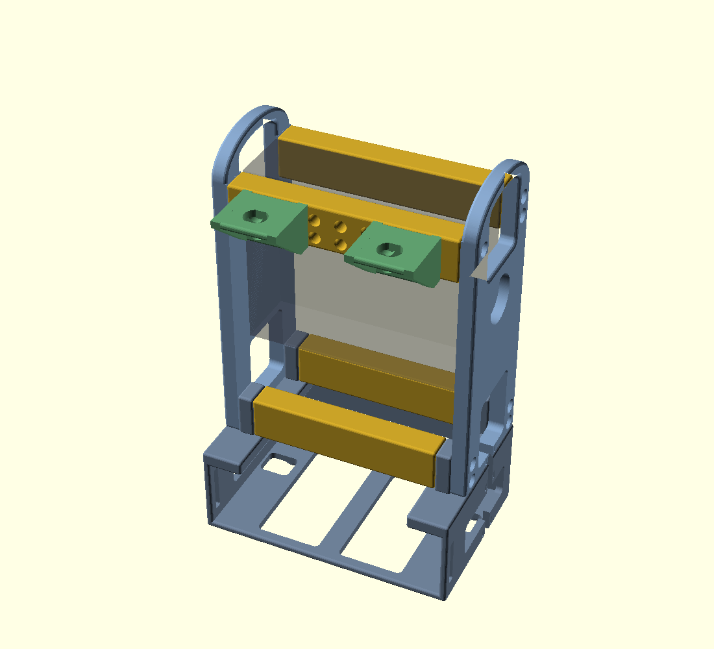 | 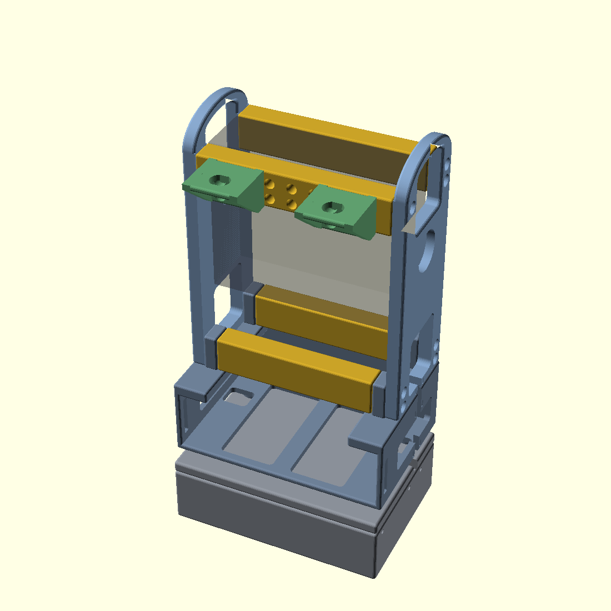 |

There is **no base plate.** The battery box's four tabs stand in the ends of the two
bottom crossbeams and take the same bolts that hold the frame together (§2.9), which
is why those beams are visibly shorter than the top pair. The compute module, when
fitted, hangs beneath the battery box on its four feet.

Key files and directories

- Source: `cad/manpack_frame.scad`
- Meshes: `stl/`
- Renders: `img/`

---

## 1. What the reference STL actually is

The reference was measured directly (voxel probing at 1 mm, exact plane
extraction, and 2D section polygons) rather than eyeballed. It is a single
watertight body, **140.75 × 85.00 × 228.00 mm**, 226.9 cm³:

| Feature           | Measured geometry                                                                                                                                                                                                                               |
| ----------------- | ----------------------------------------------------------------------------------------------------------------------------------------------------------------------------------------------------------------------------------------------- |
| Side rails ×2     | flat plates **8.25 mm** thick, 60 mm deep, **228 mm** tall                                                                                                                                                                                      |
| Inner clear span  | **124.25 mm** (this is the radio width datum)                                                                                                                                                                                                   |
| Radio mount       | **one Ø5.000 through-hole per rail**, at the radio bay's exact centre in both Y and Z, with a **Ø26.468 × 5.5 mm** flat-bottomed recess on the outer face                                                                                       |
| Crossbeams ×2     | **7 (deep) × 4 (tall) mm**, back face only, at Z 45.365–49.365 and Z 191.999–195.999, spanning the full 124.25 mm                                                                                                                               |
| Back stiffener ×2 | 4 mm fin at Y 73–77, inboard of each rail, tying the two beams                                                                                                                                                                                  |
| Antenna ears ×2   | 3.75 mm pad, **Ø12.468** hole, 25 mm forward cantilever, hole 12.66 mm back from the pad tip and 11.375 mm inboard of the rail's inner face; diagonal gusset **confined to the 8.25 mm rail plane**; the two ears tied by a 4.78 × 3.75 mm rail |
| Handles           | integral loop in the top of each rail: **33.75 × 18.5 mm** hand aperture, **11.5 mm** grip bar                                                                                                                                                  |
| Feet              | integral bottom arch: 40 × 40 mm aperture, 3.19 mm ground pad                                                                                                                                                                                   |

**228 mm tall is why it cannot print on a Mini.** A 60 × 228 rectangle will not
fit a 180 × 180 square at any rotation ((228 + 60)/√2 = 203.6 > 180).

Two measurements drove real design decisions and are worth calling out:

- The radio mount is a **single M5 bolt per side**, dead centre of the bay. That
  is the standard mobile-radio trunnion mount — the radio hangs on its own
  threaded side holes. It is reproduced exactly.
- The antenna gusset lives **inside the rail plane** (X 0–8.25), which is
  precisely what leaves the bore under the Ø12.468 hole clear. At X ≥ 9 there is
  only the 3.75 mm pad. Getting this wrong blocks the antenna shank.

---

## 2. Part breakdown

| #   | Part                       | Qty   | Print size (mm)   | Solid vol | Inserts |
| --- | -------------------------- | ----- | ----------------- | --------- | ------- |
| 1   | `side_panel`               | 2     | 175 × 70 × 9      | 71.8 cm³  | —       |
| 2a  | `crossbeam_top_front_dual` | 1\*\* | 124.25 × 16 × 24  | 44.5 cm³  | 12      |
| 2b  | `crossbeam_top_front_triple` | 1\*\* | 124.25 × 16 × 24  | 43.5 cm³  | 16      |
| 2c  | `crossbeam_top_front_grid` | 1\*\* | 124.25 × 16 × 24  | 43.1 cm³  | 18      |
| 3   | `crossbeam_top_back`       | 1     | 124.25 × 16 × 24  | 46.3 cm³  | 4       |
| 4a  | `crossbeam_bottom_front`   | 1\*\*\*\* | **106.25** × 16 × 24  | 39.5 cm³  | 4       |
| 4b  | `crossbeam_bottom_front_rail` | 1\*\*\*\* | **106.25** × 16 × 24  | 36.2 cm³  | 18      |
| 5   | `crossbeam_bottom_back`    | 1     | **106.25** × 16 × 24  | 39.5 cm³  | 4       |
| 7   | `antenna_mount_bnc`        | 2\*   | 35 × 24 × 33      | 10.9 cm³  | —       |
| 8   | `antenna_mount_so239`      | 2\*   | 35 × 24 × 38      | 11.6 cm³  | —       |
| 10  | `battery_box`              | **1, not optional** | 143 × 83.8 × 94.8 | 116.8 cm³ | 4 + tabs |
| 12a | `compute_box_inline`       | 1\*\*\* | 143 × 100 × 39 | 107.8 cm³ | 4 + 2 M3 |
| 12b | `compute_box_inline_cover` | 1\*\*\* | 143 × 100 × 18 | 118.1 cm³ | 6 M3    |

Numbers track the §2 subsections below, so 6 and 9 are absent as *parts*: §2.6 is
the handle, now part of the side panel, and §2.9 is the bottom joint, which is
made by the battery box's tabs rather than by a part of its own.

\*\* Parts 2a–2c are alternatives — the three top-front layouts (§2.11). Print one.
`_dual` is the original and is bit-identical to it, so an existing beam still fits.

\* Parts 7 and 8 are alternatives — print **two of whichever connector you use**,
not both. They share an identical leg, rib and bolt pattern, so they are
interchangeable on the same crossbeam without touching anything else.

\*\*\* Part 12a is the only compute module, and it is optional. 12b is its cover and
is not optional if you fit the box.

**The battery box is now a structural member, not an accessory.** Its tabs are
what join the bottom crossbeams to the side panels (§2.9); without it the beams
stop 9 mm short of each panel and the frame has no bottom bracing. It cannot be
left off, and it cannot be removed in the field without opening the frame up.

It is also **the only thing that carries frame load.** Everything else in the stack
hangs beneath it on its four Ø16 feet, `compute_box_inline` included — so the whole
bottom bracing stays inside this box's 8 mm flange rather than running through any
module below it.

\*\*\*\* Parts 4a and 4b are alternatives. `_rail` adds a row of accessory columns to
the bottom beam's front face, which existed to hang a front-mounted compute box off.
**With the front boxes gone it has no user** — print the plain one, which is
bit-identical to the beam already printed. `_rail` is kept in the source for anyone
wanting a front accessory, but nothing in this design bolts to it.

#### Which variants do I actually print?

Seven of the entries above are alternates, not additions. The minimum working
frame is **11 parts** — and the battery box is one of them, because its tabs are
the bottom joint (§2.9). Everything else is opt-in.

| Choose | Options | Pick this if… |
| ------ | ------- | ------------- |
| Top-front beam | `_dual` / `_triple` / `_grid` | `_dual` if you only want two antenna mounts and already own the printed beam — it is bit-identical. `_grid` if you want the accessory rail. `_triple` for three stations. |
| Bottom-front beam | plain / `_rail` | **The plain one.** `_rail` has no user now that the front compute boxes are gone; it is kept only for a future front accessory. |
| Handles | — | No choice: the handle is integral to the side panel (§2.6). |
| Antenna mounts ×2 | `_bnc` / `_so239` | Two of whichever connector you use — never one of each. Same leg and bolt pattern, so you can swap later. |
| Compute module | `_inline` / none | One option. **`_inline` hangs under the battery box** on its four feet and needs nothing else changed. Most builds need none of it. |

Largest part is the side panel at 175 mm — **5 mm of bed margin**, the tightest
in the project. All meshes verified
watertight, single-shell, and bed-legal.

Solid volume is 730 cm³ for one of each of the thirteen part files. A full
**11-piece** build (BNC mounts, battery box, no compute module) is **451 cm³** with
the grid beam, 451 with the triple, 452 with the dual. Add **226 cm³** for the
inline compute module — it hangs below the battery box and changes nothing else in
the build.

That is **106 cm³ lighter than before the tab joint**, which was a 12-piece build
at 557 cm³: the base plate's 113 cm³ gone outright, less what the battery box put
back on in tabs, plus 20 cm³ off the three shortened bottom beams. It is also one
part fewer and 25 mm shorter. The handle adds nothing separately; it is part of the
side panel.

Actual filament use is far lower — the beams are small enough in section that
the slicer's perimeters and infill dominate. The side panel and the battery box are
both already windowed, so there is no easy mass left to take out.

### 1 — `side_panel` ×2

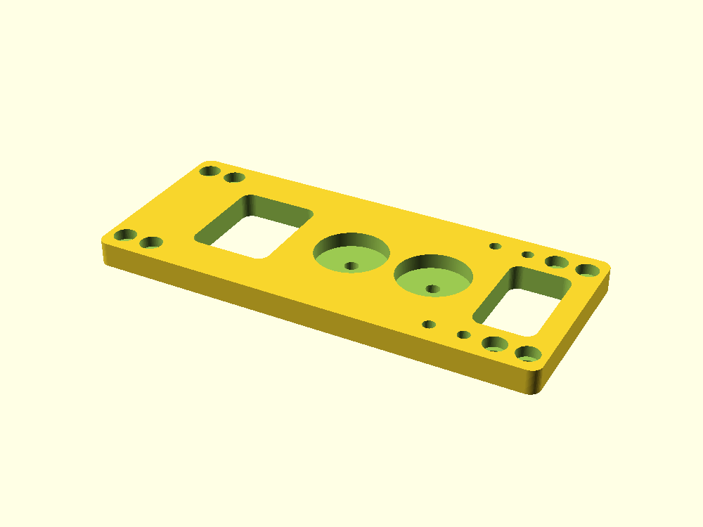

A flat plate spanning **Z 25 to 200** — the frame's side *and* its carrying
handle in one part (§2.6). It carries the ported radio mount, through-holes for the
four crossbeams, and nothing else: no feet, no antenna mount, and **no heat-set
inserts at all**. Every insert lives in the mating part, which is what keeps this a
simple flat print.

- Radio mount: **two** Ø5.000 through-holes at Y 35, each with the Ø26.468 × 5.5 mm
  outer-face recess, verbatim from the reference. **Z 98** is the ported reference
  set by the frame top, so it does not move if the bay height changes. There used
  to be a second pair 31 mm lower; see §2.13.
- **8 × M4 clearance holes**, heads counterbored flush in the **outer** face, into
  the four crossbeams — two rows per beam, at global Z 31.5 / 42.5 and
  162.5 / 173.5.
- **One lightening window**, `win_a` at Z 32–74, plus the grip aperture at
  Z 150–193 which absorbed the old upper window. Set `panel_windows = false` for a
  plain plate.
- No handle bolts: the handle is the same part.

### 2–5 — `crossbeam` ×4

Four beams instead of the reference's two, front and back at top and bottom,
forming a closed box. Each spans the full 124.25 mm between the panel inner
faces, with **two axial M4 inserts per end** stacked vertically so the joint
cannot rotate about a single bolt.

Extra insert faces by position:

- `crossbeam_top_front_dual` / `_triple` / `_grid` — 8, 12 or 14 inserts in the
  **front face**, the accessory stations (§2.11).
- `crossbeam_bottom_front_rail` — the same beam plus 7 accessory columns in its
  front face, for a tall front module.

  
- `crossbeam_bottom_front` / `_bottom_back` — **4 each, ends only.** They once
  carried two more in their undersides for the base plate; those went when the
  plate did, and nothing bolts up into these beams any more.

### 6 — the handle, now integral to the side panel

**There is no separate handle part.** The arch is the same 9 mm plate as the panel,
continuing up past the frame top. That removes the 12 mm lap on each outer face:

| | separate handle | integral |
| --- | --- | --- |
| Assembled width | 166.25 mm | **142.25 mm** |
| Parts per side | 2 | **1** |
| M4 bolts, panels + handles | 24 | **16** (8 per panel, two rows per beam) |
| Handle inserts | 8 | **none** |

**The part is 175 × 70 × 9, and making it fit the bed drove one frame change.**
Panel plus handle is naturally 184 mm — Z 16 at the base plate up to Z 200 at the
grip — which fits no orientation on a 180 bed: flat 184 × 70, on edge 184 × 9,
upright it needs 184 mm of Z, and rotated flat the best case is 179.6 mm at exactly
45°, leaving 0.2 mm a side.

Neither end can give. The grip aperture floor cannot drop below the radio top at
**Z 179.5** — lower than that and your fingers are inside the radio rather than
around a bar — so the 20 mm of grip is fixed. And the panel must reach **Z 16** to
cover the bottom crossbeams and pick up their bolts.

**The 9 mm came out of the dead space under the radio instead.** Thickening the
base plate (`base_t` 8 → 17) raises the bottom crossbeams from Z 16–40 to
**Z 25–49**, and the panel starts where the beams start. `bay_h` drops 116 → 107 to
keep the top beams exactly where they were.

| | before | now |
| --- | --- | --- |
| Panel starts at | Z 16 | **Z 25** |
| Bottom beams | Z 16–40 | **Z 25–49** |
| Part height | 184 mm | **175 mm**, 5 mm of margin |
| Dead space under the radio | 38.5 mm | 29.5 mm — still room for the DC harness |

> **The base plate has since been removed entirely (§2.9), but `z_frame` stays at
> 25.** It is now a bare datum with nothing underneath it rather than a derived
> height, and that is deliberate: moving it would move the panels' bolt rows and
> force a reprint of the two slowest parts on the plate. The battery box's top face
> simply comes up to meet it.

**Nothing above the bay moves.** Frame height, top crossbeams, accessory rail,
antenna mounts, compute-box mounting and the radio's own M5 holes at Z 98 / 129 are
all exactly where they were. At the time, the only reprint was the base plate. All
four crossbeams keep their original insert rows — 22.5 / 33.5 relative to their own
bodies, landing at global 31.5 / 42.5 once raised — and the panel's holes measure
to the same figures.

While doing this the radio's mounting height was restated as *"face 0.5 mm below
the frame top"* rather than *"centred in the bay"*. Both give today's numbers, but
the old form only landed correctly by coincidence and would have moved the radio
the moment `bay_h` changed.

**The grip bar is now 7 × 9 mm rather than 7 × 12**, because it lies in the panel's
own thickness. That is a thinner edge to carry on. If it reads as uncomfortable the
fix is a local thickening at the bar only, which would cost width just at the very
top rather than down the whole side.

**The top cross piece is gone and `win_b` with it.** The grip aperture now runs
from **Z 150 to 193** as a single opening, so the band of panel that used to tie
the front and back legs together above the top crossbeam screws no longer exists —
the arch does that job. The screws never constrained it: they sit at Y 8 / 62 while
the aperture spans Y 18–52, so the two never overlapped.

**The bottom cutout matches the arch.** `win_a` runs Z 32–74, leaving a **7.00 mm**
band along the bottom edge against the arch's **7.05 mm** at its apex. It can go
that low because Y 16–54 is the gap *between* the two bottom crossbeams, so it
never opens onto a beam, and the bolt counterbores measure Y 3.95–12.05, leaving
3.95 mm to the window edge.

**Edges are rounded 2 mm on the outer face and the whole perimeter; the inner face
is left dead flat.** That split is forced: the crossbeam footprints run right out
to Y 0 and Y 70, so the face they seat on cannot be softened. Measured — the inner
face reaches Y 0.04 / 69.96 at all four bolt rows and at the top beam's upper edge.

The rounding runs over the **whole part in one operation**, not just the arch. A
first attempt filleted the arch alone and left a 2 mm ledge straight across the
part at Z 180 — exactly where a hand wraps. Continuous, the outer edge measures
Y 0.98 at Z 170 / 178 / 179 and 1.04 at Z 181: a 0.06 mm difference where there had
been 2 mm.

Above Z 180 the **inner** face is rounded as well, since no beam seats there, so
the grip is soft on both edges — the bar underside measures 193.98 at each face and
193.04 across a 5 mm flat. The radius is 2 mm rather than the old bolt-on handle's
2.5, because the bar is 9 mm thick now instead of 12.

**This part takes ~2 m 40 s to export** — two minkowski passes over a 175 mm
profile. Everything else in the project is under a second.

The arch is not the reference's squared loop — everything above the frame line was
reworked after the built pack showed the original reading as two blocky slabs.

|                    | reference / v1             | now                           |
| ------------------ | -------------------------- | ----------------------------- |
| Proud of the frame | 30 mm                      | **20 mm**                     |
| Overall height     | 78 mm                      | **68 mm**                     |
| Hand aperture      | 33.75 × 18.5               | **40 × 13**                   |
| Grip bar section   | 11.5 × 12 mm, square edges | **7 × 9 mm, fully radiused**  |
| Arch volume        | 37.6 cm³ as a separate part | **~22.6 cm³, now inside the panel** |

Three changes, each aimed at a stated problem:

- **10 mm off the height.** This is the whole pack's tallest point, so it comes
  straight off the assembled envelope: 210 → **200 mm**.
- **Shoulders tapered.** Above the panel line the outline is a half-ellipse
  springing from the panel top, so the handle stops carrying its full 70 mm depth
  up to a flat square top. That is what removes the bulk near the top.
- **Everything radiused except the inner face.** The panel is filleted **2 mm**
  over its whole outline, then sliced flat at the inner face so the plane the
  crossbeams seat on stays dead flat and full width. (The 2.5 mm figure quoted
  elsewhere belonged to the old bolt-on handle, which was 12 mm thick; at 9 mm the
  radius had to come down.)

**The trade:** the aperture loses 5.5 mm of height. It is widened 33.75 → 40 mm to
claw some back, but it is now a two-finger lifting loop rather than a three-finger
grip. If that reads as too tight in the hand, `grip_ap_h` and `grip_bar_h` are the
two numbers — they sum to whatever you want proud of the frame, and the bar cannot
go below ~6 mm because the fillet construction needs the profile to survive an
`offset(-2.5)`.

**The arch is constant thickness, and that was a correction.** The first cut of
this rework gave the aperture a flat top under a curved outer arch. A flat line
under a curve necessarily pinches at the ends: the band waisted to **5.29 mm at
Y 21 and Y 49** against 7.00 mm at the apex — a 24 % notch sitting exactly where
the arch meets the shoulder. My own scan showed it and I let it pass because the
bending moment is low there, which was the wrong call: a waist at a joint is a
stress raiser whatever the nominal moment. The aperture's top now follows the
outer arch offset inward by `grip_bar_h`, so the band holds 7.0–7.25 mm across the
span and _grows_ to 8.25 mm into the shoulders.

| at the arch/shoulder joint       | waisted  | constant band |
| -------------------------------- | -------- | ------------- |
| minimum depth                    | 5.00 mm  | **7.00 mm**   |
| section modulus                  | 46.4 mm³ | **94.3 mm³**  |
| stress, one-handed 6× drop-catch | 7.06 MPa | **3.47 MPa**  |
| safety factor (PLA)              | 7.1      | **14.4**      |


### 7–8 — `antenna_mount_bnc` / `antenna_mount_so239`

| BNC | SO-239 |
| --- | ------ |
| 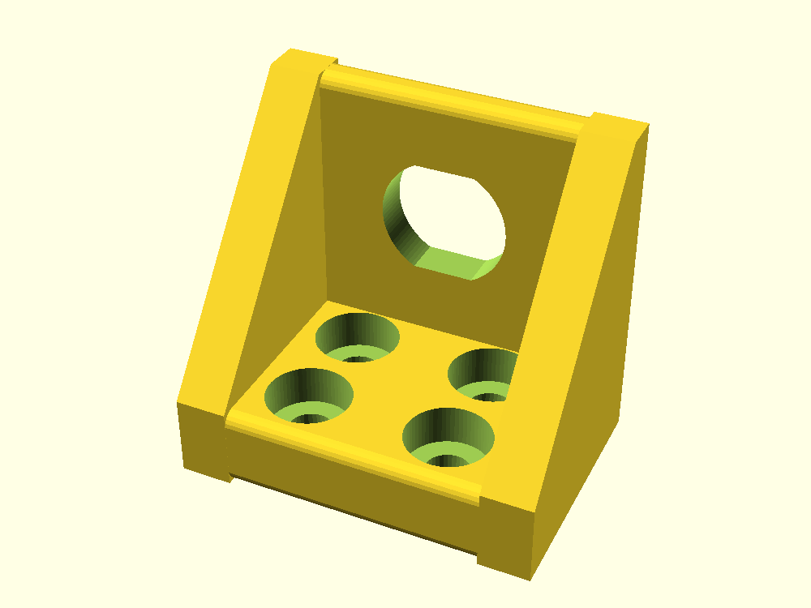 | 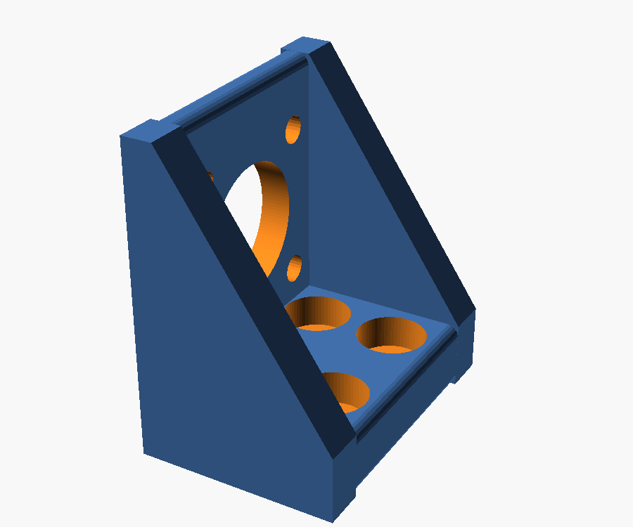 |

The reference ear, made modular and offered in two connector variants. Both share
an identical leg, gusset ribs and M4 bolt pattern, so either bolts to the same
inserts in the top-front crossbeam — you can swap connector type later without
reprinting anything else.

|                       | `antenna_mount_bnc`     | `antenna_mount_so239`                      |
| --------------------- | ----------------------- | ------------------------------------------ |
| Connector             | BNC bulkhead            | SO-239 / UHF female, 4-hole flange         |
| Bore                  | **Ø12.468 mm** [PORTED] | **Ø15.88 mm** (0.625")                     |
| Flange screws         | —                       | 4 × Ø3.4 on a **17.98 mm** square (0.708") |
| Forward reach         | 25 mm [PORTED]          | 30 mm                                      |
| Bore setback from tip | 12.66 mm [PORTED]       | 17 mm                                      |
| Print size            | 35 × 24 × 33 mm         | 35 × 24 × 38 mm                            |

The BNC variant is the reference connector carried over verbatim — the reference
STL is itself titled a _BNC bulkhead_ antenna mount, which is what the Ø12.468
bore is for. The SO-239 variant reaches 30 mm rather than 25 mm and sets its bore
17 mm back from the tip; both were needed so the rear pair of flange screws clears
the bracket's own leg and the front pair keeps material at the pad tip.

**Both variants are a single symmetric part used twice.** An earlier revision
needed a mirrored left/right pair because the bolt columns were offset to dodge
the crossbeam's end-insert pockets. Insetting the whole bracket 6 mm from the
panel inner face solves that instead, which lets the bolts sit symmetrically
between the ribs and removes the handedness.

Verified: bore clear below each pad for the connector body, all four flange-screw
nut positions clear, and zero enclosed voids in either part.

#### Rework history (v2)

The first version of this bracket had three defects, all found on a printed part:

1. **One entire bolt column was unusable.** The ribs were 8 mm thick at the
   bracket edges and the bolt columns sat at 14 and 30 mm across a 35 mm width —
   so the 30 mm column landed inside the right-hand rib. Worse than overlapping:
   because the rib spans the full pad depth, up to **19.75 mm of solid rib sat in
   front of the counterbore mouth**, sealing both holes into enclosed internal
   voids with no tool access. The printed part showed them as blind dimples where
   the slicer had bridged over a sealed cavity.
2. **The ribs were too wide**, leaving no clear span to put the bolts in.
3. **The ribs were not actually joined to the pad.** The rib profile stopped
   exactly at the pad's underside, so the two shared a plane and nothing more —
   zero volumetric overlap. Combined with the fillet on the pad's edge, that left
   a real groove along the top of each rib, visible on the print.

Fixes: ribs thinned 8 → **5 mm**, bolts moved to **10.5 / 24.5 mm** in the open
span between them, the whole bracket inset 6 mm so those symmetric columns still
clear the crossbeam's end inserts, and the rib profile carried up through the
pad's full thickness so it merges rather than touches. Consequence: antenna bore
spacing drops from 89.25 mm to **77.25 mm**.

### 9 — the bottom joint: tabs, not a plate

There is no base plate. The bottom crossbeams join the side panels **through the
battery box's tabs**, so the same bolts that hold the frame together also capture
the module:

```
panel  |  tab  |            beam            |  tab  |  panel
X 0..9 | 9..18 |        18 .. 124.25        |  ..133.25  ..142.25
       └─ M4 × 20 ─────────────► insert in the beam end
```

Each bottom beam loses **2 × 9 = 18 mm**, going from 124.25 to **106.25 mm**, and
the eight bolts on the two bottom rows (Z 31.5 and 42.5) grow from M4 × 12 to
**M4 × 20**.

**What this buys.** The plate was a whole part, 113 cm³ and 25 mm of height, doing
one job: getting from the bottom crossbeams to a module underneath. The tabs do it
with no part at all. The battery box loses its need for a plate above it, and the
stack loses 25 mm.

**What it costs, and it is not small: the frame no longer closes without the
battery box.** The bottom beams cannot reach the panels on their own. The box is a
structural member — it carries the bottom bracing — so it cannot be left off, and
taking it out in the field opens the bottom of the frame.

**The frame's own geometry is untouched.** `z_frame` stays at **25** as a pure
datum even though nothing sits below it any more — it is now a literal in the
source rather than `foot_h + base_t`. Moving it would move the panels' bolt rows,
so it keeps the value the plate gave it, and neither side panel ever needed
reprinting for this.

> **`base_plate` has been deleted** — module, export, STL and render. Its history
> is in the git log up to `d18de92` if the old arrangement is ever wanted.

### 10 — `battery_box`

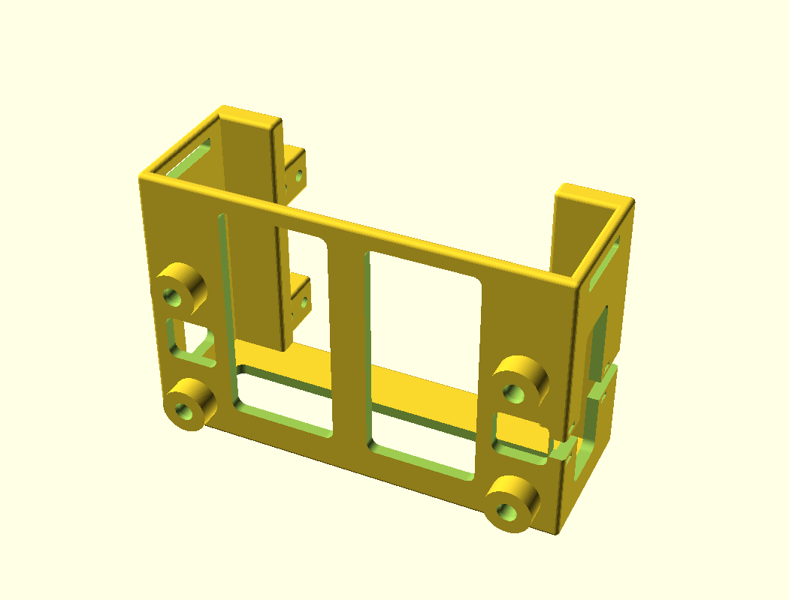

An **open frame** — not a box — for a **TalentCell LF4011 12 V 6 Ah LiFePO4**
pack lying flat on its largest face (**132 × 75.8 × 37.3 mm**, measured).

**It joins the frame on four tabs**, two per side, each standing in the space a
bottom crossbeam's end used to occupy. Measured: **X 9.02–17.98 and
124.28–133.22**, **Z 25–49** flush with the beam tops, over the beams' own Y bands
of **0–16 and 54–70**.

Four tabs and not two full-depth ones, because **the radio occupies Y 17–53 at
that height** — a tab running the full depth would foul it. That is also why the
front pair cannot be made self-supporting and **print on support**: the space a
gusset would need is the radio bay. See §8 item 14 for the full reasoning and §9
for the slicer setting. They rise off the top
flange, which already reaches 19.5 mm inboard of each end wall (to X 23.125 and
119.5), so both footprints sit on solid material.

The eight bolts run panel → tab → beam insert: 4 mm of counterbore, 5 mm of
remaining panel, 9 mm of tab, then **6 mm of thread engagement** on an
**M4 × 20**. That is one millimetre less engagement than everywhere else on the
frame — still 1.5 × D, the normal minimum for M4 in a brass insert, and the insert
is 8 mm long. M4 × 25 is *not* an alternative: the pocket is 9 mm deep and 25 would
need 11, so it bottoms out before it clamps.

Structure: two end walls, a back wall and a floor, every one of them windowed,
plus a centre rib under the pack. The front is open so the pack slides in, and
the top is open between the flanges. **Its top face is now the frame's floor** —
the panels and both bottom beams land on it — which is the other job the base
plate used to do. The pack's lead goes straight up past the flange into the bay.

Retention is by geometry, not just the strap. A **top flange runs the full length
of each end wall**, reaching 19.5 mm inboard so it laps 18 mm over each of the
pack's long edges. The pack can lift 2.5 mm before it meets them. The flange runs
the full length rather than being four pads because the bolts sit 10.4 mm inboard
of the walls — too far to cantilever cleanly — and a full-width cross rail would
have been a 135 mm bridge. A hook-and-loop strap through the four slots crosses
the 13.5 mm clear zone in front of the pack and stops it sliding out.

|                  |                                                                      |
| ---------------- | -------------------------------------------------------------------- |
| Cavity           | 135 × 90.8 × 38.8 mm                                                 |
| Outer            | 143 × 94.8 × 51.8 mm, reaching 24.8 mm forward                       |
| Behind the frame | nothing — the back wall is flush with the frame back                 |
| Bolts            | 8 × M4 × 20 through its own tabs into the bottom crossbeams (§2.9)   |
| Print pose       | back wall down, 143 × 83.8 mm footprint, 94.8 tall                   |
| Stacking feet    | 4 × Ø16 × 8 mm with M4 inserts, at the same X 14 / 128.25, Y 12 / 58 |
| Stack pitch      | 59.8 mm per module                                                   |

**It presents the same interface on its underside that it consumes on top.** Four
Ø16 × 8 mm feet with M4 inserts sit at the same X 14 / 128.25, Y 12 / 58, so a
further module bolts under the battery frame on the same pattern the frame itself
once used upward — `compute_box_inline` hangs from exactly these four. Verified by
stacking a second copy at the 59.8 mm pitch with zero interference and all four
bolts clean. Cables reach a module below
through the floor windows, so no extra pass-through was needed.

The feet are plain cylinders rather than ramped. A 45° print ramp would have to
run toward +Y, which is the downward direction in the print pose, and for the
rear pair at Y 58 that would have reached Y 74 — past the back face, breaking
both the "nothing behind the wearer" rule and the print pose's bed datum. Left
unramped they cost about 18 mm² of unsupported area each, which is what any
horizontal boss costs. The floor windows were reshaped around all four pads.

Windowing still nearly halves it: 116.8 cm³ — tabs and feet included — against
~190 cm³ for the equivalent closed box.

### 11 — the top-front crossbeam: three layouts

| `_dual` | `_triple` | `_grid` |
| --- | --- | --- |
|  |  | 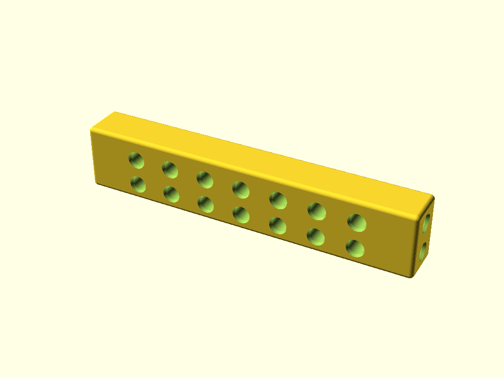 |

All three use the **same station pattern** — a copy of the antenna mount's own
four bolts, two M4 columns 14 mm apart and two rows 10 mm apart at Z 162 / 172.
They differ only in how many stations and where, so the antenna mounts are
unchanged and interchangeable between them.

| | `_dual` | `_triple` | `_grid` |
| --- | --- | --- | --- |
| Bolt columns | 4 | 6 | **7, uniform** |
| Column spacing | 14 / 63 / 14 | 14 / 24 / 14 / 24 / 14 | **14 mm throughout** |
| Front-face inserts | 8 | 12 | 14 |
| Mounting positions | 2 fixed | 3 fixed | **6, overlapping at 14 mm** |
| Wider bolt spans | no | no | **yes — 28, 42, 56, 70, 84 mm** |
| Outer bore spacing | 77.25 mm | 76 mm | 70 mm |
| **35 mm brackets at once** | 2 | **3** | 2 |
| Volume | 44.5 cm³ | 43.5 cm³ | 43.1 cm³ |

`_dual` is the original: one station per antenna mount, nothing else. It is
**bit-identical to the beam already printed**, so it is not a reprint.

`_triple` is the one to pick if you want **three full-width mounts at once** —
three SO-239 brackets sit side by side with a 3 mm gap, spanning X 15.625 to
126.625. It is the only layout that fits three, because its 38 mm pitch exceeds
the 35 mm bracket width while 26 mm does not.

`_grid` is a **uniform 14 mm column grid**, not a set of fixed stations. Because
the pitch equals the antenna mount's own bolt spacing, *every adjacent pair of
columns is a station* — six positions at 14 mm increments rather than a few fixed
ones. It also lets a wider accessory span three, five or all seven columns for a
28 / 56 / 84 mm bolt base, which the fixed layouts cannot offer at all: good for a
Le Frite compute box or a DC charge-port plate that wants a broad, stiff footprint.

The model asserts `grid_pitch == 2 * rail_bolt_dx`, because the grid only works as
a grid while its pitch matches the mount's bolt spacing.

An earlier revision of this layout used four fixed stations at 26 mm, which gave
columns alternating 14 / 12 mm — the stations were equally spaced but the holes
were not. Four stations *cannot* be made uniform: that needs a 28 mm pitch, which
overruns the beam's usable bolt span by 1.7 mm at each end and drives the outer
pockets into its own end inserts. Dropping to a 7-column grid fits with 5.3 mm to
spare and gives more positions, not fewer.

**Four full-width mounts are not possible on any layout.** Their bolts must lie
within X 23.85–118.40 (94.55 mm) to stay 3 mm clear of the beam's own end-insert
pockets, and four brackets packed edge to edge need 119 mm of bolt span. Shrinking
the bracket to the ≤26.85 mm that would allow it leaves 2.33 mm per gusset rib,
down from 5 mm — and those ribs carry the cantilevered pad and the antenna's
bending load.

Every layout keeps its outermost pocket at least 3 mm clear of the crossbeam's
own end-insert pockets, which occupy the first and last 9 mm of the span; the
model asserts it. `_dual` and `_triple` have ~5.3 mm of material there, `_grid`
5.3 mm.

**What can coexist on `_grid`.** Positions run every 14 mm — 36.125, 50.125,
64.125, 78.125, 92.125, 106.125 — so what fits together depends only on how many
positions apart you go. Two accessories clash if their half-widths sum to more
than the gap:

| positions apart | gap | two 35 mm items | 35 mm + a 22 mm one | two 22 mm items |
| --- | --- | --- | --- | --- |
| 1 | 14 mm | no | no | no |
| 2 | 28 mm | no | no | **yes** |
| 3 | 42 mm | **yes** | **yes** | **yes** |
| 4–5 | 56–70 mm | **yes** | **yes** | **yes** |

The narrowest an accessory can physically be is about 22 mm — the 14 mm bolt span
plus two Ø8.2 counterbores. So in practice:

- **two** 35 mm antenna mounts, three positions apart or more (1&4 gives 42 mm,
  1&6 gives 70 mm)
- **three** minimum-width items at positions 1, 3, 5
- or a mix: an antenna at position 1 leaves 4, 5 and 6 open for anything

Four full-width mounts remain impossible on any layout — their bolts would need
119 mm of span against the 94.55 mm available. `_triple` is still the only layout
that fits three 35 mm brackets, because its 38 mm pitch exceeds the bracket width
outright.

Set `top_front` to `"dual"`, `"triple"` or `"grid"` to pick which one the assembly views build
with; it also moves the antenna brackets to that layout's outer stations.

---

### 12 — `compute_box_inline`

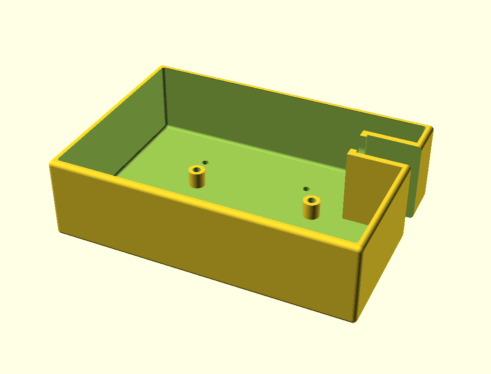

> **Both front-mounted compute boxes have been deleted** — the deep
> `compute_box_front` and the flatter `compute_box_front_slim`, with their covers,
> modules, exports, STLs and renders. `compute_box_inline`, which hangs under the
> battery box, is the only compute module left. History up to `f622eba`.

Carries a **Libre Computer La Frite** (AML-S805X-AC, 64 × 56 mm, M3 mounting on
**58.75 × 49.5**) with its 128 GB eMMC, plus a CM108/CM119 USB audio
fob, a PTT board and a GPS module, for onboard logging over WiFi to a tablet.

**Only the SBC and the converter get dedicated mounts**, because they are the only
two whose footprints are fixed and known. Everything else is zip-tied. Swapping a
CM108 for a CM119, or changing the PTT board entirely, costs nothing.

There is **no M3 hole grid**. An earlier revision had one at 10 mm pitch; it never
earned its place, and the cavity is big enough that loose devices are better
zip-tied than bolted to whichever hole happens to line up. Ventilation is
whatever the openings give: the cover is solid, so the box breathes only through
its grommet and the gap around the leads. That is fine for an idling SBC in a
padded bag and should be revisited if anything warm goes in.

**The mounting pattern is now measured, not published — and the published figure
was wrong.** M3 was confirmed early by test-fitting a bolt. The pitch was carried
as the Raspberry Pi Model A figure of 58 × 49.5 until a **printed test fit** showed
it short: with the pair nearest the converter seated, the pair at the USB end
missed by 0.5–1 mm. Calipers on the board put that dimension at **58.5–59 mm**, so
the model now uses **58.75**, the midpoint. 49.5 fitted and is unchanged.

Residual uncertainty is ±0.25 mm against roughly ±0.1 mm of slack from an M3 in the
board's ~3.2 mm hole, so **start all four screws before tightening any of them** —
the board will pull into place across four fixings but binds if one corner is fully
seated first. That is most likely what made the USB-end pair read as clearly wrong
rather than merely tight. If a later measurement lands nearer one end of the range,
`sbc_hx` is the single number to move.

This is the second assumption in the project that only a printed part could
retire — the first was the antenna bracket's sealed counterbores.

|                   | `compute_box_inline`               |
| ----------------- | ---------------------------------- |
| Mounts to         | the battery box's four feet, hanging below it |
| Outer, tray       | 143 × 100 × **39 mm**              |
| Outer, with cover | 143 × 100 × **47 mm**              |
| SBC orientation   | flat on the floor, long axis **across** the tray |
| Converter         | flat on the floor, **behind** the board |
| Opens             | **upward**, cover off              |
| Cover             | `compute_box_inline_cover`, 118.1 cm³ |
| Volume, tray      | 107.8 cm³                          |

#### The tray and its cover

| plan (cover off) | cover |
| --- | --- |
| 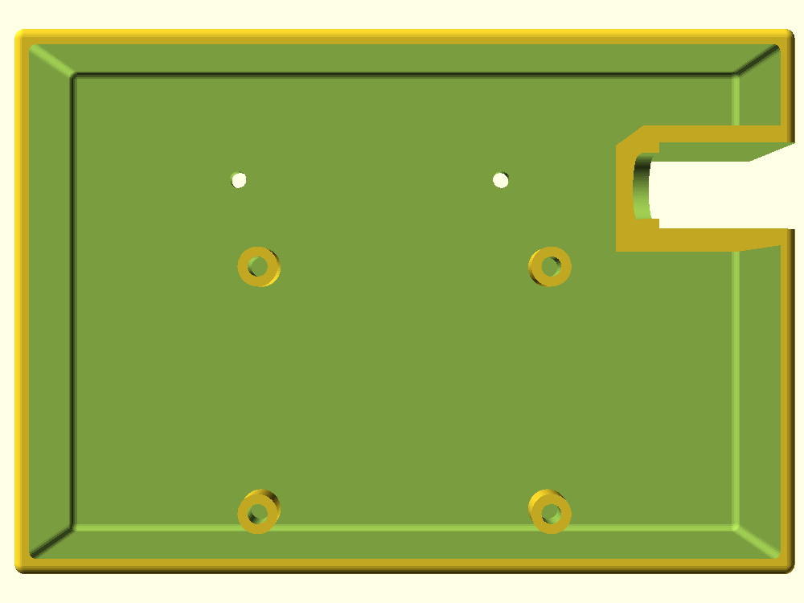 | 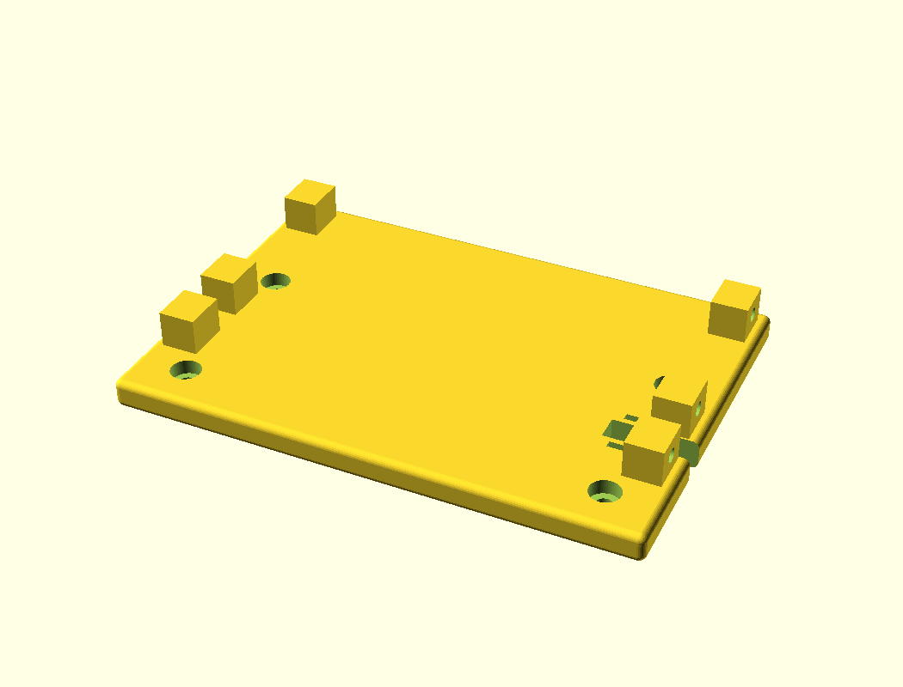 |

**It sits at the bottom of the stack and carries no frame load at all.** It hangs
from the battery box's four Ø16 feet on **4 × M4 × 12** — the same joint the battery
box used to make upward to the base plate, one level lower. Its cover takes those
four bolts, counterbored on the *underside* so the head sits inside the box; 4 mm of
remaining cover plus 7 mm of engagement keeps it on M4 × 12.

**An earlier revision put the frame's bottom tabs on this tray instead**, with the
box directly under the frame and the battery below it. That ran the frame's entire
bottom bracing through four 9 × 16 tab columns standing on 45° wedges rising off the
tray's **3 mm cavity walls** — against the battery box's 8 mm flange, which is what
carries them now. Cheap in cavity terms (about 7 cm³, and nothing at the board's
level) but the wrong load path, so it was abandoned. Under the battery instead, this
box only has to hold itself up: roughly 0.13 kg, about 4 N over four bolts at the
README's 3× snatch.

Stack pitch measures **54.99 mm** against the 55 mm budget — 39 mm of tray plus an
8 mm cover, sitting under the battery box's 8 mm feet:

| band | Z (frame) | height |
| ---- | --------- | ------ |
| *(battery box feet above)* | −34.8 … −26.8 | 8 mm |
| cover | −42.8 … −34.8 | 8 mm |
| cavity | −77.8 … −42.8 | **35 mm** |
| floor | −81.8 … −77.8 | 4 mm |

**It has no feet of its own** — it is the bottom of the stack, so the underside is
flat and sits on the ground. That also means it **prints floor-down with no
support**: swept at 0.4 mm, the only area gains anywhere are the first 2 mm of
`rbox` corner rounding. The old feet-down pose put ~13 000 mm² of floor in mid-air.

The cavity's 35 mm against 24.6 mm of contents (8 mm standoff + 1.6 board + an
assumed 15 mm of component height) leaves **10.4 mm of headroom**. That number is
only as good as the 15 mm assumption — see §8.

**Depth is 100 mm, 5.2 mm deeper than the battery box, and that 5.2 mm is what
makes the box work.** The board lies with its long axis *across* the tray, because
its connectors are on both 56 mm edges — USB one end, Ethernet/HDMI the other — and
64 of board plus 20 of clearance at each end is 104 mm against only 88.8 of depth.
Across the tray it fits in 137. That settles the board, but not the converter: put
it *beside* the board and it eats 35 mm of the X band, leaving 38 mm to split
between the two connector zones — about 19 mm each, which is not enough for a
right-angle adapter. At 100 mm deep the converter stacks **behind** the board
instead (56 + 35 = 91 against 94 of interior) and both connector zones open up to
**36.5 mm**. The cost is that the box reaches 30 mm forward of the frame rather
than 24.8.

Measured positions:

| | X | Y | note |
| --- | --- | --- | --- |
| Board | 39.125 … 103.125 | −25.75 … 30.25 | standoffs 58.75 × 49.5, 8 mm tall |
| Converter | 31.5 … 96.5 | 31.5 … 66.5 | 0.5 mm off the back wall; its lead end faces the grommet |
| Cover grommet | 99.02 … 111.00 | 43.02 … 54.98 | Ø12, 12 V in from the battery above |

The board is at Y −25.75 rather than hard against the front wall at −27: at −27 the
standoff pads merged 0.75 mm *into* the wall and the board's edge sat dead flush.
The pads overhang the board by 0.75 mm at each end, so of the 3 mm of slack in this
direction 1.5 is theirs; the remaining 1.5 is split 0.5 pad-to-wall, 0.5
pad-to-converter, 0.5 converter-to-back-wall.

**The floor is sealed — nothing pierces it.** With this box at the bottom of the
stack its floor is the ground face, so the two Ø3.4 holes that used to hold the
converter down straight through it are gone. The hold-down is now **two blind pads**,
Ø10 × 3 mm at (37, 45) and (91, 45), each with an M3 pocket measuring **4.98 mm**
against the 5.0 mm insert and leaving **2.00 mm of floor** below it. Sectioned at the
bottom face: one loop, zero holes.

The pads lift the converter 3 mm clear of the floor, which also gives its wiring
somewhere to run; body Z −74.8 to −59.8, leaving **17 mm** to the cover.

**Wall-mounting it instead does not fit, and the number is worth recording.** The
mounting holes are in its 65 × 35 face, so bolting that face to a wall puts both 65
and 35 in the wall plane. 65 cannot go vertical in a 35 mm cavity, so 35 must — and
the cavity is exactly **35.00 mm**. Zero clearance: it would not go in, let alone
bolt up. Making it work would need a floor recess for clearance *plus* local pads to
give a 3 mm wall enough depth for a 5 mm insert, and on the **side** wall it would
also sit squarely in the board's right connector zone. A blind pad closes the floor
for none of that.

**There is no raceway any more, and that is a consequence of the reordering.** The
channel existed to carry the battery's two leads *past* this module to the radio,
which only made sense while the box sat between them. With the battery directly
under the frame, its leads go straight up past its own flange into the bay, and this
box's 12 V comes **down** a short run from the battery above it. So the side-wall
channel is gone — along with the four attempts it took to place it — and the whole
interior is plain: cavity width measures **136.98 mm** against the nominal 137.00,
where the raceway block used to take 19 cm³ out of it.

What replaces it is a **single Ø12 grommeted entry in the cover** — a stock grommet
size. It measures X 99.02–111.00, Y 43.02–54.98,
sited 2.50 mm clear of the converter's lead end at X 96.5 and centred on its Y band,
so the feed drops straight onto the terminals instead of crossing the board. Both
the converter clearance and the distance to the nearest stacking bolt are asserted
on every render.

The history is worth keeping anyway, because it is one lesson about what a channel
in this box has to dodge — and three of the four attempts died on features that are
still there:

1. A notch confined to Y 62–70. The back bottom crossbeam lands on the cover at
   **Y 54–70**, so it came up directly underneath the beam and dead-ended — and
   that beam's own M4 at **(107.25, 62)** sat inside its footprint.
2. Moved inboard to X 116.25–130.25 and opened through the back face. That put
   160 mm² of the floor opening straight onto the **battery foot at (128.25, 58)**
   — the boss the battery bolts up into. Nothing can pass there.
3. Squeezed between the two: the beam's M4 counterbore reaches X 111.35 and the
   foot's boss starts at 120.25, leaving 8.90 mm and a **6.90 mm** slot. Clear of
   everything and too narrow to use.
4. In from the right side wall at Y 33.25–49, 15.75 mm wide, open through the face
   in both parts so the leads slid in without coming off their connectors. This one
   worked — it was made redundant by the reordering, not by a fault.

**Tray-to-cover is six M3 driven horizontally, from outside**, through the tray's
side walls into lugs hanging off the cover's underside. Vertical screws do not work
here, and the reason is worth recording because the first attempt shipped the
deadlock:

- the cover has to bolt **up** into the battery box's feet, so those four M4 heads
  sit on its underside — inside the box, unreachable once the tray is on;
- putting the tray screws through the cover's **top** face traps them the other way
  — they land in the 8 mm gap the feet hold open between cover and battery floor,
  which nothing can reach into.

Two fastener sets facing opposite ways with no order that gets at both. Horizontal
screws break it, and the order becomes: **cover up to the battery** (4 × M4 from
below, nothing under it yet) → **populate the tray** → **lift it up** → **six M3
from outside the side walls**. Every fastener is reachable when it is needed, and
the ground face stays sealed.

The lugs measure **10.00 × 11.98 × 17.98 mm** (10 of lug plus the 8 mm plate) with
**5.00 mm** insert pockets and 5.00 mm of material behind each. Their Y centres —
**−20, 25, 45** — dodge the M4 counterbores' Y bands of 7.9–16.1 and 53.9–62.1, which
is what lets them be a full 10 mm deep without crowding those bolts. They occupy the
top 10 mm of the cavity, headroom above the board rather than beside it.

The load is only the tray and its contents, since the frame is carried entirely by
the battery box — so this is a lid fixing, not a structural joint.

**Neither part needs support.** The tray prints floor-down; the cover prints
**top-face-down with its lugs up**, since they hang below the plate in use. Swept at
0.4 mm, the only area gains on either are the first 2 mm of `rbox` corner rounding. That was not true of the revision that had feet: those put
**702 mm² at Z 7.6 against 13 688 mm² at Z 8.4**, roughly 13 000 mm² of floor
arriving in mid-air, which was the base plate's old failure mode reintroduced.
Dropping the feet — which the reordering does anyway, since this is the bottom of
the stack — retires it completely.

### Radio mount position — and why the RT-95 was dropped

The mount is **one M5 hole per side at Z 129**, derived from the frame top rather
than the bay centre: the radio's control face sits 0.5 mm below `z_tb1`, so the
hole follows automatically if the radio's depth changes.

| Radio            | W × D × H          | Standing height | Mount hole |
| ---------------- | ------------------ | --------------- | ---------- |
| AnyTone AT-779UV | 124 × **101** × 36 | 101 mm          | **Z 129**  |

**The Retevis RT-95 no longer fits and has been removed from the design.** The
frame was originally ported for it, and it fails now on two independent counts:

| | RT-95 needs | frame provides | |
| --- | --- | --- | --- |
| standing height | 163 mm | **154.5 mm** — panel bottom Z 25 to the radio's top line at Z 179.5 | **8.5 mm short** |
| body thickness | 39 mm | **38 mm** clear between the crossbeams | **1 mm interference** |

The height failure is the fatal one, and **no mounting position fixes it** — the
body is simply taller than the space between the two planes. At the old Z 98 hole
it spanned Z 16.5–179.5, protruding 8.5 mm below the frame and into the battery
box's top flange at Z 17–25.

**It became true when the frame datum moved.** With `panel_z0` at Z 16 the RT-95's
bottom at 16.5 just cleared. Raising it to **Z 25** — which is what made the
unified side panel fit the 180 mm bed (§2.6) — took 9 mm out of the one dimension
the RT-95 had no margin in. The depth interference predates that and was already
recorded as an open item.

The reference STL is still an RT-95 part and is credited as such in §1 and under
Resources. The frame itself is an AT-779UV frame.

The Ø26.468 recess is 5.5 mm deep, leaving the 3.5 mm ligament that carries the
radio. With the second pair gone there is no longer a 4.5 mm gap between two
recesses to worry about.

---

## 3. Deliberate deviations from the reference

These are engineering necessities, not preferences. Each is a parameter.

| Change               | From                                                                  | To                                                       | Why                                                                                                                                                                                                                               |
| -------------------- | --------------------------------------------------------------------- | -------------------------------------------------------- | --------------------------------------------------------------------------------------------------------------------------------------------------------------------------------------------------------------------------------- |
| Crossbeam section    | 7 × 4 mm                                                              | **16 × 24 mm**                                           | An M4 heat-set insert needs a Ø5.7 × 9 mm pocket. It physically cannot fit in a 7 × 4 mm beam. This is the direct cost of the M4-bolted requirement.                                                                              |
| Frame depth          | 60 mm                                                                 | **70 mm**                                                | With four beams instead of two, front beams now exist at the top. At 60 mm deep they would overhang the radio's upward-facing control panel by 12 mm per side. At 70 mm the overhang is **zero** — verified in `img/asm_top.png`. |
| Panel thickness      | 8.25 mm                                                               | **9.0 mm**                                               | Leaves 5.0 mm under an M4 counterbore and 3.5 mm under the M5 recess (reference: 2.75 mm).                                                                                                                                        |
| Antenna gusset       | one 8.25 mm rib in the rail plane                                     | **two 5 mm ribs, one per bracket edge**                  | A bolt-on bracket has no rail plane to hide the rib in. Duplicating it onto both edges keeps the bore under the hole clear and makes the bracket symmetric; 5 mm rather than 8 mm leaves a clear central span for the bolts.      |
| Antenna hole spacing | 101.5 mm                                                              | **70–77.25 mm**                                          | Set by which top-front layout the brackets sit on (§2.11): 77.25 mm on `_dual`, 76 mm on `_triple`, 70 mm on `_grid`.                                                                                                            |
| Handle thickness     | 8.25 mm                                                               | **9 mm**                                                 | The handle is integral to the side panel, so it is simply the panel's own thickness. No axial insert is needed because it no longer bolts to anything.                                                                            |
| Handle form          | squared loop, 30 mm proud, 33.75 × 18.5 aperture under an 11.5 mm bar | **arch, 20 mm proud, 40 × 13 aperture under a 7 mm bar** | The built pack showed the squared loops reading as two blocky slabs — hard on the bag it only just fits, and hard on the hand. See §2.6.                                                                                          |
| Leg standoff         | 45 mm of integral leg                                                 | **a bolt-on module**                                     | That 45 mm of dead space is now where the battery box goes, joining the frame on its own tabs (§2.9). The frame datum `z_frame` sits at 25 — the height the old base plate gave it — which is what makes the unified panel+handle printable (§2.6).                                             |

Unchanged on purpose: inner span 124.25 mm, M5 hole Ø5.000 at the bay centre,
Ø26.468 × 5.5 recess, Ø12.468 antenna hole, 3.75 mm pad, 25 mm reach, 12.66 mm
setback. The hand aperture and grip bar are **not** on this list — they were
reworked to 40 × 13 under a 7 mm bar (§2.6).

**Dropped:** the reference's back stiffener fins and the rail tying the two
antenna ears. Both existed to stiffen a two-beam frame; the four-beam box makes
them redundant.

---

## 4. Hardware

All bolts stainless, socket cap. Structural inserts are brass M4, 6.0 mm OD ×
8.0 mm long (Ruthex/Bumat type) — pockets Ø5.7 × 9.0 mm with a Ø6.6 lead-in
chamfer. **M3 inserts appear only in the compute boxes**, in three places: the SBC
standoffs (pockets **7.5 mm**, for 7 mm inserts), plus two converter pads and six
cover lugs (pockets **5.0 mm**, for 5 mm inserts). All are Ø4.0 pilot. Note that is **two different insert lengths**, which
is easy to miss when ordering. Everything structural stays M4.

| Joint                           | Bolt           | Qty                      | Insert lives in                      |
| ------------------------------- | -------------- | ------------------------ | ------------------------------------ |
| Side panels → **top** crossbeams | M4 × 12       | **8**                    | crossbeam ends                       |
| Side panels → **bottom** beams, through the battery box's tabs | **M4 × 20** | **8** | crossbeam ends |
| Antenna mounts → top-front beam | M4 × 12        | 8                        | top-front beam front face            |
| **Inline box cover → battery box feet** | **M4 × 12** | **4**                | battery box feet                     |
| Inline box tray → its cover     | M3 × 10, **horizontal** | 6               | lugs under the cover                 |
| SO-239 flange → antenna mount   | M3 × 10 + nut  | 4 per mount              | (through-holes; SO-239 variant only) |
| La Frite → compute box          | M3 × 8         | 4                        | box standoffs                        |

| **Radio → side panels**         | **M5 × 10–12** | **2**                    | the radio's own threaded side holes  |
|                                 | **M4 total**   | **24 bolts** — 16 × M4 × 12 + **8 × M4 × 20** | frame with battery box, no compute module |

M4 × 12 is correct **everywhere except the eight bottom-row bolts**: 4.0 mm
counterbore, plus 5.0 mm of remaining panel, plus 7.0 mm of thread engagement,
against a 9.0 mm pocket. Do not fit longer bolts there — M4 × 16 bottoms out.

The eight through the battery box's tabs are **M4 × 20**: 4.0 counterbore + 5.0
panel + **9.0 tab** + 6.0 engagement. One millimetre less engagement than the rest
of the frame, which is still 1.5 × D and well inside what an 8 mm brass insert
holds. **M4 × 25 bottoms out** — it would need 11 mm of a 9 mm pocket.

Check the M5 length against your radio's actual side-hole thread depth. With the
head seated 5.5 mm down in the recess, an M5 × 12 gives 3.5 mm through the panel
and 8.5 mm into the radio.

---

## 5. Printing

| Part               | Orientation                       | Notes                                                                                                                         |
| ------------------ | --------------------------------- | ----------------------------------------------------------------------------------------------------------------------------- |
| `side_panel`       | flat, **inner** face down         | M5 recess and all 8 beam counterbores open upward; only 4 × Ø8.2 bridges                                                      |
| `crossbeam` ×4     | long axis on the bed, 24 mm tall  | end **and** front-face inserts both come out in-plane                                                                         |
| `antenna_mount` ×2 | on its back                       | every layer smaller than the one below — no supports; one symmetric part, print two                                           |
| `compute_box_inline` | **floor down**, open side up    | flat underside — it is the bottom of the stack and has no feet, so nothing overhangs and it needs **no support**               |
| `compute_box_inline_cover` | **top face down**, lugs up | the six lugs hang below the plate in use, so the right way up they would print as a 143 × 100 ceiling on six blocks. Inverted, the battery-facing face is the bed face and the lugs rise as plain blocks |
| `battery_box`      | **back wall down**, open front up | floor-down would cantilever both top flanges 19.5 mm along their whole length; on its back they become ribs off the back wall. **Two of the four tabs now need support** — see §8 |

Each `part=` value in the .scad already emits the part in its recommended pose,
so `stl/*.stl` are ready to slice as-is. **Do not re-orient them** — the poses
are not arbitrary, and one of them was chosen to fix a specific defect (§9).

Material choice and full slicer settings are in **§9**.

**Insert-direction note:** the beam end inserts and the beam front-face inserts are
both in-plane in their recommended orientations, so bolt tension pulls against
knurls rather than trying to delaminate layers. The one exception is the battery
box's four foot inserts, which lie on their sides in its print pose — they are
loaded in compression by whatever hangs below, not in tension.

---

## 6. Assembly order

Order matters in one place: the inline compute box has its own internal order
(step 7), because its two fastener sets face opposite ways. Nothing else is order-sensitive —
the handles are integral to the side panels now, so the old "top beams first"
constraint from the lap pads is gone.

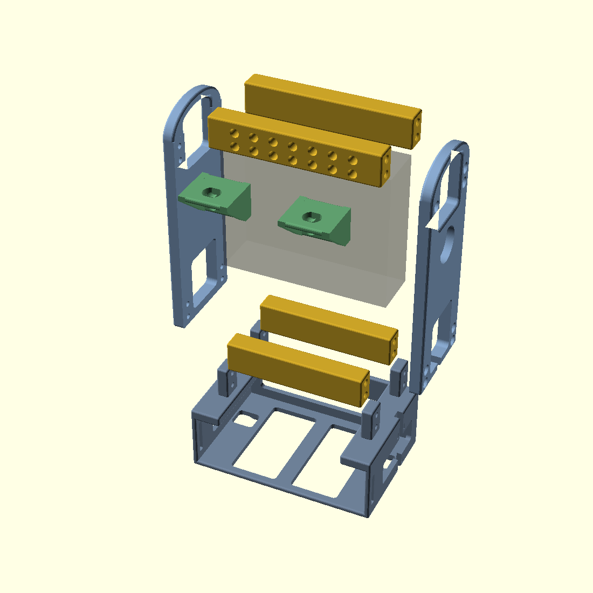

1. Heat the inserts. **16 in the beam ends** (two per end, four per beam) — do
   these first and check each pair is square, or the panel will not sit flat — plus
   the top-front beam's accessory columns, which vary by layout: 14 on `_grid`.
   If you fit the `_rail` bottom beam, that carries the same 14 in its front face.
   **The battery box's tabs take no inserts** — they are plain through-holes and the
   threads are all in the beam ends — but the box does need **4 × M4 in its feet**
   if `compute_box_inline` hangs below it.
2. Bolt the two **top** crossbeams to one side panel (8 × M4 × 12, heads on the
   **outside**).
3. **The bottom beams and the battery box go on together.** Stand the box's four
   tabs against the panel's bottom rows, offer both bottom beams up to them, and
   run the eight **M4 × 20** through panel → tab → beam. There is no base plate,
   and the beams will not reach the panels without the box. Then add the second
   side panel and repeat.
4. Drop the radio in and fit the two M5 bolts through the panel recesses into
   the radio's side holes.
5. *(No handle step — the handles are part of the side panels, fitted in step 2.)*
   Note the panel now carries **two bolt rows per beam**, eight per panel.
6. Bolt on the two antenna mounts (8 × M4 × 12), then fit the antenna
   connectors.
7. *(No separate battery-box step — it went on in step 3.)* Route the pack's lead
   up past the flange into the bay, slide the pack in from the front and strap it.
   **If fitting `compute_box_inline`, the order inside it matters** (§12): bolt the
   **cover alone** up into the battery box's four feet first (4 × M4 × 12 — the heads
   are on its underside and nothing is under it yet), then populate the tray, lift it
   up to the cover, and run the **six M3 in horizontally from outside** the side
   walls. Pass the 12 V down through the cover's Ø12 grommet. Doing it the other way
   round traps one set of heads or the other.

---

## 7. Verification performed

Not just rendered — checked:

- All 13 meshes watertight, **single connected shell**, within 180 × 180.
  (This caught two real defects: the antenna gusset and the base-plate locating
  lips initially only touched their neighbours on a coplanar face, producing
  two- and three-shell parts.)
- **Zero interference** across every pair of parts in assembled position,
  including the radio envelope.
- **All 24 M4 bolt axes and both M5 axes** traced: each passes through a
  clearance hole in one part and lands inside the insert pocket of the other,
  with no material fouling the shank.
- Antenna bore clear below each pad for the connector body, and for the SO-239
  variant all four flange-screw nut positions clear.
- **Void connectivity**: every M4 counterbore traced back to outside air, and
  both antenna brackets confirmed to contain **zero enclosed voids**. This is the
  check that would have caught the v1 bracket, whose two right-hand bolt holes
  were sealed inside the rib.
- Both antenna variants confirmed **mirror-symmetric in X**, so one part serves
  both sides.
- All 16 accessory-rail bolt axes traced into the crossbeam's inserts, and the
  station-to-station clash table computed from real part widths rather than
  assumed.
- Battery box: cable column clear through the part, zero enclosed voids. (The
  four-bolt trace into the base plate's feet dates from when it hung below one;
  it now joins the frame on its tabs instead.)
- **Recursive stack test**: a second battery frame placed one pitch (59.8 mm)
  below the first shows zero interference and all four bolts running cleanly from
  the lower flange into the upper frame's foot inserts. The module interface
  therefore repeats indefinitely.
- Battery frame's rearmost point is Y 69.99 against a frame back of 70.0 —
  nothing protrudes behind the wearer.
- Arch after the rework, now measured on the side panel that carries it:
  self-supporting in its print pose, and the assembly's tallest point down to
  199.95 mm.
- Arch band thickness scanned along the whole span, not just at the apex. This is
  what caught the waist at the arch/shoulder joint; the band is now measured at
  7.0 mm minimum, rising to 8.25 mm at the shoulders.
- Full load-path check at one-handed lift with a 3× snatch (54.7 N on one handle,
  from a measured 1.86 kg pack): arch apex 5.5 MPa, legs 0.15, bolt bearing 0.28,
  insert shear 13.6 N each, lap peel 13.6 N/bolt, lateral across layers 3.3 MPa.
  The handle prints flat so arch bending runs along the filaments, not across
  layer bonds.
- Battery box print pose swept for unsupported area: **+385.4 mm² appears at bed
  Z 54** — the two front-beam tabs starting in mid-air. The back-beam pair sit on
  the bed and are fine. Everything else in the sweep is `rbox` corner rounding.
- Tab joint, traced in **frame** coordinates by mapping the battery box's print
  pose back: tabs at **X 9.02–17.98 and 124.28–133.22** against a nominal 9.00–18.00
  and 124.25–133.25, **Z 25–49** flush with the beam tops, over the beams' Y bands
  of 0–16 and 54–70. The radio band at Y 17–53 confirmed clear between them, which
  is why there are four tabs and not two full-depth ones.
- All eight tab bolt holes break the tab exactly on the beam rows: air gaps
  measured at **Z 29.30–33.68 and 40.30–44.68** against a nominal Ø4.4 at 31.5 and
  42.5. Bottom beams measure 106.22 long against 106.25 nominal, end pockets ~9 mm.
- Battery box watertight and single shell when the tabs were added. Two faults
  caught getting there: the tabs sitting exactly on the flange plane produced
  **five separate shells** (coplanar contact, not a union) and are now sunk 1 mm;
  and the print pose was still offset by the then-deleted feet, leaving the part
  floating 25 mm off the bed. Its current figure is the 116.77 cm³ below.
- Whole-library rebuild diffed against the previous commit: **exactly four parts
  changed** — the three bottom beams and the battery box. Side panels, top beams,
  antenna mounts and the compute boxes were geometrically identical, which is
  the check that confirms `z_frame` still holds as a datum and no panel needs
  reprinting.
- Compute boxes: SBC envelope (64 × 56 board + 22 mm of connectors) traced clear
  of the walls and top flanges, single-shell with zero enclosed voids.
- `compute_box_inline`: tray 142.98 × 99.98 × 38.98 / 107.76 cm³, cover
  142.98 × 99.98 × 17.99 / 118.10 cm³, both watertight and single-shell; stack pitch
  measures **54.99 mm** against the 55 mm budget, under the battery box's 8 mm feet.
  Cavity sectioned at 35.00 mm, and at **136.98 mm** wide against a nominal 137.00 —
  the raceway block that used to take 19 cm³ out of it is gone.
- Battery box after restoring its feet: 116.77 cm³, all four foot rings 24/24 solid
  with inserts open downward; the cover's four M4 confirmed open through into them.
  Cover grommet traces Ø12 at X 99.02–111.00, Y 43.02–54.98, 2.50 mm clear of the
  converter.
- Tray-to-cover lugs: six traced at **10.00 × 11.98 mm**, full height 17.98 mm (10 of
  lug plus the 8 mm plate), pockets **5.00 mm** deep from the wall face with 5.00 mm of
  backing. Matching clearance holes confirmed through both tray side walls at all six
  positions, wall solid between them. Cover reseated on the bed after the pose flip
  and swept for mid-air material: nothing beyond the first 2 mm of `rbox` rounding.
- Tray bottom face sectioned: **one loop, zero holes** — nothing pierces the ground
  face. Converter pads measure 2.98 mm above the floor with pockets of **4.98 mm**
  against a 5.0 mm insert and 2.00 mm of floor left beneath. The pocket had to be cut
  in two halves: the pad is added after the cavity difference, so its own local cut
  reaches only the pad and left the pocket 3 mm deep until the floor's 2 mm came out
  in the main difference too.
- Both inline parts swept for unsupported area at 0.4 mm: the tray's only area gains
  anywhere are the first 2 mm of `rbox` rounding, so it is self-supporting
  floor-down. `battery_box` shows the front tabs at +381 mm² plus tangential starts
  at all four feet, so its support requirement grew slightly.
  Converter and board footprints traced against the interior: 0.5 mm clearance to
  the back wall, 36.5 mm of connector zone at each end of the board, 10.4 mm of
  headroom over it.
- **The raceway is gone** (§12), so the checks that governed it no longer apply to
  any shipped geometry. They are worth recording because four versions died on
  features that are still in the frame: one cut through into the cavity; one's kept
  block was exactly as wide as the notch and so had no side walls; one put 160 mm² of
  the floor opening onto the boss the battery bolts into — measured at the time and
  wrongly accepted; and one was squeezed to 6.90 mm between that boss and the back
  beam's M4 counterbore. The version that finally worked measured Y 33.26–49.00 =
  15.76 mm across four stations, and was retired by the reordering rather than by a
  fault.
- Unified side panel: beam inserts and panel holes measured **independently** and
  compared — 31.48 / 42.48 from the beam mesh, the same from the panel mesh. This
  is the check that caught an earlier attempt where the panel had been trimmed and
  the beam rows moved, leaving the beams protruding 6 mm below the panel.
- Panel rounding verified by scanning the grip bar's underside at nine depths
  through the 9 mm plate (193.98 at each face, 193.04 across the flat), the outer
  edge either side of the Z 180 junction (0.06 mm difference), and the inner face
  at every beam seat (Y 0.04 / 69.96, flat).
- **Regression check that nothing already printed was invalidated**: every STL
  compared against the committed version. Only the parts actually reworked
  changed; everything else came back bit-for-bit identical, which is the check
  that keeps a refactor honest.
- **Per-layer cross-sectional area of every shipped STL in its print pose**, to
  find material laid over voids. This caught two real orientation defects: the
  base plate printing 98 % in mid-air on two locating lips, and the side panel
  bridging a Ø26.5 mm ceiling directly under the ligament that carries the
  radio. Both are fixed. `battery_box` is the only part that needs support today,
  for its front tabs and its side-lying feet (§8 item 16).
- Asserts in the model fail the render if the panel exceeds the bed, the beam
  span exceeds the bed, `frame_d` is too small to clear the control panel,
  `bay_h` is too small for the radio, or the M5 recess leaves < 3 mm of panel.

**A subtraction that removes nothing is invisible to every check here.** The
cover's six screw bosses were never built, and the model still exported watertight,
single-shell, void-free, with correct bounds and volume — because cutting a
cylinder out of empty space is a no-op, not an error. No mesh property distinguishes
"this feature was made correctly" from "this feature was never made". The check that
would have caught it is the one already used for bolt axes elsewhere: **trace every
fastener from its clearance hole into the material that is supposed to receive it,
and assert that material exists.** That check was applied to the M4 frame joints and
not to the M3 cover screws.

**A bulk re-export makes every part look modified.** OpenSCAD writes byte-different
STLs for identical geometry, so re-exporting everything to check nothing broke left
19 files showing as changed when only 3 had actually moved. Always diff bounds and
volume against `HEAD` and restore the rest, or the reprint list reads far worse than
it is and the real changes are buried.

**Point-probes lie more often than the geometry does.** Every false alarm during
the compute-box and handle work was a bad measurement, not a bad part, and they
failed in ways that looked exactly like real defects:

| what was probed | why it read wrong |
| --- | --- |
| SBC pad centres | the centre *is* the M3 insert pocket — empty by design |
| pad walls, as a ring with `.all()` | the ring straddled a slot, so one open point failed the whole test |
| a point "inside the bar" | box-local coordinates against an STL exported in its print pose |
| M3 insert spacing | the scan window ran past the beam into the finger opening and averaged two voids |
| clear interior width | took `min`/`max` of all free points instead of the largest contiguous run, so one ambiguous point exactly on the boundary stretched the span by 3 mm and implied a missing wall |
| cover rim, top band | probed at Y 157, past the rim's own end at 156.6 |

The habits that catch these: probe a **control** you know the answer to in the
same run, prefer **cross-sections and island counts** over point sampling for
anything whose size matters, and confirm the coordinate mapping against a known
feature before trusting a sweep.

Reported clearances at the shipped parameters:

```
frame body            = 142.25 x 70 x 180 mm
assembled envelope    = 142.25 x 108 x 200 mm  (depth shown for the deeper SO-239 bracket)
radio bay (WxDxH)     = 124.25 x 38 x 107 mm
radio clearance  side = 1 mm/side   above/below = 3 mm
panel print footprint = 175 x 70  (bed 180) -> margin 5 mm
panel under M5 recess = 3.5 mm of material carrying the radio
```

---

## 7.1 What to reprint after the unified-panel change

Geometry diffed against the previous commit — bounds and volume, not bytes, since
OpenSCAD re-exports differ byte-wise for identical geometry.

| Part | Why |
| --- | --- |
| `crossbeam_bottom_front` | 124.25 → **106.25 mm**; the tab joint (§2.9) |
| `crossbeam_bottom_back` | 124.25 → **106.25 mm**; the tab joint |
| `crossbeam_bottom_front_rail` | 124.25 → **106.25 mm**; the tab joint |
| `battery_box` | gains four tabs and keeps its feet; top face moves to the frame datum |
| `compute_box_inline` | moves to the bottom of the stack: no feet, no raceway, sealed floor, prints floor-down (§12) |
| `compute_box_inline_cover` | bolts up into the battery box's feet, gains six lugs for the horizontal tray screws and a Ø12 grommet in place of the raceway |
| `side_panel` ×2 | the unified panel + handle |
| `side_panel` ×2 | **model only, no reprint needed** — the RT-95's M5 pair at Z 129−31 was removed (§2.13). Panels already printed carry the extra hole harmlessly; the radio mounts at the Z 129 pair either way. |

**Nothing else changed** at any point in that sequence — the top beams, both
antenna mounts and the compute box came back byte-for-byte identical every time,
which is the check that kept each rework honest.

That reprint set is now history — the base plate it refers to has since been
removed entirely (§2.9). It is kept because the reasoning still applies to anyone
coming from an older build: the 175 mm panel needs the bottom crossbeams at
Z 25–49, and a frame built to the older 16 mm datum puts them 9 mm below where the
panel's holes are.

---

## 8. Open items — read before printing

1. **Verify the M5 hole position against the radio in hand.** The reference puts
   it at the exact centre of the bay in both Y and Z, and that is the only
   evidence available for where the radio's threaded side holes actually sit.
   `radio_by` and `radio_bz` are one-line changes; everything else follows.

2. **`radio_h = 36` and `radio_d = 101` are assumptions**, and they are the two
   numbers that matter: `radio_h` sets `frame_d` (70 mm gives zero control-panel
   overhang) and `radio_d` sets `bay_h`. Re-measure before committing 400 cm³ of
   filament. The echo block above reports the resulting clearances on every
   render.

3. **The radio hangs on two M5 bolts through 3.5 mm of plastic, with nothing
   resisting rotation about that axis.** This is inherited from the reference,
   which is thinner still at 2.75 mm. It is the frame's single biggest structural
   risk. If it worries you, the fix is a bottom ledge or a back-biased top boss
   on the side panels — but that adds features to a part the brief specifies as
   carrying the radio mount only, so it has been left alone rather than added
   unasked.

4. Side clearance is **1 mm per side** in Y between the radio and the top
   crossbeams. That is deliberate — it is what buys zero overhang over the
   control panel — but it means a radio thicker than 38 mm needs `frame_d`
   increased.

5. **RESOLVED — the RT-95 has been dropped from the design.** It was 1 mm too
   thick for the channel between the crossbeams and, once the frame datum rose to
   Z 25 for the unified panel, **8.5 mm too tall** for the bay as well. See §2.13.

6. The Ø26.468 × 5.5 mm recess is reproduced because the brief says to transfer
   the radio mounts, but its purpose is inferred: it is far too large for an M5
   head, so it is almost certainly a seat for the OEM knurled mounting knob. If
   you are using plain M5 socket caps, it can shrink to Ø10 and reclaim 2 mm of
   panel thickness under the bolt.

7. **Right-angle Ethernet and HDMI adapters are required, not optional**, and
   neither has been dimensioned. A straight RJ45 plug needs ~40 mm below the
   board edge; the converter is at 22 mm. The hard limit on any adapter's
   downward projection is **21 mm**, across the converter's full width. Measure
   from the plug's mating face to the back of the housing. If it exceeds 21 mm the
   only real lever left is moving the converter out of the bottom bay — the rim
   notch and the floor drop have both already been spent.

8. **The M3 insert pocket diameter is still 4.0 mm and is probably wrong.**
    `m3_ins_d` was sized for a shorter insert; the SBC standoffs now take a 7 mm
    insert, and those typically run 4.6–5.0 mm OD. Depth has been corrected to
    7.5 mm but the diameter has deliberately **not** been guessed — too small
    splits the boss, too large and the insert spins. Measure the OD before
    printing. This affects the four SBC standoffs; the converter pads and cover lugs
    take a different, shorter 5 mm insert and keep 4.0.

9. **La Frite port positions along the board edge are not modelled.** The box is
    sized to the board outline and its M3 pattern; which port sits where along the
    now-downward edge is unverified, so the 21 mm budget is assumed to apply to
    all of them equally.

---

10. **RESOLVED — the buck converter's 12 V feed comes down through the cover**: a
    Ø12 grommeted hole at X 99.02–111.00, Y 43.02–54.98, sited 2.50 mm clear of the
    converter's lead end so the feed lands on its terminals without crossing the
    board (§12). The old raceway that made this awkward is gone with the reordering.
    The superseded note read:

    > **`compute_box_inline`: the buck converter's own 12 V feed has no modelled
    path.** The raceway is deliberately sealed off from the cavity, so the battery
    leads running up it never enter the box — but the converter *inside*
    the box has to be fed from those same leads. Nothing in the model gets them
    across the raceway's 3 mm wall. That wall is now the channel's **inboard** face
    at X 114.5–117.5, and the converter ends at X 96.5, so the run is no longer
    trivially short — 18 mm of cavity separates them. Either drill the left wall
    and bridge that gap inside the box, or bring 12 V in through the cover's cable
    opening with the rest of the wiring. **Decide which before you
    close the box** — the converter's terminals are the least accessible thing in it.

11. **RESOLVED — `compute_box_inline` moved to the bottom of the stack** (§12). It
    hangs from the battery box's four restored feet on 4 × M4 × 12 and carries no
    frame load at all, so the bottom bracing stays inside the battery box's 8 mm
    flange. An intermediate revision put the frame's tabs on this tray instead; that
    ran the bracing through four 9 × 16 columns on wedges off 3 mm cavity walls and
    was abandoned. It is preserved in `git stash` if ever worth revisiting. The
    bottom beams' four `base_face` inserts went with it — nothing bolts up into them
    any more.

12. **The battery box's two front tabs print on support. This is decided, not
    open** — recorded here so it is not re-litigated. The back-wall-down pose maps
    bed Z to 70 − frame Y, so the build runs back to front: the back-beam tabs land
    on the bed, but the front-beam pair start **54 mm up with 385.4 mm² in
    mid-air**. It cannot be designed out:

    - a self-supporting ramp would need 24 mm of run for 24 mm of rise and has only
      16 (the beam's depth) — and must be at full height by frame Y ≈ 10 to carry
      the bolt at Y 8, leaving 6 mm of run: **76° from vertical**;
    - a gusset would have to come from higher frame Y, which at Z 25–49 is the
      radio bay, and in X the tabs sit inside the radio's own 9–133.25;
    - floor-down fixes the tabs but cantilevers both top flanges 19.5 mm along
      their full 94.8 mm — about **3700 mm² against 385**.

    Support is the cheap breach: front and back tabs share an identical bed
    footprint, so the column stands on the **back tab, 38 mm tall, not 54 from the
    bed**, and the scarred face points into the radio bay. The tab's **mating faces
    are its two X faces**, against panel and beam, and those print as vertical
    walls. See the per-object modifier table in §9.

    The rejected alternative, if this ever proves annoying: make the four tabs
    separate 9 × 16 × 24 blocks (~3 cm³ total) that drop into sockets in the flange
    and are captured by the same M4 × 20. Zero supports, four more parts, and a new
    socket joint carrying the battery in a snatch load.

13. **`crossbeam_bottom_front_rail` takes an argument that does nothing.** The
    export passes `front_rows = [16]`, which is not a parameter of `crossbeam()`
    and is silently ignored — so the beam gets accessory columns on *both* rail
    rows, at beam-local Z 6 and 16, not the single row at 16 the comment describes.
    The row at 6 clears the underside inserts by **0.175 mm** of material (axes
    5.875 mm apart, two Ø5.7 pockets), so it is not a clash, but the comment and
    the code disagree and one of them is wrong. Not touched here — it would change
    a printed beam.

14. **RESOLVED — `compute_box_inline`'s tray-to-cover joint is six M3 driven
    horizontally** from outside, into lugs under the cover. Vertical screws
    deadlocked against the four M4 that hold the cover to the battery box (§12).

15. **RESOLVED — `compute_box_inline` prints floor-down with no support.** Being the
    bottom of the stack it has no feet, so the underside is flat; swept at 0.4 mm the
    only area gains are the first 2 mm of `rbox` rounding. `battery_box` is now the
    only part on the frame needing support — and it needs a little more of it, since
    its four feet are back and lie on their sides in its print pose.

16. **The 15 mm component height over the La Frite is assumed, not measured.** It
    is what gives the inline box its 10.4 mm of headroom in a 35 mm cavity, and the
    tallest thing on the board — a right-angle adapter standing off the connector
    edge, or a USB stick — is exactly what has not been put on a caliper. If it runs
    to 25 mm the box still closes; past that, the cavity has to grow and the 55 mm
    budget goes with it.

## 9. Print settings

### Overview

Slice `stl/*.stl` as-is. Every part is already in its recommended pose (§5) and
**one part on this frame needs support** — `battery_box`, for its front tabs and its
four side-lying feet (§8). Otherwise the only ceilings anywhere are the
tops of insert pockets and bolt bores, the largest of which is the Ø12.468 mm
antenna bore through a 3.75 mm wall. Verified by measuring per-layer
cross-sectional area on all thirteen meshes; the biggest single unsupported area on
any layer is about 93 mm².

One of those poses is a load-bearing decision rather than convenience, so do not
re-orient it in the slicer:

- **`side_panel` prints inner face down.** Flipping it puts a Ø26.5 mm bridged
  ceiling directly beneath the 3.5 mm ligament that carries the radio's entire
  weight through two M5 bolts. Inner-face-down makes that ligament ordinary solid
  layers and reduces the part to four trivial Ø8.2 mm bridges.
Five things matter more on this design than the usual quality knobs:

1. **Perimeters carry the load, not infill.** Every joint on the frame is either
   a bolt through a counterbore or a heat-set insert in a boss, and both react
   into wall material. Given a choice between more infill and more perimeters,
   always take the perimeters.
2. **Solid layers at the M5 recess.** The ligament under the recess is only
   3.5 mm — about 17 layers at 0.20 mm. With a slicer default of 4 top / 4 bottom
   solid layers, the middle of the one feature carrying the radio would be
   _infill_. Bump the side panels to **5 top / 5 bottom**, and — this is the part
   that actually guarantees it — apply the height range modifier described under
   _Per-object modifiers_ below, which forces that 4 mm band to 100 % solid
   regardless of layer height.
3. **The M4 counterbore is 4.0 mm deep for a 4.0 mm head — zero margin.** If your
   first layer is over-squished or elephant-foot compensation is set aggressively,
   heads will sit proud of the panel's outer face. Check with a straightedge before
   assembly — the pack is carried against the body on that face.
4. **Ø8.2 mm counterbores will not accept an M4 washer** (≈Ø9 mm OD). Run the M4
   bolts bare. The M5 recess has room for a washer if you want one.
5. **Print one crossbeam first as a coupon.** `crossbeam_top_front_dual` carries
   **12 inserts** — four in its ends and eight in its front face — which is both
   insert axes in one part. Test-seat one and run an M4 × 12 into it before
   committing the other three beams.

Rough filament expectation for a complete 11-piece set — the slicer is the
authority, this is only for planning: **~250–300 g in PLA** at prototype
settings, **~400–500 g in PETG** at production settings.

Batch the four crossbeams together; they share an orientation and a profile.

### 9.1 Prototype / dev — PLA

Cheap and fast, for checking fit, clearances, radio hole alignment and handle
feel. **Not a field frame** — see the caveats at the end of this subsection.

| Setting            | Value                                              |
| ------------------ | -------------------------------------------------- |
| Nozzle / layer     | 0.4 mm / **0.20 mm**                               |
| Perimeters         | 2                                                  |
| Top / bottom solid | **5 / 5**                                          |
| Infill             | 15 % gyroid                                        |
| Nozzle temp        | 210 °C (first layer 215 °C)                        |
| Bed temp           | 60 °C                                              |
| Cooling            | 100 %                                              |
| Brim               | 5 mm on the four crossbeams; none needed elsewhere |
| Supports           | none                                               |

Why a brim only on the crossbeams: their footprint is 124 × 16 mm and they stand
24 mm tall, so they are the one narrow, tippy part in the set. Everything else
has a large flat first layer (`side_panel` 9714 mm²).

**Why 0.20 mm and not something coarser.** The prototype's whole job is to check
the M5 hole position, the counterbore depths and the insert-pocket fit, and all
three shift with layer height — a coarser prototype would fail to validate the
very dimensions it exists to validate. The savings come from 2 perimeters and
15 % infill instead, which is where the bulk of the time and filament is anyway.
Keeping prototype and production on the same 0.20 mm layer also means what you
measure on the prototype still holds for the production run.

**PLA-specific caveats:**

- **Heat-set inserts:** iron at 200–210 °C and go slowly. PLA's window between
  "flows" and "gushes" is narrow, and an overheated boss will swallow the insert
  crooked. For a fit check, install only the inserts you actually need.
- **Torque finger-tight only.** PLA creeps under sustained preload; a PLA frame
  will loosen at every joint over days, and the two M5 bolts through a 3.5 mm
  PLA ligament are the worst case.
- **Do not leave it in a car.** PLA's glass transition is around 60 °C. A closed
  vehicle in sun will exceed that and the frame will sag under the radio's weight.
- **Cheapest useful subset:** caliper the radio first (free, and it settles
  `radio_h` / `radio_d` — see §8 item 2). Then print one crossbeam as the insert
  coupon. Then the two side panels plus four crossbeams, which is the minimum
  assembly that trial-fits the radio and proves both M5 holes. Leave the handles,
  antenna mounts and battery box until the bay geometry is confirmed.

#### PrusaSlicer 2.9.6 — PLA prototype profile (Prusa Mini, 0.4 mm nozzle)

Start from **`0.20mm SPEED @MINI`** — of the system presets the Mini offers
(0.10 FAST DETAIL, 0.15 SPEED, 0.15 STRUCTURAL, 0.20 SPEED, 0.20 STRUCTURAL) this
is the fastest at the 0.20 mm layer the prototype needs. Switch to **Expert**
mode, change the values below, then _Save Print Settings as_
**`MANPACK PLA 0.20 @MINI`**.

Setting names are as they appear on each PrusaSlicer Print Settings page.
Anything not listed keeps the base profile's value.

| Page                  | Setting                    | Value                                   |
| --------------------- | -------------------------- | --------------------------------------- |
| Layers and perimeters | Layer height               | **0.20**                                |
| Layers and perimeters | First layer height         | **0.20**                                |
| Layers and perimeters | Perimeters                 | **2**                                   |
| Layers and perimeters | Top solid layers           | **5**                                   |
| Layers and perimeters | Bottom solid layers        | **5**                                   |
| Layers and perimeters | Perimeter generator        | Arachne                                 |
| Layers and perimeters | Detect bridging perimeters | ✔                                       |
| Layers and perimeters | Seam position              | Aligned                                 |
| Infill                | Fill density               | **15 %**                                |
| Infill                | Fill pattern               | Gyroid                                  |
| Infill                | Top / Bottom fill pattern  | Monotonic                               |
| Infill                | Combine infill every       | 1                                       |
| Skirt and brim        | Brim type                  | Outer brim only                         |
| Skirt and brim        | Brim width                 | **5 mm** (crossbeam plate only, else 0) |
| Skirt and brim        | Brim separation gap        | 0.1 mm                                  |
| Support material      | Generate support material  | ✘ unchecked — **except `battery_box`**, see the modifier table |
| Speed                 | External perimeters        | **25 mm/s**                             |
| Speed                 | Bridges                    | **25 mm/s**                             |
| Advanced              | XY size compensation       | **0**                                   |
| Advanced              | Elephant foot compensation | 0.2 mm                                  |

**Filament Settings — a separate profile from Print Settings.** Temperatures and
fan live here, not in the Print Settings profile. Start from `Generic PLA`, save
as **`MANPACK PLA @MINI`**:

| Page     | Setting                          | Value           |
| -------- | -------------------------------- | --------------- |
| Filament | Nozzle temperature, other layers | **210 °C**      |
| Filament | Nozzle temperature, first layer  | **215 °C**      |
| Filament | Bed temperature, both            | **60 °C**       |
| Cooling  | Keep fan always on               | ✔               |
| Cooling  | Min / Max fan speed              | **100 / 100 %** |
| Cooling  | Bridges fan speed                | 100 %           |
| Cooling  | Disable fan for the first        | 1 layer         |

**One profile covers every plate.** 5 / 5 solid layers is applied globally rather
than only on the side-panel plate, so there is nothing to remember when you switch
plates — the extra solid layer costs almost nothing on the beams and brackets. The
only per-plate changes in the whole set are _Brim width_ and, on the battery box,
support.

### 9.2 Production / final — PETG

| Setting            | Value                                                          |
| ------------------ | -------------------------------------------------------------- |
| Nozzle / layer     | 0.4 mm / **0.20 mm** (first layer 0.20 mm)                     |
| Perimeters         | **4** — 5 on the four crossbeams                               |
| Top / bottom solid | 5 / 5 — **6 / 6 on `side_panel`**                              |
| Infill             | 40 % gyroid                                                    |
| Nozzle temp        | 240 °C (first layer 240 °C)                                    |
| Bed temp           | 85 °C first layer, 90 °C after                                 |
| Cooling            | **30–50 %**, and do not let bridge/overhang fan spike to 100 % |
| Perimeter speed    | 40–50 mm/s                                                     |
| Brim               | 5 mm on the four crossbeams                                    |
| Supports           | none                                                           |

**PETG-specific notes:**

- **Keep the fan down.** This frame's strength lives in layer adhesion — insert
  bosses resist pull-out across layers, and the beam-end joints are loaded in
  shear across layers. Over-cooled PETG loses exactly that. Cool enough to hold
  detail, no more, and slow the perimeters rather than adding fan.
- **Dry the filament.** PETG is hygroscopic and wet PETG loses layer strength.
  This is the single most common cause of insert bosses stripping out.
- **Bed release.** PETG bonds hard to smooth PEI and can tear the sheet. Use a
  textured sheet, or a glue-stick release layer on smooth. The two large flat
  parts (`side_panel`, `battery_box`) are where this bites.
- **Heat-set inserts:** iron at 250 °C. PETG is much more forgiving than PLA here.
- **Torque:** snug, not hard. PETG takes real preload far better than PLA, but the
  M5 ligament is still only 3.5 mm of plastic.

**If the pack will live in a hot car or in direct desert sun, PETG is not the
right answer** — it softens from about 80 °C and a dark pack in full sun can pass
that. ASA is the correct material for that duty, but it wants an enclosure and it
warps: the 164 mm `side_panel` is right at the limit of what an unenclosed Mini
will hold flat. If you go that route, print the panels first and check them on a
surface plate before committing to the rest.

#### PrusaSlicer 2.9.6 — PETG production profile (Prusa Mini, 0.4 mm nozzle)

Start from **`0.20mm STRUCTURAL @MINI`**, switch to **Expert** mode, change the
values below, then _Save Print Settings as_ **`MANPACK PETG 0.20 @MINI`**.

STRUCTURAL is the right base here rather than a SPEED or DETAIL preset: it already
biases toward perimeters and slower, more solid extrusion, which is exactly what a
frame whose every load path is a bolt-in-a-counterbore or an insert-in-a-boss
wants (Overview note 1). Set the values below explicitly anyway, so the profile is
deterministic no matter what the base preset ships with. If you prefer a finer
finish, `0.15mm STRUCTURAL @MINI` works identically — just leave _Layer height_ at
0.15 and expect roughly a third more print time.

| Page                  | Setting                       | Value                                   |
| --------------------- | ----------------------------- | --------------------------------------- |
| Layers and perimeters | Layer height                  | **0.20**                                |
| Layers and perimeters | First layer height            | **0.20**                                |
| Layers and perimeters | Perimeters                    | **4**                                   |
| Layers and perimeters | Top solid layers              | **5**                                   |
| Layers and perimeters | Bottom solid layers           | **5**                                   |
| Layers and perimeters | Perimeter generator           | Arachne                                 |
| Layers and perimeters | Detect bridging perimeters    | ✔                                       |
| Layers and perimeters | Thick bridges                 | ✘ unchecked                             |
| Layers and perimeters | Seam position                 | Aligned                                 |
| Layers and perimeters | External perimeters first     | ✘ unchecked                             |
| Infill                | Fill density                  | **40 %**                                |
| Infill                | Fill pattern                  | Gyroid                                  |
| Infill                | Top / Bottom fill pattern     | Monotonic                               |
| Infill                | Combine infill every          | 1                                       |
| Infill                | Infill/perimeters overlap     | 25 %                                    |
| Skirt and brim        | Brim type                     | Outer brim only                         |
| Skirt and brim        | Brim width                    | **5 mm** (crossbeam plate only, else 0) |
| Skirt and brim        | Brim separation gap           | 0.1 mm                                  |
| Support material      | Generate support material     | ✘ unchecked — **except `battery_box`**, see the modifier table |
| Speed                 | Perimeters                    | **45 mm/s**                             |
| Speed                 | Small perimeters              | **25 mm/s**                             |
| Speed                 | External perimeters           | **25 mm/s**                             |
| Speed                 | Infill                        | 60 mm/s                                 |
| Speed                 | Solid infill                  | 50 mm/s                                 |
| Speed                 | Top solid infill              | 30 mm/s                                 |
| Speed                 | Bridges                       | **25 mm/s**                             |
| Advanced              | Extrusion width — Default     | 0.45 mm                                 |
| Advanced              | Extrusion width — First layer | 0.42 mm                                 |
| Advanced              | Extrusion width — Ext. perim. | 0.42 mm                                 |
| Advanced              | XY size compensation          | **0**                                   |
| Advanced              | Elephant foot compensation    | 0.2 mm                                  |

Leaving _XY size compensation_ at 0 is deliberate: it would shift the Ø5.7 insert
pockets and the Ø4.4 bolt holes together, and those two want opposite corrections.
Trim the pockets in the .scad (`m4_ins_d`) after the coupon print instead.

**Filament Settings — a separate profile from Print Settings.** Start from
`Prusament PETG`, save as **`MANPACK PETG @MINI`**:

| Page     | Setting                                | Value                |
| -------- | -------------------------------------- | -------------------- |
| Filament | Nozzle temperature, other layers       | **240 °C**           |
| Filament | Nozzle temperature, first layer        | **240 °C**           |
| Filament | Bed temperature, first layer           | **85 °C**            |
| Filament | Bed temperature, other layers          | **90 °C**            |
| Cooling  | Keep fan always on                     | ✔                    |
| Cooling  | Min fan speed                          | **30 %**             |
| Cooling  | Max fan speed                          | **50 %**             |
| Cooling  | Bridges fan speed                      | **50 %** (not 100 %) |
| Cooling  | Disable fan for the first              | 1 layer              |
| Cooling  | Slow down if layer print time is below | 15 s                 |
| Cooling  | Min print speed                        | 15 mm/s              |
| Filament | Wipe while retracting (Overrides)      | ✔ (PETG stringing)   |

Holding _Bridges fan speed_ to 50 % is the one non-obvious entry. The stock PETG
profile spikes it to 100 %, and the bridges on this frame are not cosmetic — the
four Ø8.2 mm ceilings in `side_panel` are the bearing surfaces the crossbeam bolt
heads pull against, and blasting them with cold air is exactly how you get a weak
inter-layer bond at a load-bearing face.

#### Per-object modifiers (both profiles)

Two settings are best applied per object rather than globally. Right-click the
object in the 3D view → _Add settings_.

| Object          | Modifier                                                | Why                                                                                                                                                                                                                            |
| --------------- | ------------------------------------------------------- | ------------------------------------------------------------------------------------------------------------------------------------------------------------------------------------------------------------------------------ |
| `side_panel` ×2 | **Height range modifier, 0 → 4 mm, Fill density 100 %** | Guarantees the 3.5 mm ligament under the M5 recess is fully solid. At 0.20 mm that band is ~17 layers, so 5 top + 5 bottom solid layers would otherwise leave ~7 layers of _infill_ inside the one feature carrying the radio. |
| `crossbeam` ×4  | _Layers and perimeters → Perimeters_ = **5**            | Lets the beams run 5 perimeters on a plate sliced with the global 4, without a second profile.                                                                                                                                 |
| `battery_box`   | **Support material = on, _Support on build plate only_ = OFF** | Two things need it: the front tabs start 54 mm up with **385 mm²** in mid-air, and all four Ø16 feet lie on their sides so their undersides begin tangentially (§2.9). Build-plate-only support will not generate for the tabs — the column has to stand on the **back tab**, not the bed. |

The height range modifier is the precise fix and costs almost nothing — 4 mm of a
9 mm plate. Setting the whole panel to 100 % infill also works but roughly doubles
its mass, and there are two of them.

**Exactly one object needs support: `battery_box`.** Turn it on per object rather
than globally — every other part is self-supporting in its pose, and a global setting
will put scaffolding inside the beams' insert pockets and the panels' counterbores
for nothing.

#### Plate layout (Prusa Mini, 180 × 180 mm)

Five plates cover the frame and battery box. A compute module adds one more plate
for either front variant, or **two** for the inline box. Footprints verified
against the bed:

| Plate | Contents                                     | Footprint    | Margin      |
| ----- | -------------------------------------------- | ------------ | ----------- |
| 1     | 1 × `side_panel`                             | 175 × 70 mm  | **5** / 110 mm |
| 2     | 1 × `side_panel` (the second one)            | 175 × 70 mm  | **5** / 110 mm |
| 3     | 4 × `crossbeam`, stacked in Y, 5 mm brim     | 134 × 122 mm | 46 / 58 mm  |
| 4     | 2 × `antenna_mount`                          | 35 × 48 mm   | 145 / 132 mm |
| 5     | `battery_box` (**not optional** — §2.9)      | 143 × 83.8 mm | 37 / 96 mm  |
| 7a    | `compute_box_inline` (only if you build it)  | 143 × 100 mm | 37 / 80 mm, 39 mm tall |
| 7b    | `compute_box_inline_cover`                   | 143 × 100 mm | 37 / 80 mm, 18 mm tall (lugs up) |

The inline box needs **two plates of its own** — tray and cover are both
143 × 100, and neither pairing fits (286 mm side by side, 200 mm stacked).

**The side panels get a plate each.** Two of them stacked in Y would be
175 × 146 mm, which fits, but at 5 mm of X margin there is no room for a skirt and
no tolerance for bed-origin error on a part that takes over two hours. One per
plate is the safer call. There is no separate handle plate any more — the handles
are part of these panels.

The two panels are _identical_, not mirrored, so both come off the same STL.

> **On preset and setting names.** The two system presets named above
> (`0.20mm SPEED @MINI`, `0.20mm STRUCTURAL @MINI`) were confirmed against an
> actual PrusaSlicer 2.9.6 install, whose Mini system presets are: 0.10mm FAST
> DETAIL, 0.15mm SPEED, 0.15mm STRUCTURAL, 0.20mm SPEED, 0.20mm STRUCTURAL. Older
> Prusa profile bundles used QUALITY/DRAFT naming instead, so if you sync a
> different bundle version the names may shift again — pick the preset at the
> nearest layer height and let the tables govern. The individual _setting_ labels
> are from PrusaSlicer 2.9.x Expert mode but have not each been clicked through;
> if one reads differently, the value still applies.

# Resources

- MakerWorld
  - [4x4_Fam - RT-95 Manpack Rails and BNC bulkhead antenna mount](https://makerworld.com/en/models/1117937-rt-95-manpack-rails-and-bnc-bulkhead-antenna-mount?from=search#profileId-1115768)
  - [El Guardo - ManPack Retevis RT95 / Anytone AT778 UV](https://makerworld.com/en/models/2820039-manpack-retevis-rt95-anytone-at778-uv#profileId-3140415)
